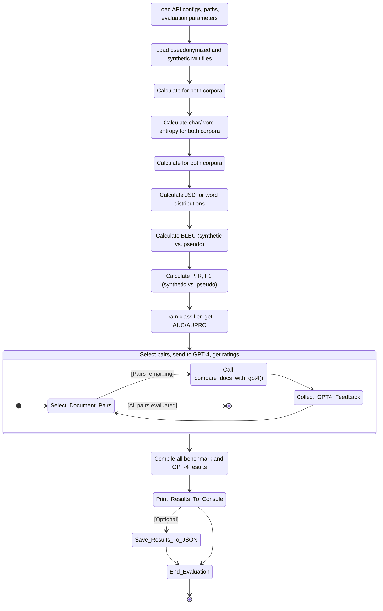

<span style="font-size: 13px;">

# *Privacy, Linguistic & Informational Preserving Synthesis of Clinical Data Through Generative Agents*


## Introduction

  This repository is a step-by-step guide to the Python code in the accompanying Jupyter Notebook, supplementing the paper "Privacy, Linguistic & Information Preserving Synthesis of Clinical Data Through Generative Agents" (Frontiers in AI).

  The overall aim is to process real-world PDF clinical notes, pseudonymize them for privacy, generate realistic synthetic notes based on these examples, and evaluate the quality and similarity of the synthetic data using various benchmarks.

  The process is broken down into several stages, as shown in the flow diagram below.

  <details>
  <summary><h2><strong>User-Friendly Synthetic EHR Generation Workflow</strong></h2></summary>


    
  ```mermaid 
    
  stateDiagram-v2
        Collect --> Pseudonymize
        Pseudonymize --> Store
        Store --> Compute
        Compute --> Toolchain
        Toolchain --> Orchestrate
        Orchestrate --> Supervisor
        Supervisor --> Worker
        Prompt  --> Supervisor
        Worker  --> Supervisor
        %%Prompt --> Model
        Supervisor --> Model
        Model --> Generate
        Generate --> Validate
        Validate --> Deploy
    
        %% Iterative Refinement & Evaluation Loop
        Generate --> Quantitative
        Quantitative --> Expert
        Expert --> Generate
    
        %% State labels for clarity
        state "Collect Real EHR Samples" as Collect
        state "Pseudonymization of EHR Samples" as Pseudonymize
        state "Store in Data Warehouse" as Store
        state "Compute Resources Setup: Cloud & Local" as Compute
        state "Toolchain Setup: Docker, Flowise, Hugging Face Spaces" as Toolchain
        state "Multi-Agent Workflow Orchestration" as Orchestrate
        state "Supervisor Agent" as Supervisor
        state "Worker Agent" as Worker
        state "Prompt Engineering: Clinical Guidelines & Standards" as Prompt
        state "Generative AI Model: GPT-4.1" as Model
        state "Generate Synthetic EHR" as Generate
        state "Validate Synthetic EHR Realism & Clinical Accuracy" as Validate
        state "Deploy Synthetic EHR Application via Secure API Endpoint" as Deploy
        state "Quantitative Assessment: Entropy, JSD, PMI, BLEU, BERTScore, Classifier Metrics" as Quantitative
        state "Expert Human Validation" as Expert
    
  ```
</details>

#

<details>
<summary><h2><strong>Stage 1: PDF Text Extraction and Markdown Conversion</strong></h2></summary>

 ```mermaid 

  stateDiagram-v2
  Initialize_Process: Initialize Azure OpenAI client and paths

  Initialize_Process --> Find_PDFs_In_Directory
  Find_PDFs_In_Directory: Scan PDF_DIRECTORY_PATH

  Find_PDFs_In_Directory --> Process_Next_PDF_Decision
  state Process_Next_PDF_Decision <<choice>>
  Process_Next_PDF_Decision --> Extract_Text_From_PDF : [PDF available]
  Process_Next_PDF_Decision --> End_Process : [No more PDFs]

  Extract_Text_From_PDF: Call extract_text_from_pdf()
  Extract_Text_From_PDF --> Text_Extraction_Check
  state Text_Extraction_Check <<choice>>
  Text_Extraction_Check --> Convert_Text_To_Markdown : [Extraction Succeeded]
  Text_Extraction_Check --> Log_Extraction_Error : [Extraction Failed]

  Log_Extraction_Error: Log PDF reading error
  Log_Extraction_Error --> Process_Next_PDF_Decision

  Convert_Text_To_Markdown: Call convert_text_to_markdown()
  Convert_Text_To_Markdown --> Markdown_Conversion_Check
  state Markdown_Conversion_Check <<choice>>
  Markdown_Conversion_Check --> Save_Single_Markdown_File : [Conversion Succeeded]
  Markdown_Conversion_Check --> Log_Conversion_Error : [Conversion Failed]

  Log_Conversion_Error: Log API or conversion error
  Log_Conversion_Error --> Process_Next_PDF_Decision

  Save_Single_Markdown_File: Call save_single_markdown_file()
  Save_Single_Markdown_File --> File_Save_Check
  state File_Save_Check <<choice>>
  File_Save_Check --> Log_Success : [Save Succeeded]
  File_Save_Check --> Log_Save_Error : [Save Failed]

  Log_Save_Error: Log file writing error
  Log_Save_Error --> Process_Next_PDF_Decision

  Log_Success: Log successful processing for the PDF
  Log_Success --> Process_Next_PDF_Decision

  End_Process --> [*]

 ```


  Shown is the prosessing needed for transforming raw PDF documents into a structured Markdown format. This conversion makes the textual content more amenable to subsequent processing, such as pseudonymization and analysis. The process leverages an AI model for intelligent structuring of the extracted text.

  **Purpose:** To systematically extract all readable text content from a collection of PDF files and then convert this raw text into well-structured Markdown. The conversion aims to preserve or infer document elements like headings, lists, and paragraphs, utilizing the capabilities of an Azure OpenAI GPT-4.1 model.

  **Key Code Components:**

  1.  **`extract_text_from_pdf(pdf_path)`**:
      *   **Library Used:** `PyMuPDF (fitz)`
      *   **Functionality:**
          *   Opens a PDF file specified by `pdf_path`.
          *   Iterates through each page of the PDF.
          *   Extracts plain text from each page using `page.get_text("text")`.
          *   Concatenates the text from all pages, adding a double newline (`\n\n`) as a separator between page contents.
          *   Includes basic error handling to catch and report issues during PDF reading, returning `None` if an error occurs.

  2.  **`convert_text_to_markdown(text_content, pdf_filename)`**:
      *   **Library Used:** `openai` (for Azure OpenAI)
      *   **Functionality:**
          *   Takes the raw `text_content` (extracted from a PDF) and the original `pdf_filename` (for context in prompts) as input.
          *   If `text_content` is empty, it returns `None`.
          *   Constructs a request to the Azure OpenAI API using the initialized `client` object.
          *   **AI Model Invocation:**
              *   Uses the deployment specified by `AZURE_OPENAI_DEPLOYMENT_NAME` (e.g., "GPT4.1").
              *   Sends a chat completion request with:
                  *   A `system_prompt` instructing the AI to act as an assistant specialized in converting raw text to well-structured Markdown, emphasizing retention of meaning, structure, and technical details without adding conversational fluff.
                  *   A `user_prompt` that includes the `text_content` and `pdf_filename`, asking the AI to convert the text to Markdown, paying attention to potential structural elements (headings, lists, paragraphs) and to output *only* the Markdown content.
                  *   `temperature` is set to `0.2` for more deterministic and factual output.
                  *   `max_tokens` is set to `24000` to accommodate potentially large documents.
          *   Extracts the AI-generated Markdown from the API response.
          *   Includes error handling for the API call, printing an error message and returning `None` if the conversion fails.

  3.  **`save_single_markdown_file(markdown_content, output_path)`**:
      *   **Library Used:** `os` (for path manipulation, though file I/O is standard Python)
      *   **Functionality:**
          *   A utility function that takes the generated `markdown_content` string and an `output_path`.
          *   Writes the `markdown_content` to the specified `output_path` using UTF-8 encoding.
          *   Includes basic error handling for file writing operations.

  **Inputs:**

  *   A collection of original PDF files located in the directory specified by the `PDF_DIRECTORY_PATH` variable.
  *   Azure OpenAI Service Configuration:
      *   `AZURE_OPENAI_ENDPOINT`: The endpoint URL for your Azure OpenAI service.
      *   `AZURE_OPENAI_API_KEY`: Your Azure OpenAI API key (Note: This is a sensitive credential and should be managed securely, not hardcoded directly for production or shared repositories).
      *   `AZURE_OPENAI_DEPLOYMENT_NAME`: The specific deployment name of your model in Azure OpenAI Studio (e.g., "GPT4.1").
      *   `API_VERSION`: The API version for the Azure OpenAI service (e.g., "2024-12-01-preview").
  *   An initialized `AzureOpenAI` client object, configured with the above credentials.

  **Outputs:**

  *   Individual Markdown files, where each file corresponds to an input PDF.
  *   These Markdown files are named `[original_filename_without_extension].md` (e.g., `report1.pdf` becomes `report1.md`).
  *   The output Markdown files are saved directly within the `PDF_DIRECTORY_PATH`.

  **Configuration Variables Used:**

  *   `PDF_DIRECTORY_PATH`: String specifying the absolute or relative path to the directory containing the input PDF files.
  *   `AZURE_OPENAI_ENDPOINT`, `AZURE_OPENAI_API_KEY`, `AZURE_OPENAI_DEPLOYMENT_NAME`, `API_VERSION`: As described under "Inputs".
  *   Prompts within `convert_text_to_markdown`:
      *   `system_prompt`: Defines the AI's role and general output requirements.
      *   `user_prompt`: Provides the specific text and instructions for the conversion task.

  **Workflow Summary:**

  The main execution block iterates through each PDF file found in `PDF_DIRECTORY_PATH`. For each PDF:
  1.  Text is extracted using `extract_text_from_pdf`.
  2.  If text extraction is successful, the text is passed to `convert_text_to_markdown`.
  3.  If Markdown conversion is successful, the resulting Markdown content is saved as an individual `.md` file using `save_single_markdown_file`.
  4.  Progress and any errors are logged to the console.
  </details>

#

<details>
  <summary><h2><strong>Stage 2: AI-Powered Pseudonymization of Markdown Content</strong></h2></summary>

  This stage is critical for protecting patient privacy. It processes the Markdown files generated in Stage 1 to identify and replace personal identifiers, specifically names, with realistic-sounding pseudonyms. This creates a safer dataset for subsequent tasks, such as training generative models or sharing example data, while aiming to preserve the original document structure and all other content.

  *   **Purpose:** To automatically replace privacy-sensitive information, focusing on person names (e.g., patients, doctors, staff, family members), with plausible, fabricated pseudonyms. This process is performed using an Azure OpenAI model, with strict instructions to *only* modify names and meticulously preserve the original Markdown formatting and all other textual content.

  *   **Key Code Components:**
      *   **`pseudonymize_markdown(markdown_content, pdf_filename)`**:
          *   **Library Used:** `openai` (for Azure OpenAI).
          *   **Functionality:**
              *   Accepts the `markdown_content` (from Stage 1) and the original `pdf_filename` (for logging/context) as input.
              *   Returns `None` if the input `markdown_content` is empty.
              *   Constructs a `pseudo_user_prompt` that combines the input `markdown_content` with explicit instructions to replace only person names and maintain Markdown integrity.
              *   **AI Model Invocation (Azure OpenAI):**
                  *   Uses the same initialized `client` object and `AZURE_OPENAI_DEPLOYMENT_NAME` (e.g., "GPT4.1") as in Stage 1.
                  *   Sends a chat completion request with:
                      *   The `PSEUDO_SYSTEM_MESSAGE_CONTENT` (see Configuration below) which strictly defines the AI's role and constraints.
                      *   The constructed `pseudo_user_prompt` containing the actual Markdown text and task instructions.
                      *   `temperature` set to `0.2` to encourage deterministic and rule-abiding output.
                      *   `max_tokens` set to `24000` (or a similar appropriate value) to handle the full document.
                  *   Extracts the pseudonymized Markdown text from the AI's response.
                  *   Includes error handling for the API call, printing an error message and returning `None` if pseudonymization fails.
      *   **`save_single_markdown_file(markdown_content, output_path)`**:
          *   This is the same helper function reused from Stage 1.
          *   It saves the pseudonymized Markdown content to a new file, typically prefixed with "pseudo_".

  *   **Inputs:**
      *   Individual Markdown files (`[original_filename].md`) generated in Stage 1, located in `PDF_DIRECTORY_PATH`.
      *   Azure OpenAI Service Configuration:
          *   `AZURE_OPENAI_ENDPOINT`: The endpoint URL for your Azure OpenAI service.
          *   `AZURE_OPENAI_DEPLOYMENT_NAME`: The specific deployment name of your model (e.g., "GPT4.1").
          *   `API_VERSION`: The API version for the Azure OpenAI service.
          *   *(API Key is configured in the environment or client initialization but not detailed here for security).*
      *   An initialized `AzureOpenAI` client object.

  *   **Outputs:**
      *   Individual pseudonymized Markdown files.
      *   Naming convention: `pseudo_[original_filename_without_extension].md` (e.g., `pseudo_report1.md`).
      *   These files are saved within the same `PDF_DIRECTORY_PATH`.

  *   **Configuration Variables Used:**
      *   `PDF_DIRECTORY_PATH`: Path to the directory containing the Markdown files.
      *   Azure OpenAI parameters: `AZURE_OPENAI_ENDPOINT`, `AZURE_OPENAI_DEPLOYMENT_NAME`, `API_VERSION`.
      *   **`PSEUDO_SYSTEM_MESSAGE_CONTENT`**:
          ```
          "Vervang in de aangeleverde tekst uitsluitend de persoonsnamen (zoals patiëntnamen, namen van artsen, medewerkers, familieleden, etc.) door realistische, verzonnen pseudoniemen. Zorg ervoor dat de originele markdown opmaak van de tekst volledig behouden blijft. Geef als antwoord *alleen* de aangepaste tekst terug, zonder enige uitleg of extra commentaar."
          ```
          *(Translation: "In the provided text, replace only personal names (such as patient names, names of doctors, employees, family members, etc.) with realistic, fabricated pseudonyms. Ensure that the original markdown formatting of the text is fully preserved. Return *only* the modified text as the answer, without any explanation or extra commentary.")*
      *   **`PRIVACY_CATEGORIES`** (primarily for contextual understanding and potential future use in prompt refinement, though the current system prompt is highly specific to names):
          ```python
          PRIVACY_CATEGORIES = [
              "Persoonsnamen (patiënt, arts, etc.)",
              "Adressen",
              "Telefoonnummers",
              "E-mailadressen",
              "Geboortedata",
              "Burgerservicenummer (BSN) of andere ID-nummers",
              "Medische klachten, symptomen of diagnoses",
              "Medische behandelingen, medicatie of procedures",
              "Verzekeringsgegevens",
              "Financiële gegevens",
              "Andere direct identificeerbare persoonlijke informatie"
          ]
          ```

  *   **Workflow Summary:**
      The main script iterates through each Markdown file (produced in Stage 1) found in `PDF_DIRECTORY_PATH`. For each Markdown file:
      1.  The content of the Markdown file is read.
      2.  This content is passed to the `pseudonymize_markdown` function.
      3.  If the AI successfully returns pseudonymized content:
          *   The `save_single_markdown_file` function saves this modified content to a new file, prefixed with `pseudo_`.
      4.  Progress and any errors encountered during the API call or file operations are logged to the console.
      5.  The script also collects all pseudonymized content to later create a combined pseudonymized Markdown file.
</details>


#

  <details>
  <summary><h2><strong>Stage 3: Combining Markdown Files (Optional)</strong></h2></summary>

  This stage is primarily for creating single files containing the processed data, which can be useful for reviewing the entire dataset or for simple corpus loading, although the subsequent stages load individual files.

  * **Purpose:** To concatenate the content of all individual Markdown files (both original converted and pseudonymized) into two single, large Markdown files.  
  * **Key Code Components:**  
    * save\_combined\_markdown\_to\_file(combined\_markdown\_content, output\_path, file\_description): A helper function to write the combined string to a specified file.  
  * **Inputs:**  
    * Individual Markdown files (\*.md and pseudo\_\*.md) from the PDF\_DIRECTORY\_PATH.  
  * **Outputs:**  
    * combined\_epds\_markdown.md (all original converted content) saved in the parent directory of PDF\_DIRECTORY\_PATH.  
    * pseudo\_combined\_epds\_markdown.md (all pseudonymized content) saved in the parent directory of PDF\_DIRECTORY\_PATH.  
  * **Configuration:**  
    * OUTPUT\_COMBINED\_MD\_FILE\_PATH, OUTPUT\_COMBINED\_PSEUDO\_MD\_FILE\_PATH: Define the output locations and filenames.

  *Note: The main execution block in the initial script handles the looping through files, calling the extraction/conversion/pseudonymization functions, appending content to lists (all\_markdown\_content, all\_pseudonymized\_content), and finally joining and saving the combined content.*
  </details>

#


  <details>
  <summary><h2><strong>Stage 4: Synthetic Data Generation</strong></h2></summary>

Using the pseudonymized real data as examples and guided by detailed prompts, this stage generates entirely new, artificial patient records for low back pain.

### Code Structure and Functionality

1.  **Imports:**
    *   `os`: For interacting with the operating system, primarily for path manipulation and directory checks.
    *   `fitz` (PyMuPDF): Although imported, it's not used in the generation logic itself (likely a remnant from previous PDF processing steps).
    *   `openai.AzureOpenAI`: The core library for interacting with the Azure OpenAI service.
    *   `glob`: Used for finding files matching a specific pattern (e.g., `pseudo_*.md`).

2.  **Configuration:**
    *   **Azure Credentials:** [`AZURE_OPENAI_ENDPOINT`](d:\OneDrive%20-%20Hogeschool%20Rotterdam\1_CURRENT_CODE\DE_IDENTIFY\EPD_DATA_SYNTHESIZER_GPT4.1_V01.ipynb), [`AZURE_OPENAI_API_KEY`](d:\OneDrive%20-%20Hogeschool%20Rotterdam\1_CURRENT_CODE\DE_IDENTIFY\EPD_DATA_SYNTHESIZER_GPT4.1_V01.ipynb), [`AZURE_OPENAI_DEPLOYMENT_NAME`](d:\OneDrive%20-%20Hogeschool%20Rotterdam\1_CURRENT_CODE\DE_IDENTIFY\EPD_DATA_SYNTHESIZER_GPT4.1_V01.ipynb), [`API_VERSION`](d:\OneDrive%20-%20Hogeschool%20Rotterdam\1_CURRENT_CODE\DE_IDENTIFY\EPD_DATA_SYNTHESIZER_GPT4.1_V01.ipynb) are defined to connect to the Azure service.
    *   **Directory Paths:**
        *   [`PSEUDO_MD_DIRECTORY_PATH`](d:\OneDrive%20-%20Hogeschool%20Rotterdam\1_CURRENT_CODE\DE_IDENTIFY\EPD_DATA_SYNTHESIZER_GPT4.1_V01.ipynb): Specifies the location of the pseudonymized Markdown files (`pseudo_*.md`) used as examples.
        *   [`SYNTHETIC_OUTPUT_DIR`](d:\OneDrive%20-%20Hogeschool%20Rotterdam\1_CURRENT_CODE\DE_IDENTIFY\EPD_DATA_SYNTHESIZER_GPT4.1_V01.ipynb): Defines the directory where the generated synthetic Markdown files will be saved.
    *   **Generation Control:**
        *   [`NUM_SYNTHETIC_RECORDS_TO_GENERATE`](d:\OneDrive%20-%20Hogeschool%20Rotterdam\1_CURRENT_CODE\DE_IDENTIFY\EPD_DATA_SYNTHESIZER_GPT4.1_V01.ipynb): Sets the number of synthetic EPDs to create.

3.  **Azure OpenAI Client Initialization:**
    *   An instance of the [`AzureOpenAI`](d:\OneDrive%20-%20Hogeschool%20Rotterdam\1_CURRENT_CODE\DE_IDENTIFY\EPD_DATA_SYNTHESIZER_GPT4.1_V01.ipynb) client is created using the specified credentials and API version. This [`client`](d:\OneDrive%20-%20Hogeschool%20Rotterdam\1_CURRENT_CODE\DE_IDENTIFY\EPD_DATA_SYNTHESIZER_GPT4.1_V01.ipynb) object is used for all subsequent API calls.


4.  **Helper Functions:**
    *   [`load_pseudonymized_examples(directory_path)`](d:\OneDrive%20-%20Hogeschool%20Rotterdam\1_CURRENT_CODE\DE_IDENTIFY\EPD_DATA_SYNTHESIZER_GPT4.1_V01.ipynb):
        *   Finds all files matching `pseudo_*.md` in the given `directory_path`.
        *   Reads the content of each found file.
        *   Formats the combined content with clear separators (`--- BEGIN VOORBEELD DOSSIER: ... ---`, `--- EINDE VOORBEELD DOSSIER ---`) to help the AI distinguish individual examples.
        *   Returns a single string containing all example content, or an empty string with a warning if no examples are found.
    *   [`generate_synthetic_record(client, example_markdown_content, record_number)`](d:\OneDrive%20-%20Hogeschool%20Rotterdam\1_CURRENT_CODE\DE_IDENTIFY\EPD_DATA_SYNTHESIZER_GPT4.1_V01.ipynb):
        *   **Prompts:** This function defines two key prompts to guide the AI, simulating a Supervisor-Worker interaction:
            *   **`system_prompt` (Supervisor Instructions):** Sets the AI's core **persona** and **overall task**. It instructs the AI to act as an **experienced physiotherapist** generating realistic Dutch EPDs. It establishes the **context** (using anonymized info, expert guidance), **methodology** (applying ICF framework, following KNGF low back pain guidelines), and a crucial **constraint** (produce *only* the requested patient dossier). This acts like a high-level directive from a supervisor.
            *   **`user_prompt` (Worker Instructions):** Provides the **specific, detailed, step-by-step instructions** for the *current* generation task. This acts like the specific work order given to the worker. It details:
                *   **Task Focus:** Generate *one* complete, realistic EPD *only* for low back pain (acute, subacute, or chronic). Explicitly forbids other conditions.
                *   **Required Structure and Content (in order):**
                    1.  **Anamnese Summary:** Specifies content (history, impact, coping, context), style (narrative, professional Dutch), and requirement (classify pain duration).
                    2.  **ICF-based Diagnosis:** Lists all mandatory components (impairments, limitations, restrictions, personal/environmental factors, risk factors, reformulated help request).
                    3.  **Treatment Goals:** Mandates SMART, patient-centered, functional goals (what the patient wants to do), clarifies role of clinical scores (support, not the goal itself), and requires a target date.
                    4.  **Treatment Plan:** Requires description of interventions and rationale, based on KNGF guidelines and goals.
                    5.  **SOEP Progress Notes:** Sets quantity (3-8 notes), format (full SOEP per session), and content requirements (show progression/changes, clinical reasoning).
                    6.  **Language/Style:** Demands professional Dutch, expansion of abbreviations, and realistic tone matching examples.
                *   **Example Guidance:** Injects the `example_markdown_content` as a reference for structure, style, and detail, while explicitly demanding a **new and unique** case.
                *   **Output Specification:** Instructs the AI to generate *only* the dossier content, starting with the anamnese and ending precisely with the word "FINISH". Re-emphasizes adherence to *all* instructions.
        *   **API Call:** Calls the `client.chat.completions.create` method with the system ("Supervisor") and user ("Worker") prompts, the specified model ([`AZURE_OPENAI_DEPLOYMENT_NAME`](d:\OneDrive%20-%20Hogeschool%20Rotterdam\1_CURRENT_CODE\DE_IDENTIFY\EPD_DATA_SYNTHESIZER_GPT4.1_V01.ipynb)), a higher `temperature` (0.8) for creativity, and sufficient `max_tokens` (8000).
        *   **Error Handling:** Catches potential API errors and returns the generated text content or `None` on failure.
    *   [`save_synthetic_record(synthetic_content, output_dir, record_number)`](d:\OneDrive%20-%20Hogeschool%20Rotterdam\1_CURRENT_CODE\DE_IDENTIFY\EPD_DATA_SYNTHESIZER_GPT4.1_V01.ipynb):
        *   Ensures the specified `output_dir` exists, creating it if necessary.
        *   Constructs a filename like `synthetic_patient_001.md` (using zero-padding for sorting).
        *   Writes the provided `synthetic_content` to the file using UTF-8 encoding.
        *   Handles potential file writing errors.

    *   [`load_pseudonymized_examples(directory_path)`](d:\OneDrive%20-%20Hogeschool%20Rotterdam\1_CURRENT_CODE\DE_IDENTIFY\EPD_DATA_SYNTHESIZER_GPT4.1_V01.ipynb):
        *   Finds all files matching `pseudo_*.md` in the given `directory_path`.
        *   Reads the content of each found file.
        *   Formats the combined content with clear separators (`--- BEGIN VOORBEELD DOSSIER: ... ---`, `--- EINDE VOORBEELD DOSSIER ---`) to help the AI distinguish individual examples.
        *   Returns a single string containing all example content, or an empty string with a warning if no examples are found.
    *   [`generate_synthetic_record(client, example_markdown_content, record_number)`](d:\OneDrive%20-%20Hogeschool%20Rotterdam\1_CURRENT_CODE\DE_IDENTIFY\EPD_DATA_SYNTHESIZER_GPT4.1_V01.ipynb):
        *   **Prompts:** This function defines two key prompts to guide the AI:
            *   **`system_prompt`**: Sets the AI's persona and overall task. It instructs the AI to act as a physiotherapist generating realistic Dutch EPDs based on anonymized information and expert guidance, specifically using the ICF framework and KNGF guidelines for low back pain, and to only output the requested dossier.
            *   **`user_prompt`**: Provides detailed instructions for generating *one* specific EPD. It specifies:
                *   **Condition Focus:** Generate only for acute, subacute, or chronic low back pain.
                *   **Required Sections (in order):**
                    1.  **Anamnese Summary:** Concise narrative of history, impact, coping, context; professional Dutch; specify duration (acute/subacute/chronic).
                    2.  **ICF-based Diagnosis:** Include impairments, activity limitations, participation restrictions, personal factors, environmental factors, risk/prognostic factors, and a reformulation of the patient's request for help.
                    3.  **Treatment Goals:** SMART, patient-centered, functional goals (what the patient wants to do again); clinical scores (PSK, NRS, ODI) can be used as criteria but aren't the goal itself; specify target date.
                    4.  **Treatment Plan:** Describe interventions (manual therapy, exercise, education, etc.) and rationale, based on KNGF guidelines and goals.
                    5.  **SOEP Progress Notes:** 3 to 8 separate notes (one per session) using the full SOEP format (Subjective, Objective, Evaluation, Plan); show realistic progression/stagnation/adjustments over time.
                    6.  **Language/Style:** Professional, natural Dutch; expand common abbreviations (PSK, LWK); realistic and varied tone matching examples.
                *   **Example Usage:** Explicitly includes the loaded `example_markdown_content` as a reference for structure, style, language, and detail, while demanding a completely new and unique case.
                *   **Output Format:** Generate *only* the dossier content, starting with the anamnese and ending precisely with the word "FINISH". Ensure all requested parts and instructions are followed.
        *   **API Call:** Calls the `client.chat.completions.create` method with the system and user prompts, the specified model ([`AZURE_OPENAI_DEPLOYMENT_NAME`](d:\OneDrive%20-%20Hogeschool%20Rotterdam\1_CURRENT_CODE\DE_IDENTIFY\EPD_DATA_SYNTHESIZER_GPT4.1_V01.ipynb)), a higher `temperature` (0.8) for creativity, and sufficient `max_tokens` (8000) for a potentially long record.
        *   **Error Handling:** Catches potential API errors and returns the generated text content or `None` on failure.
    *   [`save_synthetic_record(synthetic_content, output_dir, record_number)`](d:\OneDrive%20-%20Hogeschool%20Rotterdam\1_CURRENT_CODE\DE_IDENTIFY\EPD_DATA_SYNTHESIZER_GPT4.1_V01.ipynb):
        *   Ensures the specified `output_dir` exists, creating it if necessary.
        *   Constructs a filename like `synthetic_patient_001.md` (using zero-padding for sorting).
        *   Writes the provided `synthetic_content` to the file using UTF-8 encoding.
        *   Handles potential file writing errors.


5.  **Main Execution Logic (`if __name__ == "__main__":`)**
    *   Prints a starting message.
    *   Checks if the [`PSEUDO_MD_DIRECTORY_PATH`](d:\OneDrive%20-%20Hogeschool%20Rotterdam\1_CURRENT_CODE\DE_IDENTIFY\EPD_DATA_SYNTHESIZER_GPT4.1_V01.ipynb) exists; exits with an error if not.
    *   Calls [`load_pseudonymized_examples`](d:\OneDrive%20-%20Hogeschool%20Rotterdam\1_CURRENT_CODE\DE_IDENTIFY\EPD_DATA_SYNTHESIZER_GPT4.1_V01.ipynb) to get the example content. Issues a warning if no examples are loaded but continues execution.
    *   Enters a loop that runs [`NUM_SYNTHETIC_RECORDS_TO_GENERATE`](d:\OneDrive%20-%20Hogeschool%20Rotterdam\1_CURRENT_CODE\DE_IDENTIFY\EPD_DATA_SYNTHESIZER_GPT4.1_V01.ipynb) times.
    *   Inside the loop, for each record:
        *   Calls [`generate_synthetic_record`](d:\OneDrive%20-%20Hogeschool%20Rotterdam\1_CURRENT_CODE\DE_IDENTIFY\EPD_DATA_SYNTHESIZER_GPT4.1_V01.ipynb) to get the synthetic content.
        *   If generation is successful:
            *   Performs a basic check to see if the content ends with "FINISH" (as requested in the prompt) and warns if not.
            *   Calls [`save_synthetic_record`](d:\OneDrive%20-%20Hogeschool%20Rotterdam\1_CURRENT_CODE\DE_IDENTIFY\EPD_DATA_SYNTHESIZER_GPT4.1_V01.ipynb) to save the content to a file.
        *   If generation fails, it skips saving.
    *   Prints a completion message after the loop finishes.

### Inputs and Outputs

*   **Inputs:**
    *   Pseudonymized Markdown files (`pseudo_*.md`) located in [`PSEUDO_MD_DIRECTORY_PATH`](d:\OneDrive%20-%20Hogeschool%20Rotterdam\1_CURRENT_CODE\DE_IDENTIFY\EPD_DATA_SYNTHESIZER_GPT4.1_V01.ipynb).
    *   Azure OpenAI service credentials and configuration.
*   **Outputs:**
    *   Synthetic Markdown files (`synthetic_patient_*.md`) saved in [`SYNTHETIC_OUTPUT_DIR`](d:\OneDrive%20-%20Hogeschool%20Rotterdam\1_CURRENT_CODE\DE_IDENTIFY\EPD_DATA_SYNTHESIZER_GPT4.1_V01.ipynb).
    *   Progress messages printed to the console during execution.
  </details>


#


  <details>
  <summary><h2><strong>Stage 5: Synthetic Data Evaluation</strong></h2></summary>




  

  This final stage assesses the quality and similarity of the generated synthetic data compared to the pseudonymized real data using a combination of quantitative benchmarks and a qualitative AI-based review.

  * **Purpose:** To provide metrics and descriptions that indicate how well the synthetic data captures the linguistic, structural, and clinical characteristics of the real-world pseudonymized data.
  * **Key Code Components:**
    * `load_file_content(filepath)`: Helper function to load content for evaluation.
    * `calculate_entropy(text, unit)`: Calculates Shannon's Entropy (character and word level).
    * `calculate_avg_bigram_pmi(text, min_freq)`: Calculates average Pointwise Mutual Information for word bigrams.
    * `calculate_kl_divergence(text1, text2, unit)`: Calculates Jensen-Shannon Divergence between word distributions.
    * `calculate_corpus_bleu(synthetic_contents, pseudo_contents_list)`: Calculates corpus-level BLEU score.
    * `calculate_corpus_bertscore(synthetic_contents, pseudo_contents_list, lang='nl')`: Calculates BERT Score (Precision, Recall, F1).
    * `evaluate_classifier_performance(pseudo_contents, synthetic_contents, ...)`: Trains a classifier to distinguish data types and reports AUC/AUPRC.
    * `compare_docs_with_gpt4(...)`: Sends document pairs to Azure OpenAI for qualitative comparison.
    * Main script logic for loading data, running benchmarks, performing GPT-4 comparisons, and reporting/saving results.
  * **Inputs:**
    * Pseudonymized Markdown files from `PSEUDO_MD_DIRECTORY_PATH_COMPARE`.
    * Synthetic Markdown files from `SYNTHETIC_MD_DIRECTORY_PATH`.
    * Azure OpenAI API configuration and `client` object.
  * **Outputs:**
    * Quantitative benchmark values printed to console (Entropy, Avg. Length, PMI, JSD, BLEU, BERTScore, Classifier AUC/AUPRC).
    * Qualitative GPT-4 comparison summaries and ratings printed to console.
    * Optional JSON file (`COMPARISON_RESULTS_FILE`) with all results.
  * **Configuration:**
    * `PSEUDO_MD_DIRECTORY_PATH_COMPARE`, `SYNTHETIC_MD_DIRECTORY_PATH`.
    * `NUM_COMPARISON_PAIRS_TO_EVALUATE`.
    * `PMI_MIN_BIGRAM_FREQ`.
    * `CLASSIFIER_TEST_SIZE`, `CLASSIFIER_RANDOM_STATE`, `CLASSIFIER_MAX_FEATURES`.
    * Azure OpenAI settings (`AZURE_OPENAI_DEPLOYMENT_NAME`, etc.).
  * **Benchmark Metrics Explained:**

    **Explanation of Average Document Length (Characters):**
    1.  **Code Implementation:** Calculated directly within the main execution block using `numpy.mean([len(c) for c in corpus_contents])` for both `all_pseudo_contents` and `all_synthetic_contents`.
    2.  **Calculation Steps:**
        *   The content of each pseudonymized document and each synthetic document is loaded.
        *   The length (number of characters) of each document's content is determined using the `len()` function.
        *   `numpy.mean()` computes the average of these lengths for the set of pseudonymized documents and, separately, for the set of synthetic documents.
    3.  **Benchmark Calculation:**
        *   The average length is calculated for the corpus of all loaded pseudonymized documents.
        *   The average length is calculated for the corpus of all loaded synthetic documents.
        *   These two averages are stored in `benchmark_results['avg_doc_length_chars']`.
    4.  **Reporting:** The final report includes the "Average Document Length (Characters)" for both "Pseudonymized Files" and "Synthetic Files".

    **Interpretation of Average Document Length:**
    *   This is a fundamental structural metric that provides a simple measure of the typical size or volume of content per document.
    *   Comparing the average lengths of synthetic documents to pseudonymized documents helps assess whether the synthetic generation process produces texts of comparable verbosity or conciseness to the real data.
    *   Significant discrepancies (e.g., synthetic documents being consistently much shorter or longer) might indicate issues in the generation process, such as premature truncation, excessive verbosity, or failure to capture the typical scope of information present in the source documents.

    **Explanation of Shannon's Entropy (Character/Word):**
    1.  **`calculate_entropy(text, unit)` Function:**
        *   Takes the entire text corpus (either all pseudonymized content concatenated or all synthetic content concatenated) and a `unit` ('char' or 'word') as input.
        *   If `unit` is 'char', the text is tokenized into individual characters.
        *   If `unit` is 'word', the text is converted to lowercase and split by whitespace into words.
        *   `collections.Counter` is used to count the frequency of each unique token (character or word).
        *   The probability $p_i$ of each token $i$ is calculated as (count of token $i$) / (total number of tokens).
        *   Shannon's Entropy is computed using the formula: $H = -\sum_{i} p_i \log_2(p_i)$, summed over all unique tokens. The result is in bits.
    2.  **Benchmark Calculation:**
        *   The function is called four times:
            *   For the concatenated pseudonymized text, with `unit='char'`.
            *   For the concatenated synthetic text, with `unit='char'`.
            *   For the concatenated pseudonymized text, with `unit='word'`.
            *   For the concatenated synthetic text, with `unit='word'`.
        *   Results are stored in `benchmark_results['shannon_entropy_char']` and `benchmark_results['shannon_entropy_word']`.
    3.  **Reporting:** The report shows "Shannon Entropy (Character)" and "Shannon Entropy (Word)" for both the "Pseudonymized Corpus" and "Synthetic Corpus".

    **Interpretation of Shannon's Entropy:**
    *   Entropy measures the average level of "information", "surprise", or "uncertainty" inherent in the text's token distribution. Higher entropy indicates greater diversity and less predictability in token usage. Lower entropy suggests more repetitive or predictable patterns.
    *   Comparing the entropy of the synthetic corpus to the pseudonymized corpus helps assess if the synthetic data exhibits a similar degree of linguistic complexity and variability.
    *   If synthetic entropy is much lower, it might indicate over-simplified language or repetitive phrasing. If much higher, it could suggest overly random or unstructured text (though this is less common for model-generated text). Similar entropy values suggest the synthetic data captures a comparable level of linguistic richness.

    **Explanation of Average Bigram Pointwise Mutual Information (PMI):**
    1.  **`PMI_MIN_BIGRAM_FREQ` Constant:** A threshold (`3` by default) is introduced to filter out extremely rare bigrams. Calculating PMI for bigrams that occur only once or twice can lead to very high and less meaningful scores that skew the average.
    2.  **`calculate_avg_bigram_pmi(text, min_freq)` Function:**
        *   Takes text content (concatenated corpus) and the minimum frequency threshold as input.
        *   Splits the text into words (lowercase, whitespace split).
        *   Counts individual word frequencies (`word_counts`) and bigram frequencies (`bigram_counts`) using `collections.Counter`.
        *   Iterates through the *observed* bigrams.
        *   For each bigram occurring at least `min_freq` times:
            *   It calculates the probabilities of the individual words ($P(w1)$, $P(w2)$) and the bigram ($P(w1, w2)$) based on their counts relative to the total number of words.
            *   It computes the Pointwise Mutual Information (PMI) using the formula: $PMI(w1, w2) = \log_2 \frac{P(w1, w2)}{P(w1)P(w2)}$. This measures how much more likely word $w2$ is to follow word $w1$ than would be expected by chance if their occurrences were independent.
        *   Returns the average of the calculated PMI values for all bigrams that met the minimum frequency threshold.
    3.  **Benchmark Calculation:**
        *   The main block calls `calculate_avg_bigram_pmi` for both the concatenated pseudonymized text corpus and the concatenated synthetic text corpus, using `PMI_MIN_BIGRAM_FREQ`.
        *   The results are stored in `benchmark_results['avg_bigram_pmi']`.
    4.  **Reporting:** The final report section includes the calculated average bigram PMI values for both corpora, explicitly stating the `min_freq` threshold used.

    **Interpretation of Average Bigram PMI:**
    *   This metric provides an indication of the average strength of association or co-occurrence between adjacent words in each corpus.
    *   A higher average PMI suggests that words in that corpus tend to co-occur in less random or more specific, predictable pairs.
    *   Comparing the average PMI of the synthetic corpus to the pseudonymized corpus helps understand if the synthetic data is capturing similar patterns of word collocation and local linguistic structure. If the synthetic average PMI is similar, it suggests the generated text has a comparable level of "phrase predictability" or structural word association. Significant differences may indicate that the synthetic text forms word pairs differently than the original data.

    **Explanation of Jensen-Shannon Divergence (JSD) for Word Distributions:**
    1.  **`calculate_kl_divergence(text1, text2, unit='word')` Function:**
        *   Takes two text corpora (e.g., concatenated pseudonymized text and concatenated synthetic text) and a `unit` (here, 'word') as input.
        *   Both texts are tokenized into words (lowercase, split by whitespace).
        *   A combined vocabulary of all unique words from both corpora is created.
        *   For each corpus, a probability distribution ($P_1$ and $P_2$) over this combined vocabulary is derived from word counts. A small smoothing value (`1e-9`) is added to counts before normalization to avoid zero probabilities, which would lead to issues with logarithm calculations.
        *   The Kullback-Leibler (KL) Divergence is calculated in both directions: $KL(P_1 || P_2)$ and $KL(P_2 || P_1)$, using `scipy.stats.entropy(pk, qk, base=2)`.
        *   The Jensen-Shannon Divergence (JSD) is then computed as the average of these two KL divergences: $JSD(P_1 || P_2) = 0.5 \times (KL(P_1 || P_2) + KL(P_2 || P_1))$.
    2.  **Benchmark Calculation:**
        *   `calculate_kl_divergence` is called once with the concatenated pseudonymized corpus, the concatenated synthetic corpus, and `unit='word'`.
        *   The resulting JSD value is stored in `benchmark_results['jsd_word']`.
    3.  **Reporting:** The report includes the "Jensen-Shannon Divergence (Word Distribution)" value.

    **Interpretation of Jensen-Shannon Divergence (JSD):**
    *   JSD measures the similarity between two probability distributions. It is symmetric (i.e., $JSD(P_1 || P_2) = JSD(P_2 || P_1)$) and bounded (0 to 1 when using log base 2).
    *   A JSD value of 0 indicates that the two word distributions are identical. A value of 1 indicates they are maximally different (no overlap in high-probability words).
    *   In this context, a lower JSD value is desirable, as it suggests that the overall word usage frequencies in the synthetic corpus are more similar to those in the pseudonymized corpus. A higher JSD indicates a greater divergence in vocabulary usage or word preferences between the two corpora.

    **Explanation of Corpus BLEU Score:**
    1.  **`calculate_corpus_bleu(synthetic_contents, pseudo_contents_list)` Function:**
        *   Takes a list of synthetic document contents (candidates) and a list of all pseudonymized document contents (which serve as references) as input.
        *   The `sacrebleu.corpus_bleu` function is used for the calculation. It expects references to be a list of lists, where each inner list contains references for one candidate. In this setup, all pseudonymized documents act as potential references for each synthetic document.
        *   BLEU score measures the n-gram overlap (typically 1-grams to 4-grams) between the synthetic documents and the reference documents. It includes a brevity penalty if the synthetic documents are significantly shorter on average than the reference documents.
    2.  **Benchmark Calculation:**
        *   The function is called with `all_synthetic_contents` (as candidates) and `all_pseudo_contents` (as the list of references for each candidate).
        *   The `.score` attribute of the `sacrebleu` result object (which is the BLEU score, typically on a 0-100 scale) is stored in `benchmark_results['bleu_score']`.
    3.  **Reporting:** The report shows the "BLEU Score (Synthetic vs All Pseudonymized)".

    **Interpretation of BLEU Score:**
    *   BLEU (Bilingual Evaluation Understudy) is a precision-focused metric that measures how many n-grams in the synthetic text appear in the reference texts. Scores range from 0 to 100 (or 0 to 1).
    *   For synthetic data generation, the interpretation can be nuanced. If the goal is to create novel text that is stylistically similar but not a copy, a very high BLEU score might be undesirable as it could indicate direct copying of phrases.
    *   A low to moderate BLEU score might be preferred, suggesting that the synthetic data captures some n-gram patterns characteristic of the source data without merely replicating it. The script's existing description notes: "A low score is generally desired for synthetic data to show it's not copying phrasing."

    **Explanation of Corpus BERT Score (Precision, Recall, F1):**
    1.  **`calculate_corpus_bertscore(synthetic_contents, pseudo_contents_list, lang='nl')` Function:**
        *   Takes lists of synthetic document contents (candidates) and pseudonymized document contents (references), along with a language code (e.g., 'nl' for Dutch).
        *   It utilizes the `bert_score.score` function from the `bert_score` library.
        *   BERT (Bidirectional Encoder Representations from Transformers) embeddings are generated for tokens in both candidate and reference documents.
        *   Cosine similarity is computed between the contextual embeddings of tokens in candidate documents and tokens in reference documents.
        *   Precision, Recall, and F1 scores are calculated based on these similarities:
            *   Precision: Reflects how many tokens in the synthetic text have a good semantic match in the reference text.
            *   Recall: Reflects how many tokens in the reference text have a good semantic match in the synthetic text.
            *   F1: The harmonic mean of Precision and Recall.
        *   The function returns the mean Precision, Recall, and F1 scores, averaged across all candidate-reference pairings.
    2.  **Benchmark Calculation:**
        *   The function is called with `all_synthetic_contents`, `all_pseudo_contents`, and `lang='nl'`.
        *   The mean P, R, and F1 values are stored as a dictionary in `benchmark_results['bert_score']`.
    3.  **Reporting:** The report includes "BERT Score (Synthetic vs All Pseudonymized)" with sub-bullets for "Precision", "Recall", and "F1".

    **Interpretation of BERT Score:**
    *   BERT Score measures semantic similarity between texts by comparing their contextual embeddings, which capture deeper meaning beyond exact word matches. Scores range from approximately -1 to 1, but typically fall in the positive range for meaningful comparisons.
    *   Higher Precision indicates that the content generated in synthetic documents is semantically similar to content found in the pseudonymized documents.
    *   Higher Recall indicates that the synthetic documents manage to capture a good portion of the semantic content present in the pseudonymized documents.
    *   A higher F1 Score (the balanced measure) suggests a better overall semantic alignment between the synthetic and pseudonymized corpora. This is generally desirable, indicating that the synthetic data is semantically coherent with the real data.

    **Explanation of Classifier Performance (AUC/AUPRC):**
    1.  **`evaluate_classifier_performance(pseudo_contents, synthetic_contents, ...)` Function:**
        *   Takes lists of pseudonymized and synthetic document contents, along with configuration parameters like `test_size`, `random_state`, and `max_features` for TF-IDF.
        *   Labels are created: 0 for pseudonymized documents, 1 for synthetic documents.
        *   The combined dataset (features + labels) is split into training and testing sets using `sklearn.model_selection.train_test_split`, with stratification to maintain class proportions.
        *   A `sklearn.pipeline.Pipeline` is created, consisting of:
            *   `TfidfVectorizer`: To convert text documents into numerical TF-IDF feature vectors.
            *   `LogisticRegression`: A classifier trained to distinguish between the two classes based on these features.
        *   The pipeline is trained on the training data.
        *   The trained model predicts the probability of each test sample belonging to class 1 (synthetic).
        *   `sklearn.metrics.roc_auc_score` (AUC - Area Under the ROC Curve) and `sklearn.metrics.average_precision_score` (AUPRC - Area Under the Precision-Recall Curve) are calculated based on the true labels and predicted probabilities for the test set.
    2.  **Benchmark Calculation:**
        *   The function is called with `all_pseudo_contents`, `all_synthetic_contents`, and relevant configuration parameters.
        *   The resulting AUC and AUPRC scores are stored as a dictionary in `benchmark_results['classifier_performance']`.
    3.  **Reporting:** The report includes "Classifier Performance (Distinguishing Pseudo vs Synthetic)" with "AUC" and "AUPRC" scores, along with an interpretive note.

    **Interpretation of Classifier Performance (AUC/AUPRC):**
    *   This metric assesses the "distinguishability" of synthetic data from real (pseudonymized) data. It measures how well a machine learning model can learn to tell them apart.
    *   AUC and AUPRC scores range from 0.0 to 1.0. A score of 0.5 typically indicates performance no better than random guessing, while a score of 1.0 indicates perfect separation by the classifier.
    *   For synthetic data evaluation, **lower scores (closer to 0.5)** are generally desirable. This implies that the synthetic data is difficult for the classifier to distinguish from the real data, suggesting that the synthetic data successfully mimics the statistical patterns and characteristics of the real data to a degree that fools the classifier.
    *   Conversely, high scores (closer to 1.0) mean the synthetic data is easily distinguishable, indicating it may lack some key properties of the real data or contain artifacts that give it away.

    **Explanation of Informational Accuracy:**
    *   A standard, generalizable quantitative metric for 'Informational Accuracy' between synthetic and real clinical text is inherently challenging to define and implement without a specific clinical ontology, gold-standard annotations, or task-based evaluation.
    *   Aspects related to information capture and clinical plausibility are primarily assessed qualitatively through the GPT-4 comparison in this pipeline.
    *   Metrics like BERTScore (for semantic similarity) and document length comparisons offer partial, indirect insights into whether the volume and meaning of information are preserved. However, they do not directly validate the factual correctness or clinical appropriateness of specific pieces of information within the synthetic text.

    **Explanation of Qualitative GPT-4 Comparison:**
    1.  **`compare_docs_with_gpt4(...)` Function:**
        *   Randomly selected pairs of one pseudonymized document and one synthetic document are processed.
        *   The content of both documents, along with their filenames, is sent to an Azure OpenAI GPT-4 model (`AZURE_OPENAI_DEPLOYMENT_NAME`) via the initialized `client`.
        *   A detailed system prompt instructs GPT-4 to act as an expert in clinical documentation and to compare the documents based on:
            *   **Structuur:** Agreement in major sections (anamnese, ICF, goals, plan, SOEP).
            *   **Schrijfstijl en toon:** Realism of language, formality, professional tone, use of abbreviations.
            *   **Klinische patronen en realisme:** Plausibility of complaints, diagnoses, interventions, and treatment progression. Variation in progress notes.
            *   **Adherentie aan format:** Consistent use of SOEP format.
        *   The prompt explicitly states **not** to compare specific personal data or exact content details, but rather the template, structure, style, detail level, and realistic representation.
        *   GPT-4 is asked to provide a description of similarities/differences and a summary rating ('Laag', 'Matig', or 'Hoog') with a brief justification.
    2.  **Process:**
        *   A predefined number of pairs (`NUM_COMPARISON_PAIRS_TO_EVALUATE`) are compared.
        *   Results, including the description and rating, are collected.
    3.  **Reporting:**
        *   A summary of the GPT-4 comparison results is printed, including the files compared, status, and rating for each pair.
        *   An overall distribution of ratings (Laag/Matig/Hoog) is also reported.

    **Interpretation of Qualitative GPT-4 Comparison:**
    *   This provides a human-like, albeit AI-driven, qualitative assessment of the synthetic data's quality.
    *   The descriptive feedback offers insights into specific strengths and weaknesses of the synthetic generation concerning clinical realism, structural integrity, and stylistic appropriateness.
    *   The 'Laag'/'Matig'/'Hoog' ratings offer a summarized judgment of overall similarity from the AI's perspective, based on the defined criteria.
    *   This complements quantitative metrics by evaluating aspects that are difficult to capture numerically, such as the nuanced plausibility of clinical narratives or adherence to implicit professional standards in documentation.

  This guide provides a structured overview of the code's functionality across the different stages of processing, generating, and evaluating the physiotherapeutic EHR data. Refer to the code cells in the notebook for the specific implementation details of each function and the main execution flow.


  </details>


| Benchmark                                     | Category                        | Python Code Package(s) Required      |
|-----------------------------------------------|---------------------------------|--------------------------------------|
| Average Document Length (Characters)          | Structural                      | `numpy`                              |
| Shannon's Entropy (Character & Word)        | Linguistic Complexity           | `collections`, `math`                |
| Average Bigram Pointwise Mutual Information (PMI) | Linguistic Cohesion             | `collections`, `math`, `numpy`       |
| Jensen-Shannon Divergence (JSD)               | Distributional Similarity       | `collections`, `numpy`, `scipy.stats`|
| Corpus BLEU Score                             | N-gram Similarity               | `sacrebleu`                          |
| Corpus BERT Score (Precision, Recall, F1)     | Semantic Similarity             | `bert_score`                         |
| Classifier Performance (AUC/AUPRC)            | Statistical Distinguishability  | `scikit-learn`                       |
| Qualitative GPT-4 Comparison                  | Holistic Qualitative Assessment | `openai` (via `client` object)       |

**Note:**
*   `collections` and `math` are part of the Python standard library.
*   `numpy`, `scipy`, `sacrebleu`, `bert_score`, `scikit-learn`, and `openai` are external libraries that need to be installed.
*   The "Informational Accuracy" mentioned in the documentation is primarily assessed qualitatively via the GPT-4 comparison rather than a distinct coded quantitative benchmark in this script.


#

**REFERENCES**

#


</span>
