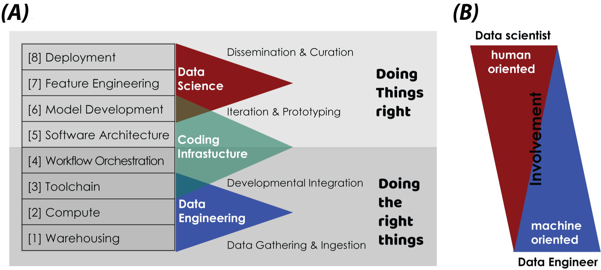
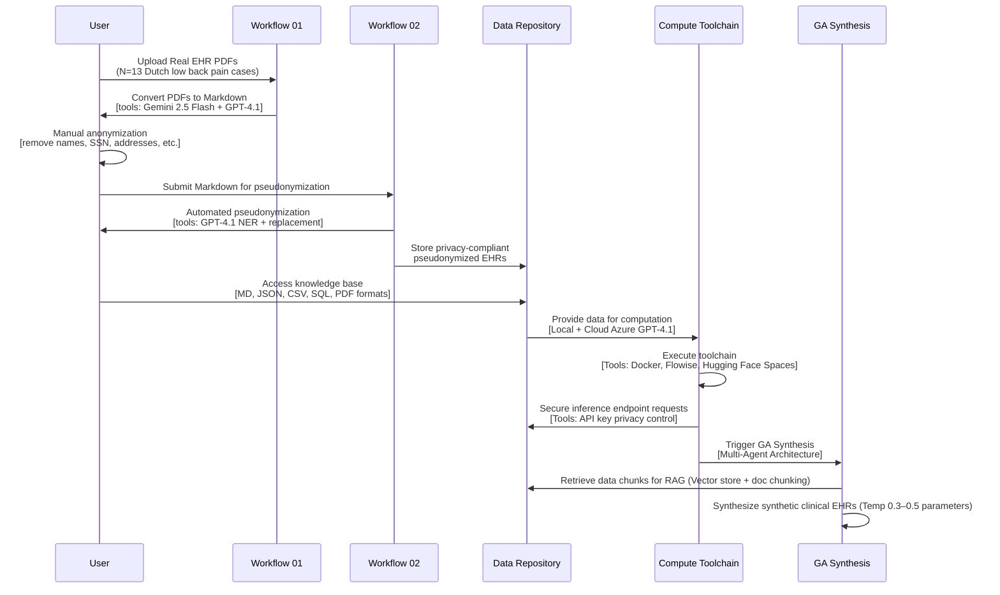
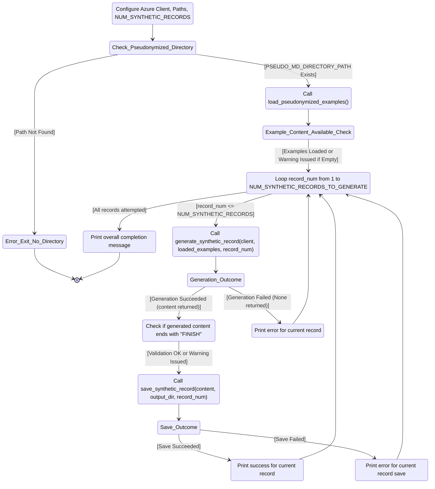
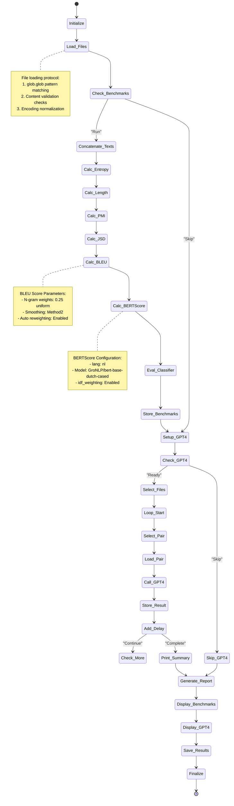
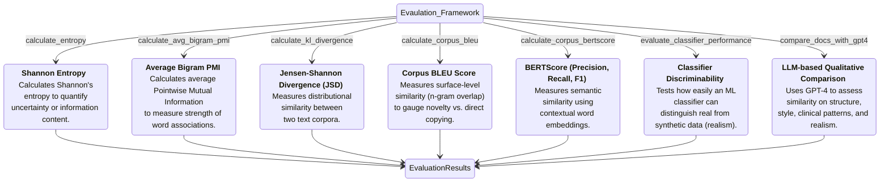
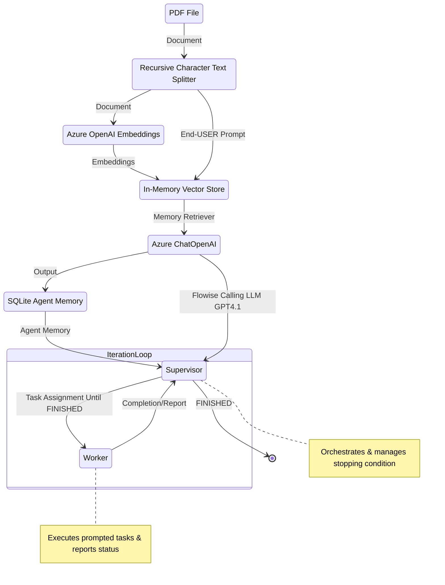

<span style="font-size: 13px;">

# *Privacy-, Linguistic-, and Information-Preserving Synthesis of Clinical Documentation through Generative Agents*

<p align="center">
  
</p>

This repository provides a detailed overview of the source code and numerical algorithms used in our research paper, *"Privacy, Linguistic & Information Preserving Synthesis of Clinical Documentation Through Generative Agents"* **(Frontiers in AI)**. 

###  [Watch Synthetic Health Data Generation video](https://github.com/HR-DataLab-Healthcare/RESEARCH_SUPPORT/blob/main/PROJECTS/Generative_Agent_based_Data-Synthesis/VIDEOs/Synthetic%20Health%20Data%20Generation-small.gif)


We hypothesize that synthetic health data generation (SHDG), leveraging pre-trained large language models (LLMs) instantiated as GAs, could offer a practical solution by creating synthetic patient information that mimics genuine EHRs.

As to date,  no open-source protocol is available to researchers to develop and test GA-assisted SHDG. The data pipeline at the core of our publication is grounded in a *Data Science Infrastructure (DSI) Stack*, which helps researchers to systematically break down the complex challenge of GA-assisted SHDG into a sequence of workflows.  

To facilitate understanding and reproducibility, we brokedown the GA-assisted SHDG pipeline into four workflows: [FLOW01](https://github.com/HR-DataLab-Healthcare/RESEARCH_SUPPORT/tree/main/PROJECTS/Generative_Agent_based_Data-Synthesis#flow01-pdf-text-extraction-and-markdown-conversion); [FLOW02](https://github.com/HR-DataLab-Healthcare/RESEARCH_SUPPORT/tree/main/PROJECTS/Generative_Agent_based_Data-Synthesis#flow02-pseudonymization-of-markdown-content); [FLOW03](https://github.com/HR-DataLab-Healthcare/RESEARCH_SUPPORT/tree/main/PROJECTS/Generative_Agent_based_Data-Synthesis#flow03-synthetic-data-generation); [FLOW04](https://github.com/HR-DataLab-Healthcare/RESEARCH_SUPPORT/tree/main/PROJECTS/Generative_Agent_based_Data-Synthesis#flow04-comparative-analysis-of-synthetic-vs-genuine-ehrs). Each workflow is accompanied by a state diagram and speudo-code illustrating its sequence and interconnections, enabling researchers to follow, adapt, or extend our methodology for new applications.

We also provide a modular, no-code proof of concept in the form of a Flowise-based [Agentflow](https://github.com/HR-DataLab-Healthcare/RESEARCH_SUPPORT/blob/main/PROJECTS/Generative_Agent_based_Data-Synthesis/AGENT-FLOWS/GA-ASSISTED-SHDG.json), featuring targeted prompt examples for both supervisors and workers. Included is a hands-on guide for responsible deployment and interaction of [GA-assisted SHDG-workflows](https://github.com/HR-DataLab-Healthcare/RESEARCH_SUPPORT/tree/main/PROJECTS/Generative_Agent_based_Data-Synthesis#ga-assisted-shdg-workflow), implemented through Hugging Face Spaces.<br> 
It represents a toolchain implementation to accomodate reproducibility and to encourage non–AI experts, such as healthcare workers, to confidently explore, adapt, and apply these workflows within their own professional contexts.
This proof of concept is built on open-source digital infrastructure that enables rapid prototyping and controlled sharing of workflows, while API key–secured inference endpoints ensure privacy compliance.

For those interested in how the synthesised EHRs look like, these are added as a set of 160 dossiers in a single PDF document—[Supervisor -Worker-interactions-and-output-dossiers-1-to-160cc.pdf](https://github.com/HR-DataLab-Healthcare/RESEARCH_SUPPORT/tree/main/PROJECTS/Generative_Agent_based_Data-Synthesis/SYNTHETIC-DATASET)—, which serves as an illustrative reference showcasing the output quality, structure, and fidelity of the generated records while ensuring that all content remains fully synthetic and privacy-compliant.

The accompanying Jupyter Notebooks are available in the [`CODE` directory](https://github.com/HR-DataLab-Healthcare/RESEARCH_SUPPORT/tree/main/PROJECTS/Generative_Agent_based_Data-Synthesis/CODE), including notebooks for performing document-level assessment in the [`DESCRIPTOR` subdirectory](https://github.com/HR-DataLab-Healthcare/RESEARCH_SUPPORT/tree/main/PROJECTS/Generative_Agent_based_Data-Synthesis/CODE/DESCRIPTOR).

#

<details>
<summary><h2><strong>GA-assisted SHDG Protocol: PART02 <br> <sub>click to view — Data Ingestion, Warehousing, Compute, and GA Synthesis </strong></h2></summary>

<br>


</details>

<details>
<summary><h2><strong>GA-assisted SHDG Protocol: PART02  <br> <sub>click to view — Deployment, Benchmarking, and Iterative Improvement </strong></h2></summary>

<br>

```mermaid 
sequenceDiagram
    participant GA as GA Synthesis
    participant Deploy as Deployment Platform
    participant End User
    participant Benchmark as Benchmarking 
    participant Expert as Human Expert

    GA->>Deploy: Send synthetic EHRs for deployment
    Deploy->>Deploy: Deploy on Hugging Face Spaces using Docker + Flowise / API endpoints
    Deploy->>User: Synthetic synthetic EHRs delivered <br> [GDPR + EU AI Act compliant]

    Deploy->>Benchmark: Start benchmarking tests
    Benchmark->>Benchmark: Document & corpus metrics calculation
    Benchmark->>Benchmark: Machine discernibility tests
    Benchmark->>GA: Provide fidelity scores <br> [pseudonymized  vs real EHRs]
    Benchmark->>Expert: Request human expert review on realism, coherence, validity

    Expert->>Benchmark: Submit review feedback
    Benchmark->>User: Return benchmarking results and expert reviews

    User->>Expert: Collaborate on iterative improvement <br> [GenAI + human experts]
    Expert->>User: Refine code, tune prompts <br>  update RAG data, evaluate metrics
 ```

</details>

#
<details>
<summary><h2><strong>FLOW01: PDF Text Extraction and Markdown Conversion <br> <sub>click to view statediagram</strong></h2></summary> 

 ```mermaid 

  stateDiagram-v2
  Initialize_Process: Initialize Azure OpenAI client and paths

  Initialize_Process --> Find_PDFs_In_Directory
  Find_PDFs_In_Directory: Scan PDF_DIRECTORY_PATH

  Find_PDFs_In_Directory --> Process_Next_PDF_Decision
  state Process_Next_PDF_Decision <<choice>>
  Process_Next_PDF_Decision --> Extract_Text_From_PDF : [PDF available]
  Process_Next_PDF_Decision --> End_Process : [No more PDFs]

  Extract_Text_From_PDF: Call extract_text_from_pdf()
  Extract_Text_From_PDF --> Text_Extraction_Check
  state Text_Extraction_Check <<choice>>
  Text_Extraction_Check --> Convert_Text_To_Markdown : [Extraction Succeeded]
  Text_Extraction_Check --> Log_Extraction_Error : [Extraction Failed]

  Log_Extraction_Error: Log PDF reading error
  Log_Extraction_Error --> Process_Next_PDF_Decision

  Convert_Text_To_Markdown: Call convert_text_to_markdown()
  Convert_Text_To_Markdown --> Markdown_Conversion_Check
  state Markdown_Conversion_Check <<choice>>
  Markdown_Conversion_Check --> Save_Single_Markdown_File : [Conversion Succeeded]
  Markdown_Conversion_Check --> Log_Conversion_Error : [Conversion Failed]

  Log_Conversion_Error: Log API or conversion error
  Log_Conversion_Error --> Process_Next_PDF_Decision

  Save_Single_Markdown_File: Call save_single_markdown_file()
  Save_Single_Markdown_File --> File_Save_Check
  state File_Save_Check <<choice>>
  File_Save_Check --> Log_Success : [Save Succeeded]
  File_Save_Check --> Log_Save_Error : [Save Failed]

  Log_Save_Error: Log file writing error
  Log_Save_Error --> Process_Next_PDF_Decision

  Log_Success: Log successful processing for the PDF
  Log_Success --> Process_Next_PDF_Decision

  End_Process --> [*]

 ```


  Shown is the flow used for transforming raw PDF documents into a structured Markdown format. This conversion makes the textual content more amenable to subsequent processing, such as pseudonymization and analysis. The process leverages an AI model for intelligent structuring of the extracted text.

  * **Purpose:** 
    *   To systematically extract all readable text content from a collection of PDF files and then convert this raw text into well-structured Markdown. 
    *   The conversion aims to preserve or infer document elements like headings, lists, and paragraphs, utilizing the capabilities of an Azure OpenAI GPT-4.1 model.

  * **Key Code Components:**

    *  **`extract_text_from_pdf(pdf_path)`**:
        *   **Library Used:** `PyMuPDF (fitz)`
        *   **Functionality:**
            *   Opens a PDF file specified by `pdf_path`.
            *   Iterates through each page of the PDF.
            *   Extracts plain text from each page using `page.get_text("text")`.
            *   Concatenates the text from all pages, adding a double newline (`<br><br>`) as a separator between page contents.
            *   Includes basic error handling to catch and report issues during PDF reading, returning `None` if an error occurs.

    *  **`convert_text_to_markdown(text_content, pdf_filename)`**:
        *   **Library Used:** `openai` (for Azure OpenAI)
        *   **Functionality:**
            *   Takes the raw `text_content` (extracted from a PDF) and the original `pdf_filename` (for context in prompts) as input.
            *   If `text_content` is empty, it returns `None`.
            *   Constructs a request to the Azure OpenAI API using the initialized `client` object.
            *   **AI Model Invocation:**
                *   Uses the deployment specified by `AZURE_OPENAI_DEPLOYMENT_NAME` (e.g., "GPT4.1").
                *   Sends a chat completion request with:
                    *   A `system_prompt` instructing the AI to act as an assistant specialized in converting raw text to well-structured Markdown, emphasizing retention of meaning, structure, and technical details without adding conversational fluff.
                    *   A `user_prompt` that includes the `text_content` and `pdf_filename`, asking the AI to convert the text to Markdown, paying attention to potential structural elements (headings, lists, paragraphs) and to output *only* the Markdown content.
                    *   `temperature` is set to `0.2` for more deterministic and factual output.
                    *   `max_tokens` is set to `24000` to accommodate potentially large documents.
            *   Extracts the AI-generated Markdown from the API response.
            *   Includes error handling for the API call, printing an error message and returning `None` if the conversion fails.

    *  **`save_single_markdown_file(markdown_content, output_path)`**:
        *   **Library Used:** `os` (for path manipulation, though file I/O is standard Python)
        *   **Functionality:**
            *   A utility function that takes the generated `markdown_content` string and an `output_path`.
            *   Writes the `markdown_content` to the specified `output_path` using UTF-8 encoding.
            *   Includes basic error handling for file writing operations.

  * **Inputs:**

    *   A collection of original PDF files located in the directory specified by the `PDF_DIRECTORY_PATH` variable.
    *   Azure OpenAI Service Configuration:
        *   `AZURE_OPENAI_ENDPOINT`: The endpoint URL for your Azure OpenAI service.
        *   `AZURE_OPENAI_API_KEY`: Your Azure OpenAI API key (Note: This is a sensitive credential and should be managed securely, not hardcoded directly for production or shared repositories).
        *   `AZURE_OPENAI_DEPLOYMENT_NAME`: The specific deployment name of your model in Azure OpenAI Studio (e.g., "GPT4.1").
        *   `API_VERSION`: The API version for the Azure OpenAI service (e.g., "2024-12-01-preview").
    *   An initialized `AzureOpenAI` client object, configured with the above credentials.

* **Outputs:**

    *   Individual Markdown files, where each file corresponds to an input PDF.
    *   These Markdown files are named `[original_filename_without_extension].md` (e.g., `report1.pdf` becomes `report1.md`).
    *   The output Markdown files are saved directly within the `PDF_DIRECTORY_PATH`.

* **Configuration Variables Used:**

  *   `PDF_DIRECTORY_PATH`: String specifying the absolute or relative path to the directory containing the input PDF files.
  *   `AZURE_OPENAI_ENDPOINT`, `AZURE_OPENAI_API_KEY`, `AZURE_OPENAI_DEPLOYMENT_NAME`, `API_VERSION`: As described under "Inputs".
  *   Prompts within `convert_text_to_markdown`:
      *   `system_prompt`: Defines the AI's role and general output requirements.
      *   `user_prompt`: Provides the specific text and instructions for the conversion task.

* **Workflow Summary:**

    * The main execution block iterates through each PDF file found in `PDF_DIRECTORY_PATH`. 
    * For each PDF:
        - Text is extracted using `extract_text_from_pdf`.
        - If text extraction is successful, the text is passed to `convert_text_to_markdown`.
        - If Markdown conversion is successful, the resulting Markdown content is saved as an individual `.md` file using `save_single_markdown_file`.
        -Progress and any errors are logged to the console.

  </details>


> The SHDG pipline begins with ingesting and converting anonymized, real-world clinical notes from PDF to Markdown format [(FLOW01)](https://github.com/HR-DataLab-Healthcare/RESEARCH_SUPPORT/blob/main/PROJECTS/Generative_Agent_based_Data-Synthesis/CODE/FLOW01%2BFLOW02.ipynb), followed by rigorous data pseudonymization to safeguard patient privacy [(FLOW02)](https://github.com/HR-DataLab-Healthcare/RESEARCH_SUPPORT/blob/main/PROJECTS/Generative_Agent_based_Data-Synthesis/CODE/FLOW01%2BFLOW02.ipynb).

#

<details>
  <summary><h2><strong>FLOW02: Pseudonymization of Markdown Content<br> <sub>click to view statediagram</strong></h2></summary>


 ```mermaid 

stateDiagram-v2
    Initialize_Process: Initialize Script & Azure OpenAI Client
    Initialize_Process --> Find_Markdown_Files

    Find_Markdown_Files: Scan PDF_DIRECTORY_PATH for .md files (from Stage 1)
    Find_Markdown_Files --> Process_Next_Markdown_Decision
    state Process_Next_Markdown_Decision <<choice>>
        Process_Next_Markdown_Decision --> Read_Markdown_Content : [Markdown file available]
        Process_Next_Markdown_Decision --> End_Pseudonymization_Process : [No more Markdown files]

    Read_Markdown_Content: Read content of current Markdown file
    Read_Markdown_Content --> Call_Pseudonymize_Markdown

    Call_Pseudonymize_Markdown: pseudonymize_markdown(content, filename)
    Call_Pseudonymize_Markdown --> Pseudonymization_Check
    state Pseudonymization_Check <<choice>>
        Pseudonymization_Check --> Save_Pseudonymized_File : [AI returns pseudonymized content]
        Pseudonymization_Check --> Log_Pseudonymization_Error : [AI fails or content empty]

    Log_Pseudonymization_Error: Log API error or empty content
    Log_Pseudonymization_Error --> Collect_Content_For_Combined_File_Error_Path
    Collect_Content_For_Combined_File_Error_Path: (No content to add)
    Collect_Content_For_Combined_File_Error_Path --> Process_Next_Markdown_Decision

    Save_Pseudonymized_File: save_single_markdown_file(pseudo_content, output_path)
    Save_Pseudonymized_File --> File_Save_Check
    state File_Save_Check <<choice>>
        File_Save_Check --> Log_Save_Success : [Save Succeeded]
        File_Save_Check --> Log_Save_Error : [Save Failed]

    Log_Save_Error: Log file writing error
    Log_Save_Error --> Collect_Content_For_Combined_File_Save_Error_Path
    Collect_Content_For_Combined_File_Save_Error_Path: (No content to add)
    Collect_Content_For_Combined_File_Save_Error_Path --> Process_Next_Markdown_Decision

    Log_Save_Success: Log successful pseudonymization and save
    Log_Save_Success --> Collect_Content_For_Combined_File
    Collect_Content_For_Combined_File: Add pseudonymized content to list for combined file
    Collect_Content_For_Combined_File --> Process_Next_Markdown_Decision

    End_Pseudonymization_Process: (Individual files processed, combined file creation follows)
    End_Pseudonymization_Process --> [*]

 ```

<br> 

  Shown is the workflow used to protect patient privacy. It utilizes Markdown files to identify and replace personal identifiers, specifically names, with realistic-sounding pseudonyms. This creates a safer dataset for subsequent tasks, such as training generative models or sharing example data, while aiming to preserve the original document structure and all other content.

  *  **Purpose:**
        * To automatically replace privacy-sensitive information, focusing on person names (e.g., patients, doctors, staff, family members), with plausible, fabricated pseudonyms. 
        * This process is performed using an Azure OpenAI model, with strict instructions to *only* modify names and meticulously preserve the original Markdown formatting and all other textual content.

  *   **Key Code Components:**
      *   **`pseudonymize_markdown(markdown_content, pdf_filename)`**:
          *   **Library Used:** `openai` (for Azure OpenAI).
          *   **Functionality:**
              *   Accepts the `markdown_content` (from Stage 1) and the original `pdf_filename` (for logging/context) as input.
              *   Returns `None` if the input `markdown_content` is empty.
              *   Constructs a `pseudo_user_prompt` that combines the input `markdown_content` with explicit instructions to replace only person names and maintain Markdown integrity.
              *   **AI Model Invocation (Azure OpenAI):**
                  *   Uses the same initialized `client` object and `AZURE_OPENAI_DEPLOYMENT_NAME` (e.g., "GPT4.1") as in Stage 1.
                  *   Sends a chat completion request with:
                      *   The `PSEUDO_SYSTEM_MESSAGE_CONTENT` (see Configuration below) which strictly defines the AI's role and constraints.
                      *   The constructed `pseudo_user_prompt` containing the actual Markdown text and task instructions.
                      *   `temperature` set to `0.2` to encourage deterministic and rule-abiding output.
                      *   `max_tokens` set to `24000` (or a similar appropriate value) to handle the full document.
                  *   Extracts the pseudonymized Markdown text from the AI's response.
                  *   Includes error handling for the API call, printing an error message and returning `None` if pseudonymization fails.
      *   **`save_single_markdown_file(markdown_content, output_path)`**:
          *   This is the same helper function reused from Stage 1.
          *   It saves the pseudonymized Markdown content to a new file, typically prefixed with "pseudo_".

  *   **Inputs:**
      *   Individual Markdown files (`[original_filename].md`) generated in Stage 1, located in `PDF_DIRECTORY_PATH`.
      *   Azure OpenAI Service Configuration:
          *   `AZURE_OPENAI_ENDPOINT`: The endpoint URL for your Azure OpenAI service.
          *   `AZURE_OPENAI_DEPLOYMENT_NAME`: The specific deployment name of your model (e.g., "GPT4.1").
          *   `API_VERSION`: The API version for the Azure OpenAI service.
          *   *(API Key is configured in the environment or client initialization but not detailed here for security).*
      *   An initialized `AzureOpenAI` client object.

  *   **Outputs:**
      *   Individual pseudonymized Markdown files.
      *   Naming convention: `pseudo_[original_filename_without_extension].md` (e.g., `pseudo_report1.md`).
      *   These files are saved within the same `PDF_DIRECTORY_PATH`.

  *   **Configuration Variables Used:**
      *   `PDF_DIRECTORY_PATH`: Path to the directory containing the Markdown files.
      *   Azure OpenAI parameters: `AZURE_OPENAI_ENDPOINT`, `AZURE_OPENAI_DEPLOYMENT_NAME`, `API_VERSION`.
      *   **`PSEUDO_SYSTEM_MESSAGE_CONTENT`**:
          ```
          "Vervang in de aangeleverde tekst uitsluitend de persoonsnamen (zoals patiëntnamen, namen van artsen, medewerkers, familieleden, etc.) door realistische, verzonnen pseudoniemen. Zorg ervoor dat de originele markdown opmaak van de tekst volledig behouden blijft. Geef als antwoord *alleen* de aangepaste tekst terug, zonder enige uitleg of extra commentaar."
          ```
          *(Translation: "In the provided text, replace only personal names (such as patient names, names of doctors, employees, family members, etc.) with realistic, fabricated pseudonyms. Ensure that the original markdown formatting of the text is fully preserved. Return *only* the modified text as the answer, without any explanation or extra commentary.")*
      *   **`PRIVACY_CATEGORIES`** (primarily for contextual understanding and potential future use in prompt refinement, though the current system prompt is highly specific to names):
          ```python
          PRIVACY_CATEGORIES = [
              "Persoonsnamen (patiënt, arts, etc.)",
              "Adressen",
              "Telefoonnummers",
              "E-mailadressen",
              "Geboortedata",
              "Burgerservicenummer (BSN) of andere ID-nummers",
              "Medische klachten, symptomen of diagnoses",
              "Medische behandelingen, medicatie of procedures",
              "Verzekeringsgegevens",
              "Financiële gegevens",
              "Andere direct identificeerbare persoonlijke informatie"
          ]
          ```

*  **Workflow Summary:**
    
    * The main script iterates through each Markdown file (produced in Stage 1) found in `PDF_DIRECTORY_PATH`. 
    * For each Markdown file:
        - The content of the Markdown file is read.
        - This content is passed to the `pseudonymize_markdown` function.
        - If the AI successfully returns pseudonymized content: <br>
        The `save_single_markdown_file` function saves this modified content to a new file, prefixed with `pseudo_`.
        - Progress and any errors encountered during the API call or file operations are logged to the console.
        - The script also collects all pseudonymized content to later create a combined pseudonymized Markdown file.
</details>

> We then generate synthetic clinical notes by leveraging advanced large language model (LLM) techniques, comparing source code based on prompting alone [(FLOW03)](https://github.com/HR-DataLab-Healthcare/RESEARCH_SUPPORT/blob/main/PROJECTS/Generative_Agent_based_Data-Synthesis/CODE/FLOW03.ipynb) with a Generative Agent-based approach [(FLOW03_AGENT_BASED)](https://github.com/HR-DataLab-Healthcare/RESEARCH_SUPPORT/blob/main/PROJECTS/Generative_Agent_based_Data-Synthesis/CODE/FLOW03_OPENAI_AGENT_VERSION.ipynb).     
  


#

  <details>
  <summary><h2><strong>FLOW03: Synthetic Data Generation<br> <sub>click to view statediagram</strong></h2></summary>



<br>

Shown is the workflow used to generate synthetic EHRs. It uses a two-tiered prompting strategy:  *Supervisor prompts set overall structure and standards*, while *Worker prompts provide case-specific instructions*.  In doing so, the GPT-4.1 LLM is directed to produce synthetic EHRs that are not only realistic and coherent but also consistently formatted and effectively anonymized. This approach is designed to create valuable data for research and development purposes without compromising the privacy of real patient information.


  *  **Purpose:**
        * The workflow leverages Azure OpenAI GPT-4.1 LLM to generate artificial EHRs These synthetic dossiers are modeled after a set of previously pseudonymized real-world EHRs, aiming to produce realistic and coherent patient records for physiotherapy, specifically focusing on low back pain cases. 
        * The generation process is guided by detailed prompts and example data to ensure the quality and relevance of the output.

   
            *  **Supervisor Instructions (`system_prompt`):**
                *   This prompt sets the **overall context and persona** for the LLM. It's like a high-level directive from a supervisor to an expert worker.
                *   It instructs the LLM to act as an "experienced physiotherapist" tasked with generating "realistic, complete, and coherent Electronic Patient Dossiers (EPDs) in Dutch."
                *   It establishes the **methodology** (ICF framework, KNGF guidelines for low back pain) and **constraints** (use anonymized information, expert guidance).
                *   Crucially, it includes the instruction: "**Produce ONLY the requested patient dossier and nothing else.**" This primes the LLM to focus solely on the EPD generation.

            *  **Worker Instructions (`user_prompt`):**
                *   This prompt provides the **specific, detailed, step-by-step instructions** for the *current* generation task. It's akin to a detailed work order given to the worker by the supervisor.
                *   It reiterates the task (generate *one* EPD for low back pain) and provides a comprehensive list of **required sections and their content** (Anamnese, ICF Diagnosis, Treatment Goals, Treatment Plan, SOEP Notes).
                *   It specifies **language, style, and formatting requirements** (professional Dutch, expand abbreviations, realistic tone).
                *   It incorporates the `example_markdown_content` to provide concrete examples of structure and quality, while explicitly demanding a **new and unique** case.  

            * Interaction with the LLM 

                - Both the `system_prompt` (Supervisor) and `user_prompt` (Worker) are sent to the Azure OpenAI GPT-4.1 model in each API call.  
                    - The `system_prompt` defines the model's role and core behavior.  
                    - The `user_prompt` gives specific, task-oriented instructions for the current dossier. 

                - LLM responds by reconciling both roles The model reads the Supervisor’s persistent context and the Worker’s current, task-specific instructions. It combines these to produce output that meets overall standards *and* immediate requirements.

                - *loop for each dossier:* For each new dossier, the Worker’s prompt can be refreshed or customized, while the Supervisor’s rules persist. This ensures that every record is unique but still adheres to clinical and structural consistency.

            - *"FINISH" signals collaborative task completion:* The dossier must end with the "FINISH" string, confirming that the LLM has followed Supervisor and Worker instructions all the way through.  
            
            This **iterative, collaborative interaction** ensures that synthetic dossiers are both reliably structured (thanks to the Supervisor) and tailored to the specific requirements or examples of each record (thanks to the Worker), ending only when all steps are *FINISH*ed.  
*   **Key Code Components:**
    *   [`load_pseudonymized_examples(directory_path)`](d:\OneDrive%20-%20Hogeschool%20Rotterdam\1_CURRENT_CODE\DE_IDENTIFY\EPD_DATA_SYNTHESIZER_GPT4.1_V01.ipynb):
        *   Finds all files matching `pseudo_*.md` in the given `directory_path`.
        *   Reads the content of each found file.
        *   Formats the combined content with clear separators (`--- BEGIN VOORBEELD DOSSIER: ... ---`, `--- EINDE VOORBEELD DOSSIER ---`) to help the AI distinguish individual examples.
        *   Returns a single string containing all example content, or an empty string with a warning if no examples are found.
    *   [`generate_synthetic_record(client, example_markdown_content, record_number)`](d:\OneDrive%20-%20Hogeschool%20Rotterdam\1_CURRENT_CODE\DE_IDENTIFY\EPD_DATA_SYNTHESIZER_GPT4.1_V01.ipynb):
        *   **Prompts:** This function defines two key prompts to guide the AI, simulating a Supervisor-Worker interaction:
            *   **`system_prompt` (Supervisor Instructions):** Sets the AI's core **persona** and **overall task**. It instructs the AI to act as an **experienced physiotherapist** generating realistic Dutch EPDs. It establishes the **context** (using anonymized info, expert guidance), **methodology** (applying ICF framework, following KNGF low back pain guidelines), and a crucial **constraint** (produce *only* the requested patient dossier). This acts like a high-level directive from a supervisor.
            *   **`user_prompt` (Worker Instructions):** Provides the **specific, detailed, step-by-step instructions** for the *current* generation task. This acts like the specific work order given to the worker. It details:
                *   **Task Focus:** Generate *one* complete, realistic EPD *only* for low back pain (acute, subacute, or chronic). Explicitly forbids other conditions.
                *   **Required Structure and Content (in order):**
                    1.  **Anamnese Summary:** Specifies content (history, impact, coping, context), style (narrative, professional Dutch), and requirement (classify pain duration).
                    2.  **ICF-based Diagnosis:** Lists all mandatory components (impairments, limitations, restrictions, personal/environmental factors, risk factors, reformulated help request).
                    3.  **Treatment Goals:** Mandates SMART, patient-centered, functional goals (what the patient wants to do), clarifies role of clinical scores (support, not the goal itself), and requires a target date.
                    4.  **Treatment Plan:** Requires description of interventions and rationale, based on KNGF guidelines and goals.
                    5.  **SOEP Progress Notes:** Sets quantity (3-8 notes), format (full SOEP per session), and content requirements (show progression/changes, clinical reasoning).
                    6.  **Language/Style:** Demands professional Dutch, expansion of abbreviations, and realistic tone matching examples.
                *   **Example Guidance:** Injects the `example_markdown_content` as a reference for structure, style, and detail, while explicitly demanding a **new and unique** case.  
                *   **Output Specification:** Instructs the AI to generate *only* the dossier content, starting with the anamnese and ending precisely with the word "FINISH". Re-emphasizes adherence to *all* instructions.
        *   **API Call:** Calls the `client.chat.completions.create` method with the system ("Supervisor") and user ("Worker") prompts, the specified model ([`AZURE_OPENAI_DEPLOYMENT_NAME`](d:\OneDrive%20-%20Hogeschool%20Rotterdam\1_CURRENT_CODE\DE_IDENTIFY\EPD_DATA_SYNTHESIZER_GPT4.1_V01.ipynb)), a higher `temperature` (0.8) for creativity, and sufficient `max_tokens` (8000).
        *   **Error Handling:** Catches potential API errors and returns the generated text content or `None` on failure.
    *   [`save_synthetic_record(synthetic_content, output_dir, record_number)`](d:\OneDrive%20-%20Hogeschool%20Rotterdam\1_CURRENT_CODE\DE_IDENTIFY\EPD_DATA_SYNTHESIZER_GPT4.1_V01.ipynb):
        *   Ensures the specified `output_dir` exists, creating it if necessary.
        *   Constructs a filename like `synthetic_patient_001.md` (using zero-padding for sorting).
        *   Writes the provided `synthetic_content` to the file using UTF-8 encoding.
        *   Handles potential file writing errors.

    *   [`load_pseudonymized_examples(directory_path)`](d:\OneDrive%20-%20Hogeschool%20Rotterdam\1_CURRENT_CODE\DE_IDENTIFY\EPD_DATA_SYNTHESIZER_GPT4.1_V01.ipynb):
        *   Finds all files matching `pseudo_*.md` in the given `directory_path`.
        *   Reads the content of each found file.
        *   Formats the combined content with clear separators (`--- BEGIN VOORBEELD DOSSIER: ... ---`, `--- EINDE VOORBEELD DOSSIER ---`) to help the AI distinguish individual examples.
        *   Returns a single string containing all example content, or an empty string with a warning if no examples are found.
    *   [`generate_synthetic_record(client, example_markdown_content, record_number)`](d:\OneDrive%20-%20Hogeschool%20Rotterdam\1_CURRENT_CODE\DE_IDENTIFY\EPD_DATA_SYNTHESIZER_GPT4.1_V01.ipynb):
        *   **Prompts:** This function defines two key prompts to guide the AI:
            *   **`system_prompt`**: Sets the AI's persona and overall task. It instructs the AI to act as a physiotherapist generating realistic Dutch EPDs based on anonymized information and expert guidance, specifically using the ICF framework and KNGF guidelines for low back pain, and to only output the requested dossier.
            *   **`user_prompt`**: Provides detailed instructions for generating *one* specific EPD. It specifies:
                *   **Condition Focus:** Generate only for acute, subacute, or chronic low back pain.
                *   **Required Sections (in order):**
                    1.  **Anamnese Summary:** Concise narrative of history, impact, coping, context; professional Dutch; specify duration (acute/subacute/chronic).
                    2.  **ICF-based Diagnosis:** Include impairments, activity limitations, participation restrictions, personal factors, environmental factors, risk/prognostic factors, and a reformulation of the patient's request for help.
                    3.  **Treatment Goals:** SMART, patient-centered, functional goals (what the patient wants to do again); clinical scores (PSK, NRS, ODI) can be used as criteria but aren't the goal itself; specify target date.
                    4.  **Treatment Plan:** Describe interventions (manual therapy, exercise, education, etc.) and rationale, based on KNGF guidelines and goals.
                    5.  **SOEP Progress Notes:** 3 to 8 separate notes (one per session) using the full SOEP format (Subjective, Objective, Evaluation, Plan); show realistic progression/stagnation/adjustments over time.
                    6.  **Language/Style:** Professional, natural Dutch; expand common abbreviations (PSK, LWK); realistic and varied tone matching examples.
                *   **Example Usage:** Explicitly includes the loaded `example_markdown_content` as a reference for structure, style, language, and detail, while demanding a completely new and unique case.
                *   **Output Format:** Generate *only* the dossier content, starting with the anamnese and ending precisely with the word "FINISH". Ensure all requested parts and instructions are followed.
        *   **API Call:** Calls the `client.chat.completions.create` method with the system and user prompts, the specified model ([`AZURE_OPENAI_DEPLOYMENT_NAME`](d:\OneDrive%20-%20Hogeschool%20Rotterdam\1_CURRENT_CODE\DE_IDENTIFY\EPD_DATA_SYNTHESIZER_GPT4.1_V01.ipynb)), a higher `temperature` (0.8) for creativity, and sufficient `max_tokens` (8000) for a potentially long record.
        *   **Error Handling:** Catches potential API errors and returns the generated text content or `None` on failure.
    *   [`save_synthetic_record(synthetic_content, output_dir, record_number)`](d:\OneDrive%20-%20Hogeschool%20Rotterdam\1_CURRENT_CODE\DE_IDENTIFY\EPD_DATA_SYNTHESIZER_GPT4.1_V01.ipynb):
        *   Ensures the specified `output_dir` exists, creating it if necessary.
        *   Constructs a filename like `synthetic_patient_001.md` (using zero-padding for sorting).
        *   Writes the provided `synthetic_content` to the file using UTF-8 encoding.
        *   Handles potential file writing errors.


*   **Inputs:**
    *   Pseudonymized Markdown files (`pseudo_*.md`) located in [`PSEUDO_MD_DIRECTORY_PATH`](d:\OneDrive%20-%20Hogeschool%20Rotterdam\1_CURRENT_CODE\DE_IDENTIFY\EPD_DATA_SYNTHESIZER_GPT4.1_V01.ipynb).
    *   Azure OpenAI service credentials and configuration.

    *   **Azure Credentials:** [`AZURE_OPENAI_ENDPOINT`](d:\OneDrive%20-%20Hogeschool%20Rotterdam\1_CURRENT_CODE\DE_IDENTIFY\EPD_DATA_SYNTHESIZER_GPT4.1_V01.ipynb), [`AZURE_OPENAI_API_KEY`](d:\OneDrive%20-%20Hogeschool%20Rotterdam\1_CURRENT_CODE\DE_IDENTIFY\EPD_DATA_SYNTHESIZER_GPT4.1_V01.ipynb), [`AZURE_OPENAI_DEPLOYMENT_NAME`](d:\OneDrive%20-%20Hogeschool%20Rotterdam\1_CURRENT_CODE\DE_IDENTIFY\EPD_DATA_SYNTHESIZER_GPT4.1_V01.ipynb), [`API_VERSION`](d:\OneDrive%20-%20Hogeschool%20Rotterdam\1_CURRENT_CODE\DE_IDENTIFY\EPD_DATA_SYNTHESIZER_GPT4.1_V01.ipynb) are defined to connect to the Azure service.
    *   **Directory Paths:**
        *   [`PSEUDO_MD_DIRECTORY_PATH`](d:\OneDrive%20-%20Hogeschool%20Rotterdam\1_CURRENT_CODE\DE_IDENTIFY\EPD_DATA_SYNTHESIZER_GPT4.1_V01.ipynb): Specifies the location of the pseudonymized Markdown files (`pseudo_*.md`) used as examples.
        *   [`SYNTHETIC_OUTPUT_DIR`](d:\OneDrive%20-%20Hogeschool%20Rotterdam\1_CURRENT_CODE\DE_IDENTIFY\EPD_DATA_SYNTHESIZER_GPT4.1_V01.ipynb): Defines the directory where the generated synthetic Markdown files will be saved.
    *   **Generation Control:**
        *   [`NUM_SYNTHETIC_RECORDS_TO_GENERATE`](d:\OneDrive%20-%20Hogeschool%20Rotterdam\1_CURRENT_CODE\DE_IDENTIFY\EPD_DATA_SYNTHESIZER_GPT4.1_V01.ipynb): Sets the number of synthetic EPDs to create.

*   **Outputs:**
    *   Synthetic Markdown files (`synthetic_patient_*.md`) saved in [`SYNTHETIC_OUTPUT_DIR`](d:\OneDrive%20-%20Hogeschool%20Rotterdam\1_CURRENT_CODE\DE_IDENTIFY\EPD_DATA_SYNTHESIZER_GPT4.1_V01.ipynb).
    *   Progress messages printed to the console during execution.
        *   Prints a starting message.
            *   Checks if the [`PSEUDO_MD_DIRECTORY_PATH`](d:\OneDrive%20-%20Hogeschool%20Rotterdam\1_CURRENT_CODE\DE_IDENTIFY\EPD_DATA_SYNTHESIZER_GPT4.1_V01.ipynb) exists; exits with an error if not.
            *   Calls [`load_pseudonymized_examples`](d:\OneDrive%20-%20Hogeschool%20Rotterdam\1_CURRENT_CODE\DE_IDENTIFY\EPD_DATA_SYNTHESIZER_GPT4.1_V01.ipynb) to get the example content. Issues a warning if no examples are loaded but continues execution.
            *   Enters a loop that runs [`NUM_SYNTHETIC_RECORDS_TO_GENERATE`](d:\OneDrive%20-%20Hogeschool%20Rotterdam\1_CURRENT_CODE\DE_IDENTIFY\EPD_DATA_SYNTHESIZER_GPT4.1_V01.ipynb) times.
            *   Inside the loop, for each record:
                *   Calls [`generate_synthetic_record`](d:\OneDrive%20-%20Hogeschool%20Rotterdam\1_CURRENT_CODE\DE_IDENTIFY\EPD_DATA_SYNTHESIZER_GPT4.1_V01.ipynb) to get the synthetic content.
                *   If generation is successful:
                    *   Performs a basic check to see if the content ends with "FINISH" (as requested in the prompt) and warns if not.
                    *   Calls [`save_synthetic_record`](d:\OneDrive%20-%20Hogeschool%20Rotterdam\1_CURRENT_CODE\DE_IDENTIFY\EPD_DATA_SYNTHESIZER_GPT4.1_V01.ipynb) to save the content to a file.
                *   If generation fails, it skips saving.
            *   Prints a completion message after the loop finishes.

  </details>

> The pipeline concludes with a comparative analysis of synthetic versus genuine EHRs [(FLOW04)](https://github.com/HR-DataLab-Healthcare/RESEARCH_SUPPORT/blob/main/PROJECTS/Generative_Agent_based_Data-Synthesis/CODE/FLOW04.ipynb). Our [Benchmark Metrics Overview](#benchmark-metrics-overview) outlines quantitative measures of textual diversity, vocabulary similarity, semantic alignment, and machine discernibility—each with its specific interpretation. Collectively, these metrics enable a holistic evaluation of how well a synthetic corpus obtained through SHDG replicates the complexity, nuance, and realism of real clinical text, providing an in-depth view of corpus-level similarity across multiple dimensions.    
  


#

  <details>
  <summary><h2><strong>FLOW04: Comparative Analysis of Synthetic vs Genuine EHRs<br> <sub>click to view statediagram</strong></h2></summary>

<br>



Shown is the workflow used to assesses the quality and similarity of the generated synthetic EHRs compared to the pseudonymized real-world EHRs using a combination of quantitative benchmarks and a qualitative AI-based review.

  * **Purpose:** 
    * To provide metrics and descriptions that indicate how well the synthetic data captures the linguistic, structural, and clinical characteristics of the real-world pseudonymized data.

  * **Key Code Components:**
    * `load_file_content(filepath)`: Helper function to load content for evaluation.
    * `calculate_entropy(text, unit)`: Calculates Shannon's Entropy (character and word level).
    * `calculate_avg_bigram_pmi(text, min_freq)`: Calculates average Pointwise Mutual Information for word bigrams.
    * `calculate_kl_divergence(text1, text2, unit)`: Calculates Jensen-Shannon Divergence between word distributions.
    * `calculate_corpus_bleu(synthetic_contents, pseudo_contents_list)`: Calculates corpus-level BLEU score.
    * `calculate_corpus_bertscore(synthetic_contents, pseudo_contents_list, lang='nl')`: Calculates BERT Score (Precision, Recall, F1).
    * `evaluate_classifier_performance(pseudo_contents, synthetic_contents, ...)`: Trains a classifier to distinguish data types and reports AUC/AUPRC.
    * `compare_docs_with_gpt4(...)`: Sends document pairs to Azure OpenAI for qualitative comparison.
    * Main script logic for loading data, running benchmarks, performing GPT-4 comparisons, and reporting/saving results.
  * **Inputs:**
    * Pseudonymized Markdown files from `PSEUDO_MD_DIRECTORY_PATH_COMPARE`.
    * Synthetic Markdown files from `SYNTHETIC_MD_DIRECTORY_PATH`.
    * Azure OpenAI API configuration and `client` object.
  * **Outputs:**
    * Quantitative benchmark values printed to console (Entropy, Avg. Length, PMI, JSD, BLEU, BERTScore, Classifier AUC/AUPRC).
    * Qualitative GPT-4 comparison summaries and ratings printed to console.
    * Optional JSON file (`COMPARISON_RESULTS_FILE`) with all results.

  * **Configuration Variables Used:**
    * `PSEUDO_MD_DIRECTORY_PATH_COMPARE`, `SYNTHETIC_MD_DIRECTORY_PATH`.
    * `NUM_COMPARISON_PAIRS_TO_EVALUATE`.
    * `PMI_MIN_BIGRAM_FREQ`.
    * `CLASSIFIER_TEST_SIZE`, `CLASSIFIER_RANDOM_STATE`, `CLASSIFIER_MAX_FEATURES`.
    * Azure OpenAI settings (`AZURE_OPENAI_DEPLOYMENT_NAME`, etc.).

  * **Benchmark Metrics Used:**

    | Benchmark                                     | Category                        | Python Code Package(s) Required      |
    |-----------------------------------------------|---------------------------------|--------------------------------------|
    | Average Document Length (Characters)          | Structural                      | `numpy`                              |
    | Shannon's Entropy (Character & Word)        | Linguistic Complexity           | `collections`, `math`                |
    | Average Bigram Pointwise Mutual Information (PMI) | Linguistic Cohesion             | `collections`, `math`, `numpy`       |
    | Jensen-Shannon Divergence (JSD)               | Distributional Similarity       | `collections`, `numpy`, `scipy.stats`|
    | Corpus BLEU Score                             | N-gram Similarity               | `sacrebleu`                          |
    | Corpus BERT Score (Precision, Recall, F1)     | Semantic Similarity             | `bert_score`                         |
    | Classifier Performance (AUC/AUPRC)            | Statistical Distinguishability  | `scikit-learn`                       |
    | Qualitative GPT-4 Comparison                  | Holistic Qualitative Assessment | `openai` (via `client` object)       |

**Note:**
*   `collections` and `math` are part of the Python standard library.
*   `numpy`, `scipy`, `sacrebleu`, `bert_score`, `scikit-learn`, and `openai` are external libraries that need to be installed.
*   The "Informational Accuracy" mentioned in the documentation is primarily assessed qualitatively via the GPT-4 comparison rather than a distinct coded quantitative benchmark in this script.

  </details>

#
## Benchmark Metrics Overview



<br>


<details>
<summary><h2><strong>click to view table</strong></h2></a></summary>

The table entails our benchmarking framework for assessing the realism and utility of synthetic clinical corpora relative to pseudonymized reference data.
It details the equations, computational steps and interpretative significance of each metric. Together, these metrics enable comprehensive, nuanced measurement of fluency, diversity, fidelity, novelty, and clinical plausibility in synthetic text generation.

<br>

| Benchmark Characterization | Computational Steps | Evaluation Significance & interpretation |
|---------------------------|---------------------|------------------------------------------|
| **Metric:** `calculate_entropy(text, unit)`<br><br>**Purpose:** Calculates Shannon's entropy to quantify the uncertainty or information content of a given text corpus (character or word level).<br><br>**Parameters:**<br>- `text` (str): input corpus<br>- `unit` (str): token type (`'char'` or `'word'`) | 1. Tokenize text into characters or words<br>2. Count token frequencies<br>3. Compute token probabilities<br>4. Compute entropy:<br>$H(X) = -\sum_{i=1}^{n}P(x_i)\log_2P(x_i)$ | - Measures linguistic diversity and predictability;<br>- Entropy close to real data indicates realistic complexity.<br>- Low entropy implies simplistic/repetitive text, high entropy may suggest unnatural complexity. |
| **Metric:** `calculate_avg_bigram_pmi(text, min_freq)`<br><br>**Purpose:** Calculates average Pointwise Mutual Information (PMI) of word bigrams to measure the strength of word associations in the text.<br><br>**Parameters:**<br>- `text` (str): input corpus<br>- `min_freq` (int): minimum frequency threshold for bigrams (default `3`) | 1. Tokenize text into words (lowercased)<br>2. Count frequencies for words and bigrams<br>3. For bigrams meeting `min_freq`:<br>$PMI(w_1,w_2)=\log_2\frac{P(w_1,w_2)}{P(w_1)P(w_2)}$<br>4. Compute average PMI across all qualifying bigrams | - Indicates realistic word collocations and phrase structures<br>- Synthetic PMI close to real data suggests natural language generation<br>- Significantly lower PMI indicates random or unnatural word pairings. |
| **Metric:** **Canonical Jensen-Shannon Divergence (JSD)** via `canonical_jsd`<br><br>**Purpose:** Measures the similarity between two text corpora by comparing their token distributions using a symmetric, stable divergence metric based on a mixture distribution.<br><br>**Parameters:**<br>- `text1` (str): First input text (e.g., pseudonymized text)<br>- `text2` (str): Second input text (e.g., synthetic text)<br>- `unit` (str): Tokenization level, either `'word'` (default, uses NLTK's `word_tokenize`) or `'char'` for character-level<br>- `smoothing`: Small constant added to avoid zero probabilities<br>- `base`: $log_2$ for entropy calculation | 1. Compute the mixture distribution:<br>$M=\frac{1}{2}(P + Q)$<br>2. Calculate the Shannon entropy of each distribution:<br>$H(P)$, $H(Q)$ and $H(M)$<br>3. Calculate the Jensen-Shannon Divergence:<br>$JSD(P\|Q)=H(M)-\frac{1}{2}\big(H(P)+H(Q)\big)$ | - **JSD = 0:** The two distributions are identical; synthetic text perfectly mimics real text patterns.<br>- **Higher JSD:** Indicates greater divergence in token usage between texts.<br>- **Interpretation:** Canonical JSD is symmetric, bounded (0 to 1 when base=2), and more stable than direct KL divergence, making it a reliable metric for evaluating similarity between synthetic and real text corpora.<br>- **Use Case:** Suitable for assessing the quality of synthetic text generation by comparing token-level distributions. |
| **Metric:** **Corpus BLEU Score** via `calculate_corpus_bleu`<br>**Purpose:** Measures surface-level similarity (n-gram overlap) between synthetic corpus and set of reference texts; helps gauge novelty vs. direct copying.<br><br>**Parameters:**<br>- `synthetic_contents` (list of str): List of synthetic documents.<br>- `pseudo_contents_list` (list of str): List of reference (pseudonymized) documents; all are references for each synthetic document. | 1. Compute $BLEU$ $Score$:<br>$BLEU=BP\cdot\exp\left(\sum_{n=1}^N w_n\cdot\log (p_n)\right)$<br>- $p_n$ = Modified n-gram precision for n-grams of size $n$<br>- $w_n = \frac{1}{N}$ = Weight for each n-gram order<br>- $N$ = Maximum n-gram length (set to 4)<br><br>Brevity penalty:<br>$BP=1$ if $c > r$<br>$BP=e^{(1-r/c)}$ if $c≤r$<br>$c$ length of candidate<br>$r$ length of reference | - Score ranges from $0$ to $100$<br>- **High BLEU:** Synthetic text closely matches references, indicating low novelty and possible privacy risk.<br>- **Low BLEU:** Synthetic text has higher novelty; less n-gram overlap with reference data. (Desirable for synthetic data) |
| **Metric:** **BERTScore (Precision, Recall, F1)** via `calculate_corpus_bertscore`<br><br>**Purpose:** Measures semantic similarity between synthetic and reference texts by comparing contextual word embeddings from a pre-trained BERT model. Captures similarity in meaning, not just surface-level overlaps.<br><br>**Parameters:**<br>- `synthetic_contents` (list of str): Synthetic documents.<br>- `pseudo_contents_list` (list of str): Reference documents.<br>- `lang` (str): Language code *e.g., 'nl' for Dutch*<br>- BERT model used: `GroNLP/bert-base-dutch-cased`<br>- `idf` (bool): Inverse Document Frequency weighting $True$ | 1. Generate contextual token embeddings for each sentence in both synthetic and reference sets.<br>2. Compute pairwise cosine similarity between candidate and reference token embeddings.<br>3. Greedy matching of tokens for maximum alignment.<br>4. Calculate **Precision** (average max similarity for synthetic tokens), **Recall** (average max similarity for reference tokens), and **F1** (harmonic mean of P/R).<br>5. Return mean corpus-level scores. | - **Higher F1:** Indicates higher semantic similarity; synthetic text conveys meanings similar to the real data.<br>- Meaningful even if wording diverges.<br>- Useful for assessing whether generated data is relevant and meaningful. |
| **Metric:** **Classifier Discriminability** via `evaluate_classifier_performance`<br><br>**Purpose:** Tests how easily a ML classifier (Logistic Regression on TF-IDF) can distinguish real (pseudonymized) from synthetic data. Indicates the "realism" of synthetic data.<br><br>**Parameters:**<br>- `pseudo_contents` (list of str): Pseudonymized (real) documents.<br>- `synthetic_contents` (list of str): Synthetic documents.<br>- `test_size` (float): Test set proportion.<br>- `random_state` (int): Seed for reproducibility.<br>- `max_features` (int): Maximum TF-IDF features. | 1. Label real data as class 0 and synthetic as class 1<br>2. Split into training/test sets.<br>3. Create pipeline: `TfidfVectorizer` + `LogisticRegression`.<br>4. Train on train set.<br>5. Predict probabilities on test set.<br>6. Compute ROC AUC and AUPRC. | - **AUC/AUPRC ≈ 0.5:** Classifier can't distinguish; synthetic is very realistic.<br>- **AUC/AUPRC ≈ 1.0:** Classifier easily separates classes; unrealistic synthetic data.<br>- Good indication of "machine-discernibility."<br>- Lower values are desirable for synthetic data quality.<br><br>- Limitations:<br>*sensitive to dataset size*<br>*Depends on classifier choice* |
| **Metric:** **LLM-based Qualitative Comparison** via `compare_docs_with_gpt4`<br><br>**Purpose:** Uses GPT-4 (via Azure OpenAI) to assess the similarity of a pseudonymized and a synthetic document on structure, style, clinical patterns, and realism—in a qualitative, "expert" manner.<br><br>**Parameters:**<br>- `client`: Initialized Azure OpenAI client.<br>- `pseudo_content` (str): Pseudonymized document content.<br>- `synthetic_content` (str): Synthetic document content.<br>- `pseudo_filename` (str): Filename for pseudonymized document (for prompt context).<br>- `synthetic_filename` (str): Filename for synthetic document. | 1. Builds a system prompt specifying the AI's expert clinical role.<br>2. User prompt provides both documents and asks for comparison (structure, style, clinical patterns, realism, SOEP template adherence), explicitly *not* on details but on overall template, style, plausibility.<br>3. Sends prompts to Azure OpenAI API (GPT-4).<br>4. Parses the returned text for both a rich qualitative description and a categorical rating (Laag/Matig/Hoog). | - **Adds Human-like Judgment:** Captures subtleties like cohesion, realism, and clinical plausibility beyond numbers.<br>- **Contextualizes Quantitative Results:** Explains underlying causes of scores.<br>- **Clear Ratings:** Categorical (Laag/Matig/Hoog) summary quickly indicates perceived similarity.<br>- **Faithful to Real-World Use:** Mimics human expert review, providing holistic and contextual feedback. |

</details>

#

<details>
<summary><h2><strong>GA-assisted SHDG-workflow<br> <sub>click to view statediagram</strong></h2></summary>



  </details>

> A proof-of-concept for rapid prototyping is provided as an open-source, modular, no-code example of a [GA-assisted SHDG-workflow](https://github.com/HR-DataLab-Healthcare/RESEARCH_SUPPORT/tree/main/PROJECTS/Generative_Agent_based_Data-Synthesis#ga-assisted-shdg-workflow) implemented as a [Flowise-based Agentflow](https://github.com/HR-DataLab-Healthcare/RESEARCH_SUPPORT/tree/main/PROJECTS/Generative_Agent_based_Data-Synthesis/AGENT-FLOWS#readme), offering a hands-on guide on how to deploy and interact with this agentflow via Hugging Face Space.  

#

<details>
  <summary><h2><strong>References<br> <sub>click to view</strong></h2></summary>

1.	Abdurahman, S., Salkhordeh Ziabari, A., Moore, A.K., Bartels, D.M., and Dehghani, M. (2025). A primer for evaluating large language models in social-science research. Advances in Methods and Practices in Psychological Science 8(2). doi: 10.1177/25152459251325174. 
2.	Abhishek, M.K., and Rao, D.R. (2021). "Framework to secure docker containers", in: Fifth World Conference on Smart Trends in Systems Security and Sustainability (WorldS4), (London, UK: IEEE), 152-156. doi: 10.1109/WorldS451998.2021.9514041 
3.	Ait, A., Cánovas Izquierdo, J.L., and Cabot, J. (2025). On the suitability of hugging face hub for empirical studies. Empir. Software Eng. 30(2), 1-48. doi: 10.1007/s10664-024-10608-8. 
4.	Alemohammad, S., Casco-Rodriguez, J., Luzi, L., Humayun, A. I., Babaei, H., LeJeune, D., Siahkoohi, A., and Baraniuk, R.G. (2024). "Self-consuming generative models go mad", in: International Conference on Learning Representations (ICLR), (Vienna, AT). doi: 10.48550/arXiv.2307.01850 Available: https://openreview.net/pdf?id=ShjMHfmPs0
5.	Alsentzer, E., Murphy, J.R., Boag, W., Weng, W.-H., Jin, D., Naumann, T., et al. (2019). "Publicly available clinical bert embeddings", in: Proceedings of the 2nd Clinical Natural Language Processing Workshop, (Minneapolis, MN: Association for Computational Linguistics), 72-78. doi: 10.18653/v1/W19-1909 Available: https://aclanthology.org/W19-1909/
6.	Arts, D.L., Voncken, A.G., Medlock, S., Abu-Hanna, A., and van Weert, H.C. (2016). Reasons for intentional guideline non-adherence: A systematic review. Int J Med Inform 89, 55-62. doi: 10.1016/j.ijmedinf.2016.02.009. 
7.	Baowaly, M.K., Lin, C.C., Liu, C.L., and Chen, K.T. (2019). Synthesizing electronic health records using improved generative adversarial networks. J. Am. Med. Inform. Assoc. 26(3), 228-241. doi: 10.1093/jamia/ocy142. 
8.	Barrault, L., Duquenne, P.-A., Elbayad, M., Kozhevnikov, A., Alastruey, B., Andrews, P., et al. 2024. Large concept models: Language modeling in a sentence representation space. arXiv [Preprint]. doi: 10.48550/arXiv.2412.08821
9.	Beam, A.L., Kompa, B., Schmaltz, A., Fried, I., Weber, G., Palmer, N., et al. (2020). "Clinical concept embeddings learned from massive sources of multimodal medical data", in: Pacific Symposium on Biocomputing 2020, (Singapore: World Scientific), 25:295-306. Available: https://psb.stanford.edu/psb-online/proceedings/psb20/Beam.pdf
10.	Bommasani, R., Hudson, D.A., Adeli, E., Altman, R., Arora, S., von Arx, S., et al. 2021. On the opportunities and risks of foundation models. arXiv [Preprint]. doi: 10.48550/arXiv.2108.07258
11.	Brown, T., Mann, B., Ryder, N., Subbiah, M., Kaplan, J.D., Dhariwal, P., et al. (2020). Language models are few-shot learners. Advances in neural information processing systems 33, 1877-1901. doi: 10.5555/3495724.3495883. 
12.	Busch, F., Kather, J.N., Johner, C., Moser, M., Truhn, D., Adams, L.C., et al. (2024). Navigating the european union artificial intelligence act for healthcare. NPJ Digit Med 7(1), 210. doi: 10.1038/s41746-024-01213-6. 
13.	Cannon, J., and Lucci, S. (2010). Transcription and ehrs. Benefits of a blended approach. J AHIMA 81(2), 36-40. 
14.	Casper, S., Bailey, L., Hunter, R., Ezell, C., Cabalé, E., Gerovitch, M., et al. 2025. The AI agent index. arXiv [Preprint]. doi: 10.48550/arXiv.2502.01635
15.	Chan, A., Salganik, R., Markelius, A., Pang, C., Rajkumar, N., Krasheninnikov, D., et al. (2023). "Harms from increasingly agentic algorithmic systems", in: 2023 ACM Conference on Fairness Accountability and Transparency, (New York, NY: Association for Computing Machinery), 651-666. doi: 10.1145/3593013.3594033 
16.	Chen, B., Zhang, Z., Langrené, N., and Zhu, S. (2025). Unleashing the potential of prompt engineering for large language models. Patterns 6(6), 101260. doi: 10.1016/j.patter.2025.101260. 
17.	Chojnacki, B. (2025). The ultimate guide to selecting the right large language model for [Online]. dsstream. Available: https://www.dsstream.com/post/the-ultimate-guide-to-selecting-the-right-large-language-model-for [Accessed: May 11 2025].
18.	Chung, J., Kamar, E., and Amershi, S. (2023). "Increasing diversity while maintaining accuracy: Text data generation with large language models and human interventions", in: Proceedings of the 61st Annual Meeting of the ACL (Volume 1: Long Papers), (Cambridge, MA: Association for Computational Linguistics (ACL)), 575-593. doi: 10.18653/v1/2023.acl-long.34 
19.	Church, K., and Hanks, P. (1990). Word association norms, mutual information, and lexicography. Computational linguistics 16(1), 22-29. Available: https://aclanthology.org/J90-1003.pdf
20.	Das, A.B., Ahmed, S., and Sakib, S.K. 2025. Hallucinations and key information extraction in medical texts: A comprehensive assessment of open-source large language models. arXiv [Preprint]. doi: 10.48550/arXiv.2504.19061
21.	Daull, X., Bellot, P., Bruno, E., Martin, V., and Murisasco, E. 2023. Complex qa and language models hybrid architectures, survey. arXiv [Preprint]. doi: 10.48550/arXiv.2302.09051
22.	DeepMind (2025). Alphaevolve: A gemini-powered coding agent for designing advanced algorithms [Online]. Available: https://deepmind.google/discover/blog/alphaevolve-a-gemini-powered-coding-agent-for-designing-advanced-algorithms/ [Accessed: May 29 2025].
23.	Doan S., C.M., Phuong T.M.., Ohno-Machado L. (2014). "Natural language processing in biomedicine; a unified system architecture overview," in Clinical bioinformatics. Methods in molecular biology, ed. T. R. (New York, NY: Humana Press), 275-294. doi: 10.1007/978-1-4939-0847-9_16
24.	Drechsler, J., and Haensch, A.-C. (2024). 30 years of synthetic data. Statist. Sci. 39(2), 221-242. doi: 10.1214/24-STS927. 
25.	Driehuis, F., Woudenberg-Hulleman, I., Verhof-van Westing, I.M., Geurkink, H., Hartstra, L., Trouw, M., van Heerde, R., et al. (2019). Verantwoording en toelichting kngf-richtlijn fysiotherapeutische dossiervoering 2019 [Online]. Amersfoort: Koninklijk Nederlands Genootschap voor Fysiotherapie (KNGF). Available: https://www.kngf.nl/app/uploads/2024/09/fysiotherapeutische-dossiervoering-2019-verantwoording-en-toelichting-versie-1.1.pdf [Accessed: May 11 2025].
26.	Eigenschink, P., Reutterer, T., Vamosi, S., Vamosi, R., Sun, C., and Kalcher, K. (2023). Deep generative models for synthetic data: A survey. IEEE Access 11, 47304-47320. doi: 10.1109/ACCESS.2023.3275134. 
27.	European Parliament and Council (2024). Regulation (EU) 2024/1689 of the european parliament and of the council of 13 june 2024 laying down harmonised rules on artificial intelligence and amending certain union legislative acts (artificial intelligence act) [Online]. Brussels: Official Journal of the European Union, L, 202. Available: https://eur-lex.europa.eu/eli/reg/2024/1689/oj/eng [Accessed: May 15 2025].
28.	FlowiseAI (2024). Multi-agents – agentflows [Online]. Available: https://docs.flowiseai.com/using-flowise/agentflows/multi-agents [Accessed: April 7 2025].
29.	Fu, Y., Mai, L., and Ustiugov, D. (2025). AI goes serverless: Are systems ready? [Online]. Sigops. Available: https://www.sigops.org/2025/ai-goes-serverless-are-systems-ready/ [Accessed: May 11, 2025].
30.	Garg, M., Raza, S., Rayana, S., Liu, X., and Sohn, S. 2025. The rise of small language models in healthcare: A comprehensive survey. arXiv [Preprint]. doi: 10.48550/arXiv.2504.17119
31.	Goodfellow, I., Bengio, Y., and Courville, A. (2018). Deep learning. Cambridge, MA: MIT press. 
32.	Goyal, M., and Mahmoud, Q.H. (2024). A systematic review of synthetic data generation techniques using generative AI. Electronics 13(17), 3509. Available: https://www.mdpi.com/2079-9292/13/17/3509
33.	Gridach, M., Nanavati, J., Abidine, K.Z.E., Mendes, L., and Mack, C. 2025. Agentic ai for scientific discovery: A survey of progress, challenges, and future directions. arXiv [Preprint]. doi: 10.48550/arXiv.2503.08979
34.	Günther, M., Mohr, I., Williams, D.J., Wang, B., and Xiao, H. 2024. Late chunking: Contextual chunk embeddings using long-context embedding models. arXiv [Preprint]. doi: 10.48550/arXiv.2409.04701
35.	Gupta, S. (2025). The rise of serverless AI: Transforming machine learning deployment. European Journal of Computer Science and Information Technology 13(5), 45-67. doi: 10.37745/ejcsit.2013/vol13n54567. 
36.	Han, T., Adams, L.C., Papaioannou, J.-M., Grundmann, P., Oberhauser, T., Löser, A., et al. 2023. Medalpaca -- an open-source collection of medical conversational AI models and training data. arXiv [Preprint]. doi: 10.48550/arXiv.2304.08247
37.	Hart, E.M., Barmby, P., LeBauer, D., Michonneau, F., Mount, S., Mulrooney, P., et al. (2016). Ten simple rules for digital data storage. PLoS Comput. Biol. 12(10), e1005097. doi: 10.1371/journal.pcbi.1005097. 
38.	Haug, C.J. (2018). Turning the tables - the new european general data protection regulation. N Engl J Med 379(3), 207-209. doi: 10.1056/NEJMp1806637. 
39.	Hechler, E., Weihrauch, M., and Wu, Y. (2023). "Evolution of data architecture," in Data fabric and data mesh approaches with AI. (Berkeley, CA: Apress), 3-15. doi: 10.1007/978-1-4842-9253-2_1
40.	Hettiarachchi, I. (2025). Exploring generative AI agents: Architecture, applications, and challenges. Journal of Artificial Intelligence General science (JAIGS) ISSN: 3006-4023 8(1), 105-127. doi: 10.60087/jaigs.v8i1.350. 
41.	Hoofnagle, C.J., Van Der Sloot, B., and Borgesius, F.Z. (2019). The european union general data protection regulation: What it is and what it means. Information & Communications Technology Law  28(1), 65-98. doi: 10.1080/13600834.2019.1573501. 
42.	Huerta, E.A., Blaiszik, B., Brinson, L.C., Bouchard, K.E., Diaz, D., Doglioni, C., et al. (2023). Fair for AI: An interdisciplinary and international community building perspective. Sci Data 10(1), 487. doi: 10.1038/s41597-023-02298-6. 
43.	Hugging-Face (2025). Hugging face spaces (version [latest]) [Online]. Available: https://huggingface.co/spaces [Accessed: May 13 2025].
44.	Ibrahim, M., Khalil, Y.A., Amirrajab, S., Sun, C., Breeuwer, M., Pluim, J., et al. (2025). Generative AI for synthetic data across multiple medical modalities: A systematic review of recent developments and challenges. Comput. Biol. Med. 189(109834). doi: 10.1016/j.compbiomed.2025.109834. 
45.	Inoue, k. (2024). A practitioner’s guide to selecting large language models for your business needs [Online]. Veritone. Available: https://www.veritone.com/blog/a-practitioners-guide-to-selecting-large-language-models-for-your-business-needs/ [Accessed: May 11 2025].
46.	Jeong, C. (2025). Beyond text: Implementing multimodal large language model-powered multi-agent systems using a no-code platform. J Intell Inf Syst. doi: 10.13088/jiis.2025.31.1.191. 
47.	Jin, M., Sang-Min, C., and Gun-Woo, K. (2025). Comcare: A collaborative ensemble framework for context-aware medical named entity recognition and relation extraction. Electronics 14(2), 328. doi: 10.3390/electronics14020328. 
48.	Jin, R., Du, J., Huang, W., Liu, W., Luan, J., Wang, B., et al. (2024). "A comprehensive evaluation of quantization strategies for large language models", in: Findings of the ACL 2024, (Stroudsburg, PA: Association for Computational Linguistics (ACL)), 12186-12215. doi: 10.18653/v1/2024.findings-acl.726 
49.	Kaplan, J., McCandlish, S., Henighan, T., Brown, T.B., Chess, B., Child, R., et al. 2020. Scaling laws for neural language models. arXiv [Preprint]. doi: 10.48550/arXiv.2001.08361
50.	Karpathy, A. (2025). Vibe coding [Online]. Available: https://x.com/karpathy/status/1886192184808149383 [Accessed: May 12 2025].
51.	Kim, H., Hwang, H., Lee, J., Park, S., Kim, D., Lee, T., et al. (2025). Small language models learn enhanced reasoning skills from medical textbooks. npj Digital Medicine 8(1), 240. doi: 10.1038/s41746-025-01653-8. 
52.	[Dataset] Knaw, Nfu, Nwo, TO federatie, Vereniging Hogescholen, and Vsnu (2018). Nederlandse gedragscode wetenschappelijke integriteit. V1. doi: 10.17026/dans-2cj-nvwu.
53.	Kochanowska, M., Gagliardi, W.R., and with reference to Jonathan, B. (2022). "The double diamond model: In pursuit of simplicity and flexibility," in Perspectives on design ii, eds. D. Raposo, J. Neves & J. Silva. (Cham: Springer International Publishing), 19-32. doi: 10.1007/978-3-030-79879-6_2
54.	Krishnakumar, A., Ogras, U., Marculescu, R., Kishinevsky, M., and Mudge, T. (2023). Domain-specific architectures: Research problems and promising approaches. ACM Transactions on Embedded Computing Systems 22(2), 1-26. doi: 10.1145/3563946. 
55.	Kumar, A. (2023). 5 best flowise alternatives in 2024 to build AI agents. 5 Best Flowise Alternatives in 2024 to Build AI Agents [Online]. Available from: https://blog.fabrichq.ai/6-best-flowise-alternatives-in-2024-to-build-ai-agents-8af9cb572449 [Accessed March 24 2025].
56.	LeCun, Y., Bengio, Y., and Hinton, G. (2015). Deep learning. Nature 521(7553), 436-444. doi: 10.1038/nature14539. 
57.	Lee, J., Yoon, W., Kim, S., Kim, D., Kim, S., So, C.H., et al. (2020). Biobert: A pre-trained biomedical language representation model for biomedical text mining. Bioinformatics 36(4), 1234-1240. doi: 10.1093/bioinformatics/btz682. 
58.	Li, Z., Zhu, H., Lu, Z., and Yin, M. (2023). "Synthetic data generation with large language models for text classification: Potential and limitations", in: Proceedings of the 2023 Conference on Empirical Methods in Natural Language Processing, eds. H. Bouamor, J. Pino & K. Bali (Cambridge, MA: Association for Computational Linguistics (ACL)), 10443--10461. doi: 10.18653/v1/2023.emnlp-main.647 
59.	Little, R.J. (1993). Statistical analysis of masked data. Journal of Official statistics 9(2), 407-426. Available: https://www.imstat.org/publications/sts/sts_39_2/sts_39_2.pdf
60.	Liu, Y., Acharya, U.R., and Tan, J.H. (2025). Preserving privacy in healthcare: A systematic review of deep learning approaches for synthetic data generation. Comput. Methods Programs Biomed. 260, 108571. doi: 10.1016/j.cmpb.2024.108571. 
61.	Loni, M., Poursalim, F., Asadi, M., and Gharehbaghi, A. (2025). A review on generative AI models for synthetic medical text, time series, and longitudinal data. npj Digital Medicine 8(1), 281. doi: 10.1038/s41746-024-01409-w. 
62.	Manning, C.D., and Schutze, H. (1999). Foundations of statistical natural language processing. Cambridge, MA: MIT Press. 
63.	Mayo, M. (2025). Feel the vibe: Why AI-dependent coding isn’t the enemy (or is it?) [Online]. Available: https://www.kdnuggets.com/feel-the-vibe-why-ai-dependent-coding-isnt-the-enemy-or-is-it [Accessed: May 15 2025].
64.	Meng, X.-L. (2021). Building data science infrastructures and infrastructural data science. Harvard Data Science Review 3(2). doi: 10.1162/99608f92.abfa0e70. 
65.	Meystre, S.M., Lovis, C., Burkle, T., Tognola, G., Budrionis, A., and Lehmann, C.U. (2017). Clinical data reuse or secondary use: Current status and potential future progress. Yearb Med Inform 26(1), 38-52. doi: 10.15265/IY-2017-007. 
66.	Mons, B., Neylon, C., Velterop, J., Dumontier, M., da Silva Santos, L.O.B., and Wilkinson, M.D. (2017). Cloudy, increasingly fair; revisiting the fair data guiding principles for the european open science cloud. Information Services and Use 37(1), 49-56. doi: 10.3233/isu-170824. 
67.	Morris, J.X., Sitawarin, C., Guo, C., Kokhlikyan, N., Suh, G.E., Rush, A.M., et al. 2025. How much do language models memorize? arXiv [Preprint]. doi: 10.48550/arXiv.2505.24832
68.	Murtaza, H., Ahmed, M., Khan, N.F., Murtaza, G., Zafar, S., and Bano, A. (2023). Synthetic data generation: State of the art in health care domain. Computer Science Review 48, 100546. doi: 10.1016/j.cosrev.2023.100546. 
69.	Negro-Calduch, E., Azzopardi-Muscat, N., Krishnamurthy, R.S., and Novillo-Ortiz, D. (2021). Technological progress in electronic health record system optimization: Systematic review of systematic literature reviews. Int J Med Inform 152, 104507. doi: 10.1016/j.ijmedinf.2021.104507. 
70.	Nijor, S., Rallis, G., Lad, N., and Gokcen, E. (2022). Patient safety issues from information overload in electronic medical records. J. Patient Saf. 18(6), e999-e1003. doi: 10.1097/PTS.0000000000001002. 
71.	Novikov, A., Vu, N., Eisenberger, M., Dupont, E., Huang, P., Wagner, A.Z., et al. 2025. Alphaevolve: A coding agent for scientific and algorithmic discovery. [online] [Preprint]. Available: https://storage.googleapis.com/deepmind-media/DeepMind.com/Blog/alphaevolve-a-gemini-powered-coding-agent-for-designing-advanced-algorithms/AlphaEvolve.pdf [Accessed May 09 2025]. 
72.	Ohse, J., Hadžić, B., Mohammed, P., Peperkorn, N., Danner, M., Yorita, A., et al. (2024). Zero-shot strike: Testing the generalisation capabilities of out-of-the-box llm models for depression detection. Computer Speech & Language 88, 101663. doi: 10.1016/j.csl.2024.101663. 
73.	OpenAI (2025). Introducing gpt-4.1 in the api [Online]. Available: https://openai.com/index/gpt-4-1/ [Accessed: May 13 2025].
74.	Orru, G., Piarulli, A., Conversano, C., and Gemignani, A. (2023). Human-like problem-solving abilities in large language models using chatgpt. Front Artif Intell 6, 1199350. doi: 10.3389/frai.2023.1199350. 
75.	Park, J.S., O'Brien, J., Cai, C.J., Morris, M.R., Liang, P., and Bernstein, M.S. (2023). "Generative agents: Interactive simulacra of human behavior", in: Proceedings of the 36th Annual ACM Symposium on User Interface Software and Technology (UIST '23), (San Francisco, CA: ACM), 1-22. doi: 10.1145/3586183.3606763 
76.	Peeperkorn, M., Kouwenhoven, T., Brown, D., and Jordanous, A. (2024). "Is temperature the creativity parameter of large language models?", in: Proceedings of the 15th International Conference on Computational Creativity (ICCC’24), (Coimbra, Portugal: Association for Computational Creativity). doi: 10.48550/arXiv.2405.00492 
77.	Pezoulas, V.C., Zaridis, D.I., Mylona, E., Androutsos, C., Apostolidis, K., Tachos, N.S., et al. (2024). Synthetic data generation methods in healthcare: A review on open-source tools and methods. Comput Struct Biotechnol J 23, 2892-2910. doi: 10.1016/j.csbj.2024.07.005. 
78.	Piccialli, F., Chiaro, D., Sarwar, S., Cerciello, D., Qi, P., and Mele, V. (2025). Agentai: A comprehensive survey on autonomous agents in distributed AI for industry 4.0. Expert Systems with Applications 291. doi: 10.1016/j.eswa.2025.128404. 
79.	Post, M. (2018). "A call for clarity in reporting bleu scores", in: Proceedings of the 3d Conference on Machine Translation: Research Papers, (Stroudsburg, PA: Association for Computational Linguistics), 186–191. doi: 10.18653/v1/W18-6319 
80.	Priebe, T., Neumaier, S., and Markus, S. (2021). "Finding your way through the jungle of big data architectures", in: 2021 IEEE International Conference on Big Data (Big Data), (New York, NY: IEEE), 5994-5996. doi: 10.1109/BigData52589.2021.9671862 
81.	Qiu, X., Wang, H., Tan, X., Qu, C., Xiong, Y., Cheng, Y., et al. 2024. Towards collaborative intelligence: Propagating intentions and reasoning for multi-agent coordination with large language models. arXiv [Preprint]. doi: 10.48550/arXiv.2407.12532
82.	QuantSpark. (2023). Choosing the right llm: A guide for decision-makers. Available from: https://quantspark.ai/blogs/2023/10/31/ai-comparison-guide [Accessed may 11, 2025 2025].
83.	Rubin, D.B. (1993). Statistical disclosure limitation. Journal of official Statistics 9(2), 461-468. Available: https://ecommons.cornell.edu/server/api/core/bitstreams/dd0b63ff-4494-4491-96ba-a69811563dee/content
84.	Ruczynski, K. (2024). Compare llms: A guide to finding the best large language models [Online]. Wordware. Available: https://www.wordware.ai/blog/compare-llms-a-guide-to-finding-the-best-large-language-models [Accessed: May 11 2025].
85.	Rujas, M., Martin Gomez Del Moral Herranz, R., Fico, G., and Merino-Barbancho, B. (2025). Synthetic data generation in healthcare: A scoping review of reviews on domains, motivations, and future applications. Int J Med Inform 195, 105763. doi: 10.1016/j.ijmedinf.2024.105763. 
86.	Schick, T., and Schütze, H. (2021). "It’s not just size that matters: Small language models are also few-shot learners", in: Proceedings of the 2021 Conference of the North American Chapter of the Association for Computational Linguistics (NAACL): Human Language Technologies, (Cambridge, MA: Association for Computational Linguistics), 2339-2352. doi: 10.18653/v1/2021.naacl-main.185 
87.	Schneider, J. 2025. Generative to agentic AI: Survey, conceptualization, and challenges. arXiv [Preprint]. doi: 10.48550/arXiv.2504.18875
88.	Schut, M.C., Luik, T.T., Vagliano, I., Rios, M., Helsper, C.W., van Asselt, K.M., et al. (2025). Artificial intelligence for early detection of lung cancer in gps' clinical notes: A retrospective observational cohort study. Br J Gen Pract 75(754), e316-e322. doi: 10.3399/BJGP.2023.0489. 
89.	Seinen, T.M., Kors, J.A., van mulligen, E.M., and Rijnbeek, P.R. 2024. Structured codes and free-text notes: Measuring information complementarity in electronic health records. medRxiv [Preprint]. doi: 10.1101/2024.10.28.24316294
90.	Sengupta, A., Goel, Y., and Chakraborty, T. 2025. How to upscale neural networks with scaling law? A survey and practical guidelines. arXiv [Preprint]. doi: 10.48550/arXiv.2502.12051
91.	Shannon, C.E. (1948). A mathematical theory of communication. Bcl] Syst. Tech. J. 27(3), 379-423. doi: 10.1002/j.1538-7305.1948.tb01338.x. 
92.	Singhal, K., Azizi, S., Tu, T., Mahdavi, S.S., Wei, J., Chung, H.W., et al. (2023). Large language models encode clinical knowledge. Nature 620(7972), 172-180. doi: 10.1038/s41586-023-06291-2. Available: https://www.ncbi.nlm.nih.gov/pubmed/37438534
93.	Steinkamp, J., Kantrowitz, J.J., and Airan-Javia, S. (2022). Prevalence and sources of duplicate information in the electronic medical record. JAMA Netw Open 5(9), e2233348. doi: 10.1001/jamanetworkopen.2022.33348. Available: https://www.ncbi.nlm.nih.gov/pubmed/36156143
94.	Suominen, H., Salanterä, S., Velupillai, S., Chapman, W.W., Savova, G., Elhadad, N., et al. (2013). "Overview of the share/clef ehealth evaluation lab 2013", in: Information Access Evaluation. Multilinguality, Multimodality, and Visualization: 4th International Conference of the CLEF Initiative, (Heidelberg, Germany: Springer), 212-231. doi: 10.1007/978-3-642-40802-1_17 
95.	Swart, N.M., Apeldoorn, A.T., Conijn, D., Meerhoff, G.A., and Ostelo, R.W.J.G. (2021). Kngf-richtlijn lage rugpijn en lumbosacraal radiculair syndroom [Online]. Amersfoort/ Utrecht: Koninklijk Nederlands Genootschap voor Fysiotherapie (KNGF) & Vereniging van Oefentherapeuten Cesar en Mensendieck. Available: https://vvocm.nl/Portals/2/kngf_richtlijn_lage_rugpijn_en_lrs_2021_verantwoording.pdf [Accessed: May 15 2025].
96.	Thandla, S.R., Armstrong, G.Q., Menon, A., Shah, A., Gueye, D.L., Harb, C., et al. (2024). Comparing new tools of artificial intelligence to the authentic intelligence of our global health students. BioData Min. 17(1), 58. doi: 10.1186/s13040-024-00408-7. Available: https://www.ncbi.nlm.nih.gov/pubmed/39696442
97.	Tuulos, V. (2022). Effective data science infrastructure: How to make data scientists productive. Shelter Island, NY: Manning. 
98.	U.S.-National-Library-of-Medicine (2024). Unified medical language system (umls) [Online]. Available: https://www.nlm.nih.gov/research/umls/index.html [Accessed: May 15 2025].
99.	Ulfsnes, R., Moe, N.B., Stray, V., and Skarpen, M. (2024). "Transforming software development with generative AI: Empirical insights on collaboration and workflow," in Generative AI for effective software development, eds. A. Nguyen-Duc, P. Abrahamsson & F. Khomh. (Cham: Springer Nature Switzerland), 219-234. doi: 10.1007/978-3-031-55642-5_10
100.	van Velzen, M., de Graaf-Waar, H.I., Ubert, T., van der Willigen, R.F., Muilwijk, L., Schmitt, M.A., et al. (2023). 21st century (clinical) decision support in nursing and allied healthcare. Developing a learning health system: A reasoned design of a theoretical framework. BMC Med. Inform. Decis. Mak. 23(1), 279. doi: 10.1186/s12911-023-02372-4. Available: https://www.ncbi.nlm.nih.gov/pubmed/38053104
101.	Vasireddy, I., Sriveni, B., Prathyusha, K., and Kandi, A. (2024). "Sentiment analysis of web media using hybrid model with t5 and gpt-4 models", in: 2nd International Conference on Recent Trends in Microelectronics, Automation, Computing and Communications Systems (ICMACC), (New York, NY: IEEE), 634-639. doi: 10.1109/ICMACC62921.2024.10894040 
102.	Vaswani, A., Shazeer, N., Parmar, N., Uszkoreit, J., Jones, L., Gomez, A.N., et al. (2017). "Attention is all you need", in: Advances in Neural Information Processing Systems (NeurIPS, 2017)), 15 pages. doi: 10.48550/arXiv.1706.03762 
103.	Verhulst, S., Zahuranec, A.J., and Chafetz, H. (2025). Moving toward the fair-r principles: Advancing AI-ready data. Available at SSRN. 
104.	Walturn (2025). Gpt‑4.1 and the frontier of AI: Capabilities, improvements, and comparison to claude 3, gemini, mistral, and llama [Online]. Available: https://www.walturn.com/insights/gpt-4-1-and-the-frontier-of-ai-capabilities-improvements-and-comparison-to-claude-3-gemini-mistral-and-llama [Accessed: May 13 2025].
105.	Woisetschläger, H., Erben, A., Marino, B., Wang, S., Lane, N.D., Mayer, R., et al. 2024. Federated learning priorities under the european union artificial intelligence act. arXiv [Preprint]. doi: 10.48550/arXiv.2402.05968
106.	World Health Organization (2001). Icf : International classification of functioning, disability and health / world health organization. Geneva: World Health Organization. 
107.	World Medical Association (2025). World medical association: Declaration of helsinki: Ethical principles for medical research involving human participants. JAMA 333(1), 71-74. doi: 10.1001/jama.2024.21972. 
108.	Xie, C., Cai, S., Wang, W., Li, P., Sang, Z., Yang, K., et al. 2025. Infir: Crafting effective small language models and multimodal small language models in reasoning. arXiv [Preprint]. doi: 10.48550/arXiv.2502.11573
109.	Xie, J., Chen, Z., Zhang, R., Wan, X., and Li, G. 2024. Large multimodal agents: A survey. arXiv [Preprint]. doi: 10.48550/arXiv.2402.15116
110.	Yang, X., Xiao, Y., Liu, D., Deng, H., Huang, J., Zhou, Y., et al. (2025). Cross language transformation of free text into structured lobectomy surgical records from a multi center study. Sci. Rep. 15(1), 15417. doi: 10.1038/s41598-025-97500-7. Available: https://www.ncbi.nlm.nih.gov/pubmed/40316625
111.	Zhang, T., Kishore, V., Wu, F., Weinberger, K.Q., and Artzi, Y. 2019. Bertscore: Evaluating text generation with bert. arXiv [Preprint]. doi: 10.48550/arXiv.1904.09675


  </details>

#


