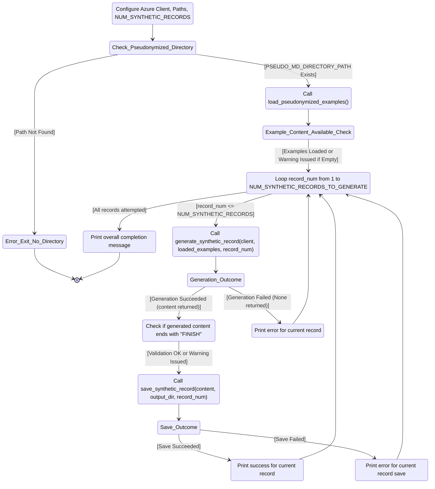

<span style="font-size: 13px;">

# *Privacy, Linguistic & Informational Preserving Synthesis of Clinical Data Through Generative Agents*

Here we provide detailed insight into the followed scientific methododology and applied numerical algorithms, complementing the paper *"Privacy, Linguistic & Information Preserving Synthesis of Clinical Data Through Generative Agents"* **(Frontiers in AI)**. You can find the accompanying Jupyter Notebooks in the [`CODE` directory of this repository](https://github.com/HR-DataLab-Healthcare/RESEARCH_SUPPORT/tree/main/PROJECTS/Generative_Agent_based_Data-Synthesis/CODE).


The data pipeline at the core of our publication is grounded in *computational thinking*, systematically dissecting the complex challenge of clinical data synthesis into a sequence of stagesworkflows. We start with the ingestion of real-world PDF clinical notes, followed by rigorous data pseudonymization to safeguard patient privacy. We then proceed to the generation of realistic synthetic clinical notes, leveraging advanced large language model (LLM) techniques. We conclude with a thorough evaluation of the generated data, assessing both quality and fidelity against multiple benchmarks.

To facilitate understanding and reproducibility, each workflow is accompanied by a flow diagram that clarifies the progression and interconnections within the overall data pipeline. This structured approach enables readers not only to follow the logic behind our methodology, but also to readily adapt or extend the source code for a variety of new research applications. 

#

<details>
<summary><h2><strong>PDF Text Extraction and Markdown Conversion</strong></h2></summary>

 ```mermaid 

  stateDiagram-v2
  Initialize_Process: Initialize Azure OpenAI client and paths

  Initialize_Process --> Find_PDFs_In_Directory
  Find_PDFs_In_Directory: Scan PDF_DIRECTORY_PATH

  Find_PDFs_In_Directory --> Process_Next_PDF_Decision
  state Process_Next_PDF_Decision <<choice>>
  Process_Next_PDF_Decision --> Extract_Text_From_PDF : [PDF available]
  Process_Next_PDF_Decision --> End_Process : [No more PDFs]

  Extract_Text_From_PDF: Call extract_text_from_pdf()
  Extract_Text_From_PDF --> Text_Extraction_Check
  state Text_Extraction_Check <<choice>>
  Text_Extraction_Check --> Convert_Text_To_Markdown : [Extraction Succeeded]
  Text_Extraction_Check --> Log_Extraction_Error : [Extraction Failed]

  Log_Extraction_Error: Log PDF reading error
  Log_Extraction_Error --> Process_Next_PDF_Decision

  Convert_Text_To_Markdown: Call convert_text_to_markdown()
  Convert_Text_To_Markdown --> Markdown_Conversion_Check
  state Markdown_Conversion_Check <<choice>>
  Markdown_Conversion_Check --> Save_Single_Markdown_File : [Conversion Succeeded]
  Markdown_Conversion_Check --> Log_Conversion_Error : [Conversion Failed]

  Log_Conversion_Error: Log API or conversion error
  Log_Conversion_Error --> Process_Next_PDF_Decision

  Save_Single_Markdown_File: Call save_single_markdown_file()
  Save_Single_Markdown_File --> File_Save_Check
  state File_Save_Check <<choice>>
  File_Save_Check --> Log_Success : [Save Succeeded]
  File_Save_Check --> Log_Save_Error : [Save Failed]

  Log_Save_Error: Log file writing error
  Log_Save_Error --> Process_Next_PDF_Decision

  Log_Success: Log successful processing for the PDF
  Log_Success --> Process_Next_PDF_Decision

  End_Process --> [*]

 ```


  Shown is the prosessing needed for transforming raw PDF documents into a structured Markdown format. This conversion makes the textual content more amenable to subsequent processing, such as pseudonymization and analysis. The process leverages an AI model for intelligent structuring of the extracted text.

  * **Purpose:** 
    *   To systematically extract all readable text content from a collection of PDF files and then convert this raw text into well-structured Markdown. 
    *   The conversion aims to preserve or infer document elements like headings, lists, and paragraphs, utilizing the capabilities of an Azure OpenAI GPT-4.1 model.

  * **Key Code Components:**

    *  **`extract_text_from_pdf(pdf_path)`**:
        *   **Library Used:** `PyMuPDF (fitz)`
        *   **Functionality:**
            *   Opens a PDF file specified by `pdf_path`.
            *   Iterates through each page of the PDF.
            *   Extracts plain text from each page using `page.get_text("text")`.
            *   Concatenates the text from all pages, adding a double newline (`\n\n`) as a separator between page contents.
            *   Includes basic error handling to catch and report issues during PDF reading, returning `None` if an error occurs.

    *  **`convert_text_to_markdown(text_content, pdf_filename)`**:
        *   **Library Used:** `openai` (for Azure OpenAI)
        *   **Functionality:**
            *   Takes the raw `text_content` (extracted from a PDF) and the original `pdf_filename` (for context in prompts) as input.
            *   If `text_content` is empty, it returns `None`.
            *   Constructs a request to the Azure OpenAI API using the initialized `client` object.
            *   **AI Model Invocation:**
                *   Uses the deployment specified by `AZURE_OPENAI_DEPLOYMENT_NAME` (e.g., "GPT4.1").
                *   Sends a chat completion request with:
                    *   A `system_prompt` instructing the AI to act as an assistant specialized in converting raw text to well-structured Markdown, emphasizing retention of meaning, structure, and technical details without adding conversational fluff.
                    *   A `user_prompt` that includes the `text_content` and `pdf_filename`, asking the AI to convert the text to Markdown, paying attention to potential structural elements (headings, lists, paragraphs) and to output *only* the Markdown content.
                    *   `temperature` is set to `0.2` for more deterministic and factual output.
                    *   `max_tokens` is set to `24000` to accommodate potentially large documents.
            *   Extracts the AI-generated Markdown from the API response.
            *   Includes error handling for the API call, printing an error message and returning `None` if the conversion fails.

    *  **`save_single_markdown_file(markdown_content, output_path)`**:
        *   **Library Used:** `os` (for path manipulation, though file I/O is standard Python)
        *   **Functionality:**
            *   A utility function that takes the generated `markdown_content` string and an `output_path`.
            *   Writes the `markdown_content` to the specified `output_path` using UTF-8 encoding.
            *   Includes basic error handling for file writing operations.

  * **Inputs:**

    *   A collection of original PDF files located in the directory specified by the `PDF_DIRECTORY_PATH` variable.
    *   Azure OpenAI Service Configuration:
        *   `AZURE_OPENAI_ENDPOINT`: The endpoint URL for your Azure OpenAI service.
        *   `AZURE_OPENAI_API_KEY`: Your Azure OpenAI API key (Note: This is a sensitive credential and should be managed securely, not hardcoded directly for production or shared repositories).
        *   `AZURE_OPENAI_DEPLOYMENT_NAME`: The specific deployment name of your model in Azure OpenAI Studio (e.g., "GPT4.1").
        *   `API_VERSION`: The API version for the Azure OpenAI service (e.g., "2024-12-01-preview").
    *   An initialized `AzureOpenAI` client object, configured with the above credentials.

* **Outputs:**

    *   Individual Markdown files, where each file corresponds to an input PDF.
    *   These Markdown files are named `[original_filename_without_extension].md` (e.g., `report1.pdf` becomes `report1.md`).
    *   The output Markdown files are saved directly within the `PDF_DIRECTORY_PATH`.

* **Configuration Variables Used:**

  *   `PDF_DIRECTORY_PATH`: String specifying the absolute or relative path to the directory containing the input PDF files.
  *   `AZURE_OPENAI_ENDPOINT`, `AZURE_OPENAI_API_KEY`, `AZURE_OPENAI_DEPLOYMENT_NAME`, `API_VERSION`: As described under "Inputs".
  *   Prompts within `convert_text_to_markdown`:
      *   `system_prompt`: Defines the AI's role and general output requirements.
      *   `user_prompt`: Provides the specific text and instructions for the conversion task.

* **Workflow Summary:**

    * The main execution block iterates through each PDF file found in `PDF_DIRECTORY_PATH`. 
    * For each PDF:
        - Text is extracted using `extract_text_from_pdf`.
        - If text extraction is successful, the text is passed to `convert_text_to_markdown`.
        - If Markdown conversion is successful, the resulting Markdown content is saved as an individual `.md` file using `save_single_markdown_file`.
        -Progress and any errors are logged to the console.

  </details>

#

<details>
  <summary><h2><strong>Pseudonymization of Markdown Content</strong></h2></summary>


 ```mermaid 

stateDiagram-v2
    Initialize_Process: Initialize Script & Azure OpenAI Client
    Initialize_Process --> Find_Markdown_Files

    Find_Markdown_Files: Scan PDF_DIRECTORY_PATH for .md files (from Stage 1)
    Find_Markdown_Files --> Process_Next_Markdown_Decision
    state Process_Next_Markdown_Decision <<choice>>
        Process_Next_Markdown_Decision --> Read_Markdown_Content : [Markdown file available]
        Process_Next_Markdown_Decision --> End_Pseudonymization_Process : [No more Markdown files]

    Read_Markdown_Content: Read content of current Markdown file
    Read_Markdown_Content --> Call_Pseudonymize_Markdown

    Call_Pseudonymize_Markdown: pseudonymize_markdown(content, filename)
    Call_Pseudonymize_Markdown --> Pseudonymization_Check
    state Pseudonymization_Check <<choice>>
        Pseudonymization_Check --> Save_Pseudonymized_File : [AI returns pseudonymized content]
        Pseudonymization_Check --> Log_Pseudonymization_Error : [AI fails or content empty]

    Log_Pseudonymization_Error: Log API error or empty content
    Log_Pseudonymization_Error --> Collect_Content_For_Combined_File_Error_Path
    Collect_Content_For_Combined_File_Error_Path: (No content to add)
    Collect_Content_For_Combined_File_Error_Path --> Process_Next_Markdown_Decision

    Save_Pseudonymized_File: save_single_markdown_file(pseudo_content, output_path)
    Save_Pseudonymized_File --> File_Save_Check
    state File_Save_Check <<choice>>
        File_Save_Check --> Log_Save_Success : [Save Succeeded]
        File_Save_Check --> Log_Save_Error : [Save Failed]

    Log_Save_Error: Log file writing error
    Log_Save_Error --> Collect_Content_For_Combined_File_Save_Error_Path
    Collect_Content_For_Combined_File_Save_Error_Path: (No content to add)
    Collect_Content_For_Combined_File_Save_Error_Path --> Process_Next_Markdown_Decision

    Log_Save_Success: Log successful pseudonymization and save
    Log_Save_Success --> Collect_Content_For_Combined_File
    Collect_Content_For_Combined_File: Add pseudonymized content to list for combined file
    Collect_Content_For_Combined_File --> Process_Next_Markdown_Decision

    End_Pseudonymization_Process: (Individual files processed, combined file creation follows)
    End_Pseudonymization_Process --> [*]

 ```

<br> 

  Shown is the workflow needed to protect patient privacy. It utilizes Markdown files to identify and replace personal identifiers, specifically names, with realistic-sounding pseudonyms. This creates a safer dataset for subsequent tasks, such as training generative models or sharing example data, while aiming to preserve the original document structure and all other content.

  *  **Purpose:**
    * To automatically replace privacy-sensitive information, focusing on person names (e.g., patients, doctors, staff, family members), with plausible, fabricated pseudonyms. 
    * This process is performed using an Azure OpenAI model, with strict instructions to *only* modify names and meticulously preserve the original Markdown formatting and all other textual content.

  *   **Key Code Components:**
      *   **`pseudonymize_markdown(markdown_content, pdf_filename)`**:
          *   **Library Used:** `openai` (for Azure OpenAI).
          *   **Functionality:**
              *   Accepts the `markdown_content` (from Stage 1) and the original `pdf_filename` (for logging/context) as input.
              *   Returns `None` if the input `markdown_content` is empty.
              *   Constructs a `pseudo_user_prompt` that combines the input `markdown_content` with explicit instructions to replace only person names and maintain Markdown integrity.
              *   **AI Model Invocation (Azure OpenAI):**
                  *   Uses the same initialized `client` object and `AZURE_OPENAI_DEPLOYMENT_NAME` (e.g., "GPT4.1") as in Stage 1.
                  *   Sends a chat completion request with:
                      *   The `PSEUDO_SYSTEM_MESSAGE_CONTENT` (see Configuration below) which strictly defines the AI's role and constraints.
                      *   The constructed `pseudo_user_prompt` containing the actual Markdown text and task instructions.
                      *   `temperature` set to `0.2` to encourage deterministic and rule-abiding output.
                      *   `max_tokens` set to `24000` (or a similar appropriate value) to handle the full document.
                  *   Extracts the pseudonymized Markdown text from the AI's response.
                  *   Includes error handling for the API call, printing an error message and returning `None` if pseudonymization fails.
      *   **`save_single_markdown_file(markdown_content, output_path)`**:
          *   This is the same helper function reused from Stage 1.
          *   It saves the pseudonymized Markdown content to a new file, typically prefixed with "pseudo_".

  *   **Inputs:**
      *   Individual Markdown files (`[original_filename].md`) generated in Stage 1, located in `PDF_DIRECTORY_PATH`.
      *   Azure OpenAI Service Configuration:
          *   `AZURE_OPENAI_ENDPOINT`: The endpoint URL for your Azure OpenAI service.
          *   `AZURE_OPENAI_DEPLOYMENT_NAME`: The specific deployment name of your model (e.g., "GPT4.1").
          *   `API_VERSION`: The API version for the Azure OpenAI service.
          *   *(API Key is configured in the environment or client initialization but not detailed here for security).*
      *   An initialized `AzureOpenAI` client object.

  *   **Outputs:**
      *   Individual pseudonymized Markdown files.
      *   Naming convention: `pseudo_[original_filename_without_extension].md` (e.g., `pseudo_report1.md`).
      *   These files are saved within the same `PDF_DIRECTORY_PATH`.

  *   **Configuration Variables Used:**
      *   `PDF_DIRECTORY_PATH`: Path to the directory containing the Markdown files.
      *   Azure OpenAI parameters: `AZURE_OPENAI_ENDPOINT`, `AZURE_OPENAI_DEPLOYMENT_NAME`, `API_VERSION`.
      *   **`PSEUDO_SYSTEM_MESSAGE_CONTENT`**:
          ```
          "Vervang in de aangeleverde tekst uitsluitend de persoonsnamen (zoals patiëntnamen, namen van artsen, medewerkers, familieleden, etc.) door realistische, verzonnen pseudoniemen. Zorg ervoor dat de originele markdown opmaak van de tekst volledig behouden blijft. Geef als antwoord *alleen* de aangepaste tekst terug, zonder enige uitleg of extra commentaar."
          ```
          *(Translation: "In the provided text, replace only personal names (such as patient names, names of doctors, employees, family members, etc.) with realistic, fabricated pseudonyms. Ensure that the original markdown formatting of the text is fully preserved. Return *only* the modified text as the answer, without any explanation or extra commentary.")*
      *   **`PRIVACY_CATEGORIES`** (primarily for contextual understanding and potential future use in prompt refinement, though the current system prompt is highly specific to names):
          ```python
          PRIVACY_CATEGORIES = [
              "Persoonsnamen (patiënt, arts, etc.)",
              "Adressen",
              "Telefoonnummers",
              "E-mailadressen",
              "Geboortedata",
              "Burgerservicenummer (BSN) of andere ID-nummers",
              "Medische klachten, symptomen of diagnoses",
              "Medische behandelingen, medicatie of procedures",
              "Verzekeringsgegevens",
              "Financiële gegevens",
              "Andere direct identificeerbare persoonlijke informatie"
          ]
          ```

*  **Workflow Summary:**
    
    * The main script iterates through each Markdown file (produced in Stage 1) found in `PDF_DIRECTORY_PATH`. 
    * For each Markdown file:
        - The content of the Markdown file is read.
        - This content is passed to the `pseudonymize_markdown` function.
        - If the AI successfully returns pseudonymized content: <br>
        The `save_single_markdown_file` function saves this modified content to a new file, prefixed with `pseudo_`.
        - Progress and any errors encountered during the API call or file operations are logged to the console.
        - The script also collects all pseudonymized content to later create a combined pseudonymized Markdown file.
</details>


#

  <details>
  <summary><h2><strong>Combining Markdown Files</strong></h2></summary>

  Shown is the workflow needed for creating single files comprising all processed data, which can be useful for reviewing the entire dataset or for simple corpus loading.

  * **Purpose:**

    * To concatenate the content of all individual Markdown files (both original converted and pseudonymized) into two single, large Markdown files.  

  * **Key Code Components:**  
    * save\_combined\_markdown\_to\_file(combined\_markdown\_content, output\_path, file\_description): A helper function to write the combined string to a specified file.  
  * **Inputs:**  
    * Individual Markdown files (\*.md and pseudo\_\*.md) from the PDF\_DIRECTORY\_PATH.  
  * **Outputs:**  
    * combined\_epds\_markdown.md (all original converted content) saved in the parent directory of PDF\_DIRECTORY\_PATH.  
    * pseudo\_combined\_epds\_markdown.md (all pseudonymized content) saved in the parent directory of PDF\_DIRECTORY\_PATH.  
  * **Configuration Variables Used:**  
    * OUTPUT\_COMBINED\_MD\_FILE\_PATH, OUTPUT\_COMBINED\_PSEUDO\_MD\_FILE\_PATH: Define the output locations and filenames.

  *Note: The main execution block in the initial script handles the looping through files, calling the extraction/conversion/pseudonymization functions, appending content to lists (all\_markdown\_content, all\_pseudonymized\_content), and finally joining and saving the combined content.*
  </details>

#


  <details>
  <summary><h2><strong>Synthetic Data Generation</strong></h2></summary>



<br>

Shown is the workflow needed for generating synthetic EHRs. It uses a two-tiered prompting strategy:  *Supervisor prompts set overall structure and standards*, while *Worker prompts provide case-specific instructions*.  In doing so, the GPT-4.1 LLM is directed to produce synthetic EHRs that are not only realistic and coherent but also consistently formatted and effectively anonymized. This approach is designed to create valuable data for research and development purposes without compromising the privacy of real patient information.


  *  **Purpose:**
        * To automatically replace privacy-sensitive information, focusing on person names (e.g., patients, doctors, staff, family members), with plausible, fabricated pseudonyms. 
        * This workflow is performed using an Azure OpenAI model, with strict instructions to *only* modify names and meticulously preserve the original Markdown formatting and all other textual content.

  *   **Key Code Components:**
        *  **Supervisor Instructions (`system_prompt`):**
            *   This prompt sets the **overall context and persona** for the LLM. It's like a high-level directive from a supervisor to an expert worker.
            *   It instructs the LLM to act as an "experienced physiotherapist" tasked with generating "realistic, complete, and coherent Electronic Patient Dossiers (EPDs) in Dutch."
            *   It establishes the **methodology** (ICF framework, KNGF guidelines for low back pain) and **constraints** (use anonymized information, expert guidance).
            *   Crucially, it includes the instruction: "**Produce ONLY the requested patient dossier and nothing else.**" This primes the LLM to focus solely on the EPD generation.

        *  **Worker Instructions (`user_prompt`):**
            *   This prompt provides the **specific, detailed, step-by-step instructions** for the *current* generation task. It's akin to a detailed work order given to the worker by the supervisor.
            *   It reiterates the task (generate *one* EPD for low back pain) and provides a comprehensive list of **required sections and their content** (Anamnese, ICF Diagnosis, Treatment Goals, Treatment Plan, SOEP Notes).
            *   It specifies **language, style, and formatting requirements** (professional Dutch, expand abbreviations, realistic tone).
            *   It incorporates the `example_markdown_content` to provide concrete examples of structure and quality, while explicitly demanding a **new and unique** case.  

        * Interaction with the LLM 

            - Both the `system_prompt` (Supervisor) and `user_prompt` (Worker) are sent to the Azure OpenAI GPT-4.1 model in each API call.  
                - The `system_prompt` defines the model's role and core behavior.  
                - The `user_prompt` gives specific, task-oriented instructions for the current dossier. 

            - LLM responds by reconciling both roles The model reads the Supervisor’s persistent context and the Worker’s current, task-specific instructions. It combines these to produce output that meets overall standards *and* immediate requirements.

            - *loop for each dossier:* For each new dossier, the Worker’s prompt can be refreshed or customized, while the Supervisor’s rules persist. This ensures that every record is unique but still adheres to clinical and structural consistency.

        - *"FINISH" signals collaborative task completion:* The dossier must end with the "FINISH" string, confirming that the LLM has followed Supervisor and Worker instructions all the way through.  
        
        This **iterative, collaborative interaction** ensures that synthetic dossiers are both reliably structured (thanks to the Supervisor) and tailored to the specific requirements or examples of each record (thanks to the Worker), ending only when all steps are *FINISH*ed.  

*  **Inputs**
    *   `os`: For interacting with the operating system, primarily for path manipulation and directory checks.
    *   `fitz` (PyMuPDF): Although imported, it's not used in the generation logic itself (likely a remnant from previous PDF processing steps).
    *   `openai.AzureOpenAI`: The core library for interacting with the Azure OpenAI service.
    *   `glob`: Used for finding files matching a specific pattern (e.g., `pseudo_*.md`).

*  **Configuration:**
    *   **Azure Credentials:** [`AZURE_OPENAI_ENDPOINT`](d:\OneDrive%20-%20Hogeschool%20Rotterdam\1_CURRENT_CODE\DE_IDENTIFY\EPD_DATA_SYNTHESIZER_GPT4.1_V01.ipynb), [`AZURE_OPENAI_API_KEY`](d:\OneDrive%20-%20Hogeschool%20Rotterdam\1_CURRENT_CODE\DE_IDENTIFY\EPD_DATA_SYNTHESIZER_GPT4.1_V01.ipynb), [`AZURE_OPENAI_DEPLOYMENT_NAME`](d:\OneDrive%20-%20Hogeschool%20Rotterdam\1_CURRENT_CODE\DE_IDENTIFY\EPD_DATA_SYNTHESIZER_GPT4.1_V01.ipynb), [`API_VERSION`](d:\OneDrive%20-%20Hogeschool%20Rotterdam\1_CURRENT_CODE\DE_IDENTIFY\EPD_DATA_SYNTHESIZER_GPT4.1_V01.ipynb) are defined to connect to the Azure service.
    *   **Directory Paths:**
        *   [`PSEUDO_MD_DIRECTORY_PATH`](d:\OneDrive%20-%20Hogeschool%20Rotterdam\1_CURRENT_CODE\DE_IDENTIFY\EPD_DATA_SYNTHESIZER_GPT4.1_V01.ipynb): Specifies the location of the pseudonymized Markdown files (`pseudo_*.md`) used as examples.
        *   [`SYNTHETIC_OUTPUT_DIR`](d:\OneDrive%20-%20Hogeschool%20Rotterdam\1_CURRENT_CODE\DE_IDENTIFY\EPD_DATA_SYNTHESIZER_GPT4.1_V01.ipynb): Defines the directory where the generated synthetic Markdown files will be saved.
    *   **Generation Control:**
        *   [`NUM_SYNTHETIC_RECORDS_TO_GENERATE`](d:\OneDrive%20-%20Hogeschool%20Rotterdam\1_CURRENT_CODE\DE_IDENTIFY\EPD_DATA_SYNTHESIZER_GPT4.1_V01.ipynb): Sets the number of synthetic EPDs to create.

3.  **Azure OpenAI Client Initialization:**
    *   An instance of the [`AzureOpenAI`](d:\OneDrive%20-%20Hogeschool%20Rotterdam\1_CURRENT_CODE\DE_IDENTIFY\EPD_DATA_SYNTHESIZER_GPT4.1_V01.ipynb) client is created using the specified credentials and API version. This [`client`](d:\OneDrive%20-%20Hogeschool%20Rotterdam\1_CURRENT_CODE\DE_IDENTIFY\EPD_DATA_SYNTHESIZER_GPT4.1_V01.ipynb) object is used for all subsequent API calls.


4.  **Helper Functions:**
    *   [`load_pseudonymized_examples(directory_path)`](d:\OneDrive%20-%20Hogeschool%20Rotterdam\1_CURRENT_CODE\DE_IDENTIFY\EPD_DATA_SYNTHESIZER_GPT4.1_V01.ipynb):
        *   Finds all files matching `pseudo_*.md` in the given `directory_path`.
        *   Reads the content of each found file.
        *   Formats the combined content with clear separators (`--- BEGIN VOORBEELD DOSSIER: ... ---`, `--- EINDE VOORBEELD DOSSIER ---`) to help the AI distinguish individual examples.
        *   Returns a single string containing all example content, or an empty string with a warning if no examples are found.
    *   [`generate_synthetic_record(client, example_markdown_content, record_number)`](d:\OneDrive%20-%20Hogeschool%20Rotterdam\1_CURRENT_CODE\DE_IDENTIFY\EPD_DATA_SYNTHESIZER_GPT4.1_V01.ipynb):
        *   **Prompts:** This function defines two key prompts to guide the AI, simulating a Supervisor-Worker interaction:
            *   **`system_prompt` (Supervisor Instructions):** Sets the AI's core **persona** and **overall task**. It instructs the AI to act as an **experienced physiotherapist** generating realistic Dutch EPDs. It establishes the **context** (using anonymized info, expert guidance), **methodology** (applying ICF framework, following KNGF low back pain guidelines), and a crucial **constraint** (produce *only* the requested patient dossier). This acts like a high-level directive from a supervisor.
            *   **`user_prompt` (Worker Instructions):** Provides the **specific, detailed, step-by-step instructions** for the *current* generation task. This acts like the specific work order given to the worker. It details:
                *   **Task Focus:** Generate *one* complete, realistic EPD *only* for low back pain (acute, subacute, or chronic). Explicitly forbids other conditions.
                *   **Required Structure and Content (in order):**
                    1.  **Anamnese Summary:** Specifies content (history, impact, coping, context), style (narrative, professional Dutch), and requirement (classify pain duration).
                    2.  **ICF-based Diagnosis:** Lists all mandatory components (impairments, limitations, restrictions, personal/environmental factors, risk factors, reformulated help request).
                    3.  **Treatment Goals:** Mandates SMART, patient-centered, functional goals (what the patient wants to do), clarifies role of clinical scores (support, not the goal itself), and requires a target date.
                    4.  **Treatment Plan:** Requires description of interventions and rationale, based on KNGF guidelines and goals.
                    5.  **SOEP Progress Notes:** Sets quantity (3-8 notes), format (full SOEP per session), and content requirements (show progression/changes, clinical reasoning).
                    6.  **Language/Style:** Demands professional Dutch, expansion of abbreviations, and realistic tone matching examples.
                *   **Example Guidance:** Injects the `example_markdown_content` as a reference for structure, style, and detail, while explicitly demanding a **new and unique** case.
                *   **Output Specification:** Instructs the AI to generate *only* the dossier content, starting with the anamnese and ending precisely with the word "FINISH". Re-emphasizes adherence to *all* instructions.
        *   **API Call:** Calls the `client.chat.completions.create` method with the system ("Supervisor") and user ("Worker") prompts, the specified model ([`AZURE_OPENAI_DEPLOYMENT_NAME`](d:\OneDrive%20-%20Hogeschool%20Rotterdam\1_CURRENT_CODE\DE_IDENTIFY\EPD_DATA_SYNTHESIZER_GPT4.1_V01.ipynb)), a higher `temperature` (0.8) for creativity, and sufficient `max_tokens` (8000).
        *   **Error Handling:** Catches potential API errors and returns the generated text content or `None` on failure.
    *   [`save_synthetic_record(synthetic_content, output_dir, record_number)`](d:\OneDrive%20-%20Hogeschool%20Rotterdam\1_CURRENT_CODE\DE_IDENTIFY\EPD_DATA_SYNTHESIZER_GPT4.1_V01.ipynb):
        *   Ensures the specified `output_dir` exists, creating it if necessary.
        *   Constructs a filename like `synthetic_patient_001.md` (using zero-padding for sorting).
        *   Writes the provided `synthetic_content` to the file using UTF-8 encoding.
        *   Handles potential file writing errors.

    *   [`load_pseudonymized_examples(directory_path)`](d:\OneDrive%20-%20Hogeschool%20Rotterdam\1_CURRENT_CODE\DE_IDENTIFY\EPD_DATA_SYNTHESIZER_GPT4.1_V01.ipynb):
        *   Finds all files matching `pseudo_*.md` in the given `directory_path`.
        *   Reads the content of each found file.
        *   Formats the combined content with clear separators (`--- BEGIN VOORBEELD DOSSIER: ... ---`, `--- EINDE VOORBEELD DOSSIER ---`) to help the AI distinguish individual examples.
        *   Returns a single string containing all example content, or an empty string with a warning if no examples are found.
    
    *   [`save_synthetic_record(synthetic_content, output_dir, record_number)`](d:\OneDrive%20-%20Hogeschool%20Rotterdam\1_CURRENT_CODE\DE_IDENTIFY\EPD_DATA_SYNTHESIZER_GPT4.1_V01.ipynb):
        *   Ensures the specified `output_dir` exists, creating it if necessary.
        *   Constructs a filename like `synthetic_patient_001.md` (using zero-padding for sorting).
        *   Writes the provided `synthetic_content` to the file using UTF-8 encoding.
        *   Handles potential file writing errors.


5.  **Main Execution Logic (`if __name__ == "__main__":`)**
    *   Prints a starting message.
    *   Checks if the [`PSEUDO_MD_DIRECTORY_PATH`](d:\OneDrive%20-%20Hogeschool%20Rotterdam\1_CURRENT_CODE\DE_IDENTIFY\EPD_DATA_SYNTHESIZER_GPT4.1_V01.ipynb) exists; exits with an error if not.
    *   Calls [`load_pseudonymized_examples`](d:\OneDrive%20-%20Hogeschool%20Rotterdam\1_CURRENT_CODE\DE_IDENTIFY\EPD_DATA_SYNTHESIZER_GPT4.1_V01.ipynb) to get the example content. Issues a warning if no examples are loaded but continues execution.
    *   Enters a loop that runs [`NUM_SYNTHETIC_RECORDS_TO_GENERATE`](d:\OneDrive%20-%20Hogeschool%20Rotterdam\1_CURRENT_CODE\DE_IDENTIFY\EPD_DATA_SYNTHESIZER_GPT4.1_V01.ipynb) times.
    *   Inside the loop, for each record:
        *   Calls [`generate_synthetic_record`](d:\OneDrive%20-%20Hogeschool%20Rotterdam\1_CURRENT_CODE\DE_IDENTIFY\EPD_DATA_SYNTHESIZER_GPT4.1_V01.ipynb) to get the synthetic content.
        *   If generation is successful:
            *   Performs a basic check to see if the content ends with "FINISH" (as requested in the prompt) and warns if not.
            *   Calls [`save_synthetic_record`](d:\OneDrive%20-%20Hogeschool%20Rotterdam\1_CURRENT_CODE\DE_IDENTIFY\EPD_DATA_SYNTHESIZER_GPT4.1_V01.ipynb) to save the content to a file.
        *   If generation fails, it skips saving.
    *   Prints a completion message after the loop finishes.

### Inputs and Outputs

*   **Inputs:**
    *   Pseudonymized Markdown files (`pseudo_*.md`) located in [`PSEUDO_MD_DIRECTORY_PATH`](d:\OneDrive%20-%20Hogeschool%20Rotterdam\1_CURRENT_CODE\DE_IDENTIFY\EPD_DATA_SYNTHESIZER_GPT4.1_V01.ipynb).
    *   Azure OpenAI service credentials and configuration.
*   **Outputs:**
    *   Synthetic Markdown files (`synthetic_patient_*.md`) saved in [`SYNTHETIC_OUTPUT_DIR`](d:\OneDrive%20-%20Hogeschool%20Rotterdam\1_CURRENT_CODE\DE_IDENTIFY\EPD_DATA_SYNTHESIZER_GPT4.1_V01.ipynb).
    *   Progress messages printed to the console during execution.
  </details>


#

  <details>
  <summary><h2><strong>Comparative Analysis of Synthetic vs Genuine EHRs</strong></h2></summary>


<br>

Show is the workflow needed to assesses the quality and similarity of the generated synthetic data compared to the pseudonymized real data using a combination of quantitative benchmarks and a qualitative AI-based review.

  * **Purpose:** 
    * To provide metrics and descriptions that indicate how well the synthetic data captures the linguistic, structural, and clinical characteristics of the real-world pseudonymized data.

  * **Key Code Components:**
    * `load_file_content(filepath)`: Helper function to load content for evaluation.
    * `calculate_entropy(text, unit)`: Calculates Shannon's Entropy (character and word level).
    * `calculate_avg_bigram_pmi(text, min_freq)`: Calculates average Pointwise Mutual Information for word bigrams.
    * `calculate_kl_divergence(text1, text2, unit)`: Calculates Jensen-Shannon Divergence between word distributions.
    * `calculate_corpus_bleu(synthetic_contents, pseudo_contents_list)`: Calculates corpus-level BLEU score.
    * `calculate_corpus_bertscore(synthetic_contents, pseudo_contents_list, lang='nl')`: Calculates BERT Score (Precision, Recall, F1).
    * `evaluate_classifier_performance(pseudo_contents, synthetic_contents, ...)`: Trains a classifier to distinguish data types and reports AUC/AUPRC.
    * `compare_docs_with_gpt4(...)`: Sends document pairs to Azure OpenAI for qualitative comparison.
    * Main script logic for loading data, running benchmarks, performing GPT-4 comparisons, and reporting/saving results.
  * **Inputs:**
    * Pseudonymized Markdown files from `PSEUDO_MD_DIRECTORY_PATH_COMPARE`.
    * Synthetic Markdown files from `SYNTHETIC_MD_DIRECTORY_PATH`.
    * Azure OpenAI API configuration and `client` object.
  * **Outputs:**
    * Quantitative benchmark values printed to console (Entropy, Avg. Length, PMI, JSD, BLEU, BERTScore, Classifier AUC/AUPRC).
    * Qualitative GPT-4 comparison summaries and ratings printed to console.
    * Optional JSON file (`COMPARISON_RESULTS_FILE`) with all results.

  * **Configuration Variables Used:**
    * `PSEUDO_MD_DIRECTORY_PATH_COMPARE`, `SYNTHETIC_MD_DIRECTORY_PATH`.
    * `NUM_COMPARISON_PAIRS_TO_EVALUATE`.
    * `PMI_MIN_BIGRAM_FREQ`.
    * `CLASSIFIER_TEST_SIZE`, `CLASSIFIER_RANDOM_STATE`, `CLASSIFIER_MAX_FEATURES`.
    * Azure OpenAI settings (`AZURE_OPENAI_DEPLOYMENT_NAME`, etc.).

  * **Benchmark Metrics Used:**

    | Benchmark                                     | Category                        | Python Code Package(s) Required      |
    |-----------------------------------------------|---------------------------------|--------------------------------------|
    | Average Document Length (Characters)          | Structural                      | `numpy`                              |
    | Shannon's Entropy (Character & Word)        | Linguistic Complexity           | `collections`, `math`                |
    | Average Bigram Pointwise Mutual Information (PMI) | Linguistic Cohesion             | `collections`, `math`, `numpy`       |
    | Jensen-Shannon Divergence (JSD)               | Distributional Similarity       | `collections`, `numpy`, `scipy.stats`|
    | Corpus BLEU Score                             | N-gram Similarity               | `sacrebleu`                          |
    | Corpus BERT Score (Precision, Recall, F1)     | Semantic Similarity             | `bert_score`                         |
    | Classifier Performance (AUC/AUPRC)            | Statistical Distinguishability  | `scikit-learn`                       |
    | Qualitative GPT-4 Comparison                  | Holistic Qualitative Assessment | `openai` (via `client` object)       |

**Note:**
*   `collections` and `math` are part of the Python standard library.
*   `numpy`, `scipy`, `sacrebleu`, `bert_score`, `scikit-learn`, and `openai` are external libraries that need to be installed.
*   The "Informational Accuracy" mentioned in the documentation is primarily assessed qualitatively via the GPT-4 comparison rather than a distinct coded quantitative benchmark in this script.


  </details>


#

**REFERENCES**

#


</span>
