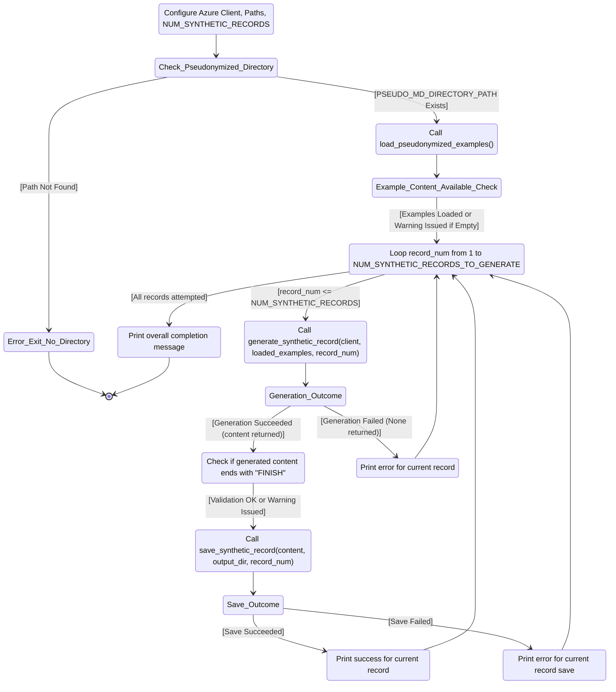
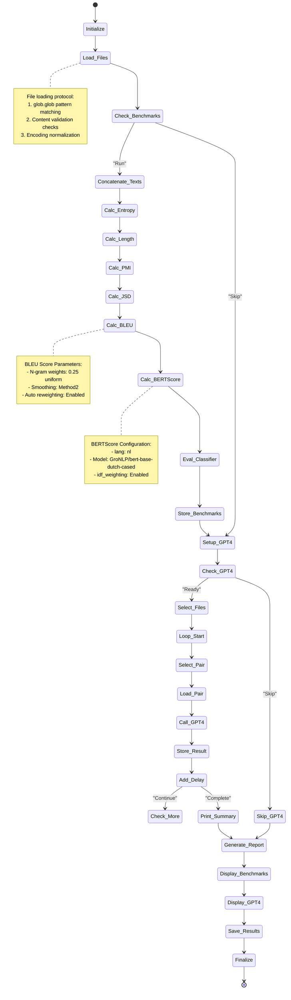
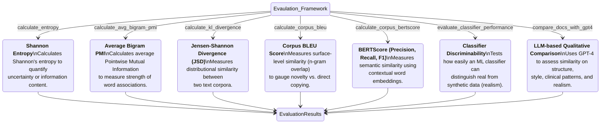
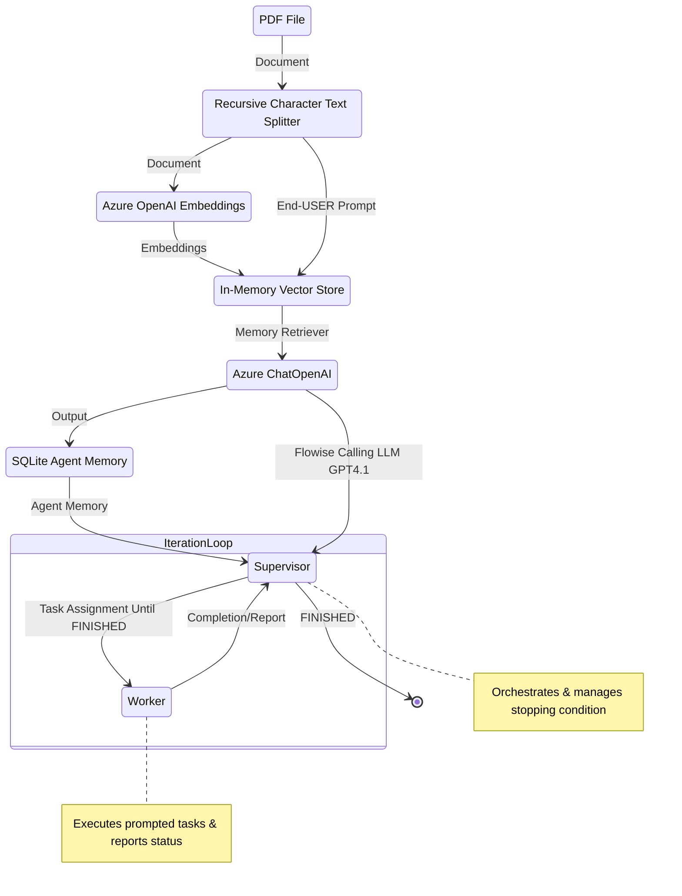

<span style="font-size: 13px;">

# *Privacy-, Linguistic-, and Information-Preserving Synthesis of Clinical Documentation through Generative Agents*

Here we provide detailed insight into the followed and applied numerical algorithms, complementing the paper *"Privacy, Linguistic & Information Preserving Synthesis of Clinical Documentation Through Generative Agents"* **(Frontiers in AI)**. You can find the accompanying Jupyter Notebooks in the [`CODE` directory of this repository](https://github.com/HR-DataLab-Healthcare/RESEARCH_SUPPORT/tree/main/PROJECTS/Generative_Agent_based_Data-Synthesis/CODE).

We also provide notebooks used to perfom document level assessment in the [`DESCRIPTOR` directory of this repository](https://github.com/HR-DataLab-Healthcare/RESEARCH_SUPPORT/tree/main/PROJECTS/Generative_Agent_based_Data-Synthesis/CODE/DESCRIPTOR)

The data pipeline at the core of our publication is grounded in *computational thinking*, systematically dissecting the complex challenge of clinical data synthesis into a sequence of workflows. We start with the ingestion and conversion of anonymised real-world PDF clinical notes into markdown format (FLOW01), followed by rigorous data pseudonymization (FLOW02) to safeguard patient privacy. We then proceed to the generation of realistic synthetic clinical notes, leveraging advanced large language model (LLM) techniques using promping  alone versus Generative Agent-based (FLOW03) . We conclude with a thorough evaluation of the generated data, assessing both quality and fidelity against multiple benchmarks (FLOW04).

To facilitate understanding and reproducibility, each workflow is accompanied by a flow diagram that clarifies the progression and interconnections within the overall data pipeline. This structured approach enables readers not only to follow the logic behind our methodology, but also to readily adapt or extend the source code for a variety of new research applications. 

We conclude with the flow diagram of our rapid-prototype example of a multi-turn GA-based SHDG workflow as implemented via Flowise.

#

<details>
<summary><h2><strong>FLOW01: PDF Text Extraction and Markdown Conversion</strong></h2></summary>

 ```mermaid 

  stateDiagram-v2
  Initialize_Process: Initialize Azure OpenAI client and paths

  Initialize_Process --> Find_PDFs_In_Directory
  Find_PDFs_In_Directory: Scan PDF_DIRECTORY_PATH

  Find_PDFs_In_Directory --> Process_Next_PDF_Decision
  state Process_Next_PDF_Decision <<choice>>
  Process_Next_PDF_Decision --> Extract_Text_From_PDF : [PDF available]
  Process_Next_PDF_Decision --> End_Process : [No more PDFs]

  Extract_Text_From_PDF: Call extract_text_from_pdf()
  Extract_Text_From_PDF --> Text_Extraction_Check
  state Text_Extraction_Check <<choice>>
  Text_Extraction_Check --> Convert_Text_To_Markdown : [Extraction Succeeded]
  Text_Extraction_Check --> Log_Extraction_Error : [Extraction Failed]

  Log_Extraction_Error: Log PDF reading error
  Log_Extraction_Error --> Process_Next_PDF_Decision

  Convert_Text_To_Markdown: Call convert_text_to_markdown()
  Convert_Text_To_Markdown --> Markdown_Conversion_Check
  state Markdown_Conversion_Check <<choice>>
  Markdown_Conversion_Check --> Save_Single_Markdown_File : [Conversion Succeeded]
  Markdown_Conversion_Check --> Log_Conversion_Error : [Conversion Failed]

  Log_Conversion_Error: Log API or conversion error
  Log_Conversion_Error --> Process_Next_PDF_Decision

  Save_Single_Markdown_File: Call save_single_markdown_file()
  Save_Single_Markdown_File --> File_Save_Check
  state File_Save_Check <<choice>>
  File_Save_Check --> Log_Success : [Save Succeeded]
  File_Save_Check --> Log_Save_Error : [Save Failed]

  Log_Save_Error: Log file writing error
  Log_Save_Error --> Process_Next_PDF_Decision

  Log_Success: Log successful processing for the PDF
  Log_Success --> Process_Next_PDF_Decision

  End_Process --> [*]

 ```


  Shown is the flow used for transforming raw PDF documents into a structured Markdown format. This conversion makes the textual content more amenable to subsequent processing, such as pseudonymization and analysis. The process leverages an AI model for intelligent structuring of the extracted text.

  * **Purpose:** 
    *   To systematically extract all readable text content from a collection of PDF files and then convert this raw text into well-structured Markdown. 
    *   The conversion aims to preserve or infer document elements like headings, lists, and paragraphs, utilizing the capabilities of an Azure OpenAI GPT-4.1 model.

  * **Key Code Components:**

    *  **`extract_text_from_pdf(pdf_path)`**:
        *   **Library Used:** `PyMuPDF (fitz)`
        *   **Functionality:**
            *   Opens a PDF file specified by `pdf_path`.
            *   Iterates through each page of the PDF.
            *   Extracts plain text from each page using `page.get_text("text")`.
            *   Concatenates the text from all pages, adding a double newline (`\n\n`) as a separator between page contents.
            *   Includes basic error handling to catch and report issues during PDF reading, returning `None` if an error occurs.

    *  **`convert_text_to_markdown(text_content, pdf_filename)`**:
        *   **Library Used:** `openai` (for Azure OpenAI)
        *   **Functionality:**
            *   Takes the raw `text_content` (extracted from a PDF) and the original `pdf_filename` (for context in prompts) as input.
            *   If `text_content` is empty, it returns `None`.
            *   Constructs a request to the Azure OpenAI API using the initialized `client` object.
            *   **AI Model Invocation:**
                *   Uses the deployment specified by `AZURE_OPENAI_DEPLOYMENT_NAME` (e.g., "GPT4.1").
                *   Sends a chat completion request with:
                    *   A `system_prompt` instructing the AI to act as an assistant specialized in converting raw text to well-structured Markdown, emphasizing retention of meaning, structure, and technical details without adding conversational fluff.
                    *   A `user_prompt` that includes the `text_content` and `pdf_filename`, asking the AI to convert the text to Markdown, paying attention to potential structural elements (headings, lists, paragraphs) and to output *only* the Markdown content.
                    *   `temperature` is set to `0.2` for more deterministic and factual output.
                    *   `max_tokens` is set to `24000` to accommodate potentially large documents.
            *   Extracts the AI-generated Markdown from the API response.
            *   Includes error handling for the API call, printing an error message and returning `None` if the conversion fails.

    *  **`save_single_markdown_file(markdown_content, output_path)`**:
        *   **Library Used:** `os` (for path manipulation, though file I/O is standard Python)
        *   **Functionality:**
            *   A utility function that takes the generated `markdown_content` string and an `output_path`.
            *   Writes the `markdown_content` to the specified `output_path` using UTF-8 encoding.
            *   Includes basic error handling for file writing operations.

  * **Inputs:**

    *   A collection of original PDF files located in the directory specified by the `PDF_DIRECTORY_PATH` variable.
    *   Azure OpenAI Service Configuration:
        *   `AZURE_OPENAI_ENDPOINT`: The endpoint URL for your Azure OpenAI service.
        *   `AZURE_OPENAI_API_KEY`: Your Azure OpenAI API key (Note: This is a sensitive credential and should be managed securely, not hardcoded directly for production or shared repositories).
        *   `AZURE_OPENAI_DEPLOYMENT_NAME`: The specific deployment name of your model in Azure OpenAI Studio (e.g., "GPT4.1").
        *   `API_VERSION`: The API version for the Azure OpenAI service (e.g., "2024-12-01-preview").
    *   An initialized `AzureOpenAI` client object, configured with the above credentials.

* **Outputs:**

    *   Individual Markdown files, where each file corresponds to an input PDF.
    *   These Markdown files are named `[original_filename_without_extension].md` (e.g., `report1.pdf` becomes `report1.md`).
    *   The output Markdown files are saved directly within the `PDF_DIRECTORY_PATH`.

* **Configuration Variables Used:**

  *   `PDF_DIRECTORY_PATH`: String specifying the absolute or relative path to the directory containing the input PDF files.
  *   `AZURE_OPENAI_ENDPOINT`, `AZURE_OPENAI_API_KEY`, `AZURE_OPENAI_DEPLOYMENT_NAME`, `API_VERSION`: As described under "Inputs".
  *   Prompts within `convert_text_to_markdown`:
      *   `system_prompt`: Defines the AI's role and general output requirements.
      *   `user_prompt`: Provides the specific text and instructions for the conversion task.

* **Workflow Summary:**

    * The main execution block iterates through each PDF file found in `PDF_DIRECTORY_PATH`. 
    * For each PDF:
        - Text is extracted using `extract_text_from_pdf`.
        - If text extraction is successful, the text is passed to `convert_text_to_markdown`.
        - If Markdown conversion is successful, the resulting Markdown content is saved as an individual `.md` file using `save_single_markdown_file`.
        -Progress and any errors are logged to the console.

  </details>

#

<details>
  <summary><h2><strong>FLOW02: Pseudonymization of Markdown Content</strong></h2></summary>


 ```mermaid 

stateDiagram-v2
    Initialize_Process: Initialize Script & Azure OpenAI Client
    Initialize_Process --> Find_Markdown_Files

    Find_Markdown_Files: Scan PDF_DIRECTORY_PATH for .md files (from Stage 1)
    Find_Markdown_Files --> Process_Next_Markdown_Decision
    state Process_Next_Markdown_Decision <<choice>>
        Process_Next_Markdown_Decision --> Read_Markdown_Content : [Markdown file available]
        Process_Next_Markdown_Decision --> End_Pseudonymization_Process : [No more Markdown files]

    Read_Markdown_Content: Read content of current Markdown file
    Read_Markdown_Content --> Call_Pseudonymize_Markdown

    Call_Pseudonymize_Markdown: pseudonymize_markdown(content, filename)
    Call_Pseudonymize_Markdown --> Pseudonymization_Check
    state Pseudonymization_Check <<choice>>
        Pseudonymization_Check --> Save_Pseudonymized_File : [AI returns pseudonymized content]
        Pseudonymization_Check --> Log_Pseudonymization_Error : [AI fails or content empty]

    Log_Pseudonymization_Error: Log API error or empty content
    Log_Pseudonymization_Error --> Collect_Content_For_Combined_File_Error_Path
    Collect_Content_For_Combined_File_Error_Path: (No content to add)
    Collect_Content_For_Combined_File_Error_Path --> Process_Next_Markdown_Decision

    Save_Pseudonymized_File: save_single_markdown_file(pseudo_content, output_path)
    Save_Pseudonymized_File --> File_Save_Check
    state File_Save_Check <<choice>>
        File_Save_Check --> Log_Save_Success : [Save Succeeded]
        File_Save_Check --> Log_Save_Error : [Save Failed]

    Log_Save_Error: Log file writing error
    Log_Save_Error --> Collect_Content_For_Combined_File_Save_Error_Path
    Collect_Content_For_Combined_File_Save_Error_Path: (No content to add)
    Collect_Content_For_Combined_File_Save_Error_Path --> Process_Next_Markdown_Decision

    Log_Save_Success: Log successful pseudonymization and save
    Log_Save_Success --> Collect_Content_For_Combined_File
    Collect_Content_For_Combined_File: Add pseudonymized content to list for combined file
    Collect_Content_For_Combined_File --> Process_Next_Markdown_Decision

    End_Pseudonymization_Process: (Individual files processed, combined file creation follows)
    End_Pseudonymization_Process --> [*]

 ```

<br> 

  Shown is the workflow used to protect patient privacy. It utilizes Markdown files to identify and replace personal identifiers, specifically names, with realistic-sounding pseudonyms. This creates a safer dataset for subsequent tasks, such as training generative models or sharing example data, while aiming to preserve the original document structure and all other content.

  *  **Purpose:**
        * To automatically replace privacy-sensitive information, focusing on person names (e.g., patients, doctors, staff, family members), with plausible, fabricated pseudonyms. 
        * This process is performed using an Azure OpenAI model, with strict instructions to *only* modify names and meticulously preserve the original Markdown formatting and all other textual content.

  *   **Key Code Components:**
      *   **`pseudonymize_markdown(markdown_content, pdf_filename)`**:
          *   **Library Used:** `openai` (for Azure OpenAI).
          *   **Functionality:**
              *   Accepts the `markdown_content` (from Stage 1) and the original `pdf_filename` (for logging/context) as input.
              *   Returns `None` if the input `markdown_content` is empty.
              *   Constructs a `pseudo_user_prompt` that combines the input `markdown_content` with explicit instructions to replace only person names and maintain Markdown integrity.
              *   **AI Model Invocation (Azure OpenAI):**
                  *   Uses the same initialized `client` object and `AZURE_OPENAI_DEPLOYMENT_NAME` (e.g., "GPT4.1") as in Stage 1.
                  *   Sends a chat completion request with:
                      *   The `PSEUDO_SYSTEM_MESSAGE_CONTENT` (see Configuration below) which strictly defines the AI's role and constraints.
                      *   The constructed `pseudo_user_prompt` containing the actual Markdown text and task instructions.
                      *   `temperature` set to `0.2` to encourage deterministic and rule-abiding output.
                      *   `max_tokens` set to `24000` (or a similar appropriate value) to handle the full document.
                  *   Extracts the pseudonymized Markdown text from the AI's response.
                  *   Includes error handling for the API call, printing an error message and returning `None` if pseudonymization fails.
      *   **`save_single_markdown_file(markdown_content, output_path)`**:
          *   This is the same helper function reused from Stage 1.
          *   It saves the pseudonymized Markdown content to a new file, typically prefixed with "pseudo_".

  *   **Inputs:**
      *   Individual Markdown files (`[original_filename].md`) generated in Stage 1, located in `PDF_DIRECTORY_PATH`.
      *   Azure OpenAI Service Configuration:
          *   `AZURE_OPENAI_ENDPOINT`: The endpoint URL for your Azure OpenAI service.
          *   `AZURE_OPENAI_DEPLOYMENT_NAME`: The specific deployment name of your model (e.g., "GPT4.1").
          *   `API_VERSION`: The API version for the Azure OpenAI service.
          *   *(API Key is configured in the environment or client initialization but not detailed here for security).*
      *   An initialized `AzureOpenAI` client object.

  *   **Outputs:**
      *   Individual pseudonymized Markdown files.
      *   Naming convention: `pseudo_[original_filename_without_extension].md` (e.g., `pseudo_report1.md`).
      *   These files are saved within the same `PDF_DIRECTORY_PATH`.

  *   **Configuration Variables Used:**
      *   `PDF_DIRECTORY_PATH`: Path to the directory containing the Markdown files.
      *   Azure OpenAI parameters: `AZURE_OPENAI_ENDPOINT`, `AZURE_OPENAI_DEPLOYMENT_NAME`, `API_VERSION`.
      *   **`PSEUDO_SYSTEM_MESSAGE_CONTENT`**:
          ```
          "Vervang in de aangeleverde tekst uitsluitend de persoonsnamen (zoals patiëntnamen, namen van artsen, medewerkers, familieleden, etc.) door realistische, verzonnen pseudoniemen. Zorg ervoor dat de originele markdown opmaak van de tekst volledig behouden blijft. Geef als antwoord *alleen* de aangepaste tekst terug, zonder enige uitleg of extra commentaar."
          ```
          *(Translation: "In the provided text, replace only personal names (such as patient names, names of doctors, employees, family members, etc.) with realistic, fabricated pseudonyms. Ensure that the original markdown formatting of the text is fully preserved. Return *only* the modified text as the answer, without any explanation or extra commentary.")*
      *   **`PRIVACY_CATEGORIES`** (primarily for contextual understanding and potential future use in prompt refinement, though the current system prompt is highly specific to names):
          ```python
          PRIVACY_CATEGORIES = [
              "Persoonsnamen (patiënt, arts, etc.)",
              "Adressen",
              "Telefoonnummers",
              "E-mailadressen",
              "Geboortedata",
              "Burgerservicenummer (BSN) of andere ID-nummers",
              "Medische klachten, symptomen of diagnoses",
              "Medische behandelingen, medicatie of procedures",
              "Verzekeringsgegevens",
              "Financiële gegevens",
              "Andere direct identificeerbare persoonlijke informatie"
          ]
          ```

*  **Workflow Summary:**
    
    * The main script iterates through each Markdown file (produced in Stage 1) found in `PDF_DIRECTORY_PATH`. 
    * For each Markdown file:
        - The content of the Markdown file is read.
        - This content is passed to the `pseudonymize_markdown` function.
        - If the AI successfully returns pseudonymized content: <br>
        The `save_single_markdown_file` function saves this modified content to a new file, prefixed with `pseudo_`.
        - Progress and any errors encountered during the API call or file operations are logged to the console.
        - The script also collects all pseudonymized content to later create a combined pseudonymized Markdown file.
</details>


#

  <details>
  <summary><h2><strong>FLOW03: Synthetic Data Generation</strong></h2></summary>



<br>

Shown is the workflow used to generate synthetic EHRs. It uses a two-tiered prompting strategy:  *Supervisor prompts set overall structure and standards*, while *Worker prompts provide case-specific instructions*.  In doing so, the GPT-4.1 LLM is directed to produce synthetic EHRs that are not only realistic and coherent but also consistently formatted and effectively anonymized. This approach is designed to create valuable data for research and development purposes without compromising the privacy of real patient information.


  *  **Purpose:**
        * The workflow leverages Azure OpenAI GPT-4.1 LLM to generate artificial EHRs These synthetic dossiers are modeled after a set of previously pseudonymized real-world EHRs, aiming to produce realistic and coherent patient records for physiotherapy, specifically focusing on low back pain cases. 
        * The generation process is guided by detailed prompts and example data to ensure the quality and relevance of the output.

   
            *  **Supervisor Instructions (`system_prompt`):**
                *   This prompt sets the **overall context and persona** for the LLM. It's like a high-level directive from a supervisor to an expert worker.
                *   It instructs the LLM to act as an "experienced physiotherapist" tasked with generating "realistic, complete, and coherent Electronic Patient Dossiers (EPDs) in Dutch."
                *   It establishes the **methodology** (ICF framework, KNGF guidelines for low back pain) and **constraints** (use anonymized information, expert guidance).
                *   Crucially, it includes the instruction: "**Produce ONLY the requested patient dossier and nothing else.**" This primes the LLM to focus solely on the EPD generation.

            *  **Worker Instructions (`user_prompt`):**
                *   This prompt provides the **specific, detailed, step-by-step instructions** for the *current* generation task. It's akin to a detailed work order given to the worker by the supervisor.
                *   It reiterates the task (generate *one* EPD for low back pain) and provides a comprehensive list of **required sections and their content** (Anamnese, ICF Diagnosis, Treatment Goals, Treatment Plan, SOEP Notes).
                *   It specifies **language, style, and formatting requirements** (professional Dutch, expand abbreviations, realistic tone).
                *   It incorporates the `example_markdown_content` to provide concrete examples of structure and quality, while explicitly demanding a **new and unique** case.  

            * Interaction with the LLM 

                - Both the `system_prompt` (Supervisor) and `user_prompt` (Worker) are sent to the Azure OpenAI GPT-4.1 model in each API call.  
                    - The `system_prompt` defines the model's role and core behavior.  
                    - The `user_prompt` gives specific, task-oriented instructions for the current dossier. 

                - LLM responds by reconciling both roles The model reads the Supervisor’s persistent context and the Worker’s current, task-specific instructions. It combines these to produce output that meets overall standards *and* immediate requirements.

                - *loop for each dossier:* For each new dossier, the Worker’s prompt can be refreshed or customized, while the Supervisor’s rules persist. This ensures that every record is unique but still adheres to clinical and structural consistency.

            - *"FINISH" signals collaborative task completion:* The dossier must end with the "FINISH" string, confirming that the LLM has followed Supervisor and Worker instructions all the way through.  
            
            This **iterative, collaborative interaction** ensures that synthetic dossiers are both reliably structured (thanks to the Supervisor) and tailored to the specific requirements or examples of each record (thanks to the Worker), ending only when all steps are *FINISH*ed.  
*   **Key Code Components:**
    *   [`load_pseudonymized_examples(directory_path)`](d:\OneDrive%20-%20Hogeschool%20Rotterdam\1_CURRENT_CODE\DE_IDENTIFY\EPD_DATA_SYNTHESIZER_GPT4.1_V01.ipynb):
        *   Finds all files matching `pseudo_*.md` in the given `directory_path`.
        *   Reads the content of each found file.
        *   Formats the combined content with clear separators (`--- BEGIN VOORBEELD DOSSIER: ... ---`, `--- EINDE VOORBEELD DOSSIER ---`) to help the AI distinguish individual examples.
        *   Returns a single string containing all example content, or an empty string with a warning if no examples are found.
    *   [`generate_synthetic_record(client, example_markdown_content, record_number)`](d:\OneDrive%20-%20Hogeschool%20Rotterdam\1_CURRENT_CODE\DE_IDENTIFY\EPD_DATA_SYNTHESIZER_GPT4.1_V01.ipynb):
        *   **Prompts:** This function defines two key prompts to guide the AI, simulating a Supervisor-Worker interaction:
            *   **`system_prompt` (Supervisor Instructions):** Sets the AI's core **persona** and **overall task**. It instructs the AI to act as an **experienced physiotherapist** generating realistic Dutch EPDs. It establishes the **context** (using anonymized info, expert guidance), **methodology** (applying ICF framework, following KNGF low back pain guidelines), and a crucial **constraint** (produce *only* the requested patient dossier). This acts like a high-level directive from a supervisor.
            *   **`user_prompt` (Worker Instructions):** Provides the **specific, detailed, step-by-step instructions** for the *current* generation task. This acts like the specific work order given to the worker. It details:
                *   **Task Focus:** Generate *one* complete, realistic EPD *only* for low back pain (acute, subacute, or chronic). Explicitly forbids other conditions.
                *   **Required Structure and Content (in order):**
                    1.  **Anamnese Summary:** Specifies content (history, impact, coping, context), style (narrative, professional Dutch), and requirement (classify pain duration).
                    2.  **ICF-based Diagnosis:** Lists all mandatory components (impairments, limitations, restrictions, personal/environmental factors, risk factors, reformulated help request).
                    3.  **Treatment Goals:** Mandates SMART, patient-centered, functional goals (what the patient wants to do), clarifies role of clinical scores (support, not the goal itself), and requires a target date.
                    4.  **Treatment Plan:** Requires description of interventions and rationale, based on KNGF guidelines and goals.
                    5.  **SOEP Progress Notes:** Sets quantity (3-8 notes), format (full SOEP per session), and content requirements (show progression/changes, clinical reasoning).
                    6.  **Language/Style:** Demands professional Dutch, expansion of abbreviations, and realistic tone matching examples.
                *   **Example Guidance:** Injects the `example_markdown_content` as a reference for structure, style, and detail, while explicitly demanding a **new and unique** case.
                *   **Output Specification:** Instructs the AI to generate *only* the dossier content, starting with the anamnese and ending precisely with the word "FINISH". Re-emphasizes adherence to *all* instructions.
        *   **API Call:** Calls the `client.chat.completions.create` method with the system ("Supervisor") and user ("Worker") prompts, the specified model ([`AZURE_OPENAI_DEPLOYMENT_NAME`](d:\OneDrive%20-%20Hogeschool%20Rotterdam\1_CURRENT_CODE\DE_IDENTIFY\EPD_DATA_SYNTHESIZER_GPT4.1_V01.ipynb)), a higher `temperature` (0.8) for creativity, and sufficient `max_tokens` (8000).
        *   **Error Handling:** Catches potential API errors and returns the generated text content or `None` on failure.
    *   [`save_synthetic_record(synthetic_content, output_dir, record_number)`](d:\OneDrive%20-%20Hogeschool%20Rotterdam\1_CURRENT_CODE\DE_IDENTIFY\EPD_DATA_SYNTHESIZER_GPT4.1_V01.ipynb):
        *   Ensures the specified `output_dir` exists, creating it if necessary.
        *   Constructs a filename like `synthetic_patient_001.md` (using zero-padding for sorting).
        *   Writes the provided `synthetic_content` to the file using UTF-8 encoding.
        *   Handles potential file writing errors.

    *   [`load_pseudonymized_examples(directory_path)`](d:\OneDrive%20-%20Hogeschool%20Rotterdam\1_CURRENT_CODE\DE_IDENTIFY\EPD_DATA_SYNTHESIZER_GPT4.1_V01.ipynb):
        *   Finds all files matching `pseudo_*.md` in the given `directory_path`.
        *   Reads the content of each found file.
        *   Formats the combined content with clear separators (`--- BEGIN VOORBEELD DOSSIER: ... ---`, `--- EINDE VOORBEELD DOSSIER ---`) to help the AI distinguish individual examples.
        *   Returns a single string containing all example content, or an empty string with a warning if no examples are found.
    *   [`generate_synthetic_record(client, example_markdown_content, record_number)`](d:\OneDrive%20-%20Hogeschool%20Rotterdam\1_CURRENT_CODE\DE_IDENTIFY\EPD_DATA_SYNTHESIZER_GPT4.1_V01.ipynb):
        *   **Prompts:** This function defines two key prompts to guide the AI:
            *   **`system_prompt`**: Sets the AI's persona and overall task. It instructs the AI to act as a physiotherapist generating realistic Dutch EPDs based on anonymized information and expert guidance, specifically using the ICF framework and KNGF guidelines for low back pain, and to only output the requested dossier.
            *   **`user_prompt`**: Provides detailed instructions for generating *one* specific EPD. It specifies:
                *   **Condition Focus:** Generate only for acute, subacute, or chronic low back pain.
                *   **Required Sections (in order):**
                    1.  **Anamnese Summary:** Concise narrative of history, impact, coping, context; professional Dutch; specify duration (acute/subacute/chronic).
                    2.  **ICF-based Diagnosis:** Include impairments, activity limitations, participation restrictions, personal factors, environmental factors, risk/prognostic factors, and a reformulation of the patient's request for help.
                    3.  **Treatment Goals:** SMART, patient-centered, functional goals (what the patient wants to do again); clinical scores (PSK, NRS, ODI) can be used as criteria but aren't the goal itself; specify target date.
                    4.  **Treatment Plan:** Describe interventions (manual therapy, exercise, education, etc.) and rationale, based on KNGF guidelines and goals.
                    5.  **SOEP Progress Notes:** 3 to 8 separate notes (one per session) using the full SOEP format (Subjective, Objective, Evaluation, Plan); show realistic progression/stagnation/adjustments over time.
                    6.  **Language/Style:** Professional, natural Dutch; expand common abbreviations (PSK, LWK); realistic and varied tone matching examples.
                *   **Example Usage:** Explicitly includes the loaded `example_markdown_content` as a reference for structure, style, language, and detail, while demanding a completely new and unique case.
                *   **Output Format:** Generate *only* the dossier content, starting with the anamnese and ending precisely with the word "FINISH". Ensure all requested parts and instructions are followed.
        *   **API Call:** Calls the `client.chat.completions.create` method with the system and user prompts, the specified model ([`AZURE_OPENAI_DEPLOYMENT_NAME`](d:\OneDrive%20-%20Hogeschool%20Rotterdam\1_CURRENT_CODE\DE_IDENTIFY\EPD_DATA_SYNTHESIZER_GPT4.1_V01.ipynb)), a higher `temperature` (0.8) for creativity, and sufficient `max_tokens` (8000) for a potentially long record.
        *   **Error Handling:** Catches potential API errors and returns the generated text content or `None` on failure.
    *   [`save_synthetic_record(synthetic_content, output_dir, record_number)`](d:\OneDrive%20-%20Hogeschool%20Rotterdam\1_CURRENT_CODE\DE_IDENTIFY\EPD_DATA_SYNTHESIZER_GPT4.1_V01.ipynb):
        *   Ensures the specified `output_dir` exists, creating it if necessary.
        *   Constructs a filename like `synthetic_patient_001.md` (using zero-padding for sorting).
        *   Writes the provided `synthetic_content` to the file using UTF-8 encoding.
        *   Handles potential file writing errors.


*   **Inputs:**
    *   Pseudonymized Markdown files (`pseudo_*.md`) located in [`PSEUDO_MD_DIRECTORY_PATH`](d:\OneDrive%20-%20Hogeschool%20Rotterdam\1_CURRENT_CODE\DE_IDENTIFY\EPD_DATA_SYNTHESIZER_GPT4.1_V01.ipynb).
    *   Azure OpenAI service credentials and configuration.

    *   **Azure Credentials:** [`AZURE_OPENAI_ENDPOINT`](d:\OneDrive%20-%20Hogeschool%20Rotterdam\1_CURRENT_CODE\DE_IDENTIFY\EPD_DATA_SYNTHESIZER_GPT4.1_V01.ipynb), [`AZURE_OPENAI_API_KEY`](d:\OneDrive%20-%20Hogeschool%20Rotterdam\1_CURRENT_CODE\DE_IDENTIFY\EPD_DATA_SYNTHESIZER_GPT4.1_V01.ipynb), [`AZURE_OPENAI_DEPLOYMENT_NAME`](d:\OneDrive%20-%20Hogeschool%20Rotterdam\1_CURRENT_CODE\DE_IDENTIFY\EPD_DATA_SYNTHESIZER_GPT4.1_V01.ipynb), [`API_VERSION`](d:\OneDrive%20-%20Hogeschool%20Rotterdam\1_CURRENT_CODE\DE_IDENTIFY\EPD_DATA_SYNTHESIZER_GPT4.1_V01.ipynb) are defined to connect to the Azure service.
    *   **Directory Paths:**
        *   [`PSEUDO_MD_DIRECTORY_PATH`](d:\OneDrive%20-%20Hogeschool%20Rotterdam\1_CURRENT_CODE\DE_IDENTIFY\EPD_DATA_SYNTHESIZER_GPT4.1_V01.ipynb): Specifies the location of the pseudonymized Markdown files (`pseudo_*.md`) used as examples.
        *   [`SYNTHETIC_OUTPUT_DIR`](d:\OneDrive%20-%20Hogeschool%20Rotterdam\1_CURRENT_CODE\DE_IDENTIFY\EPD_DATA_SYNTHESIZER_GPT4.1_V01.ipynb): Defines the directory where the generated synthetic Markdown files will be saved.
    *   **Generation Control:**
        *   [`NUM_SYNTHETIC_RECORDS_TO_GENERATE`](d:\OneDrive%20-%20Hogeschool%20Rotterdam\1_CURRENT_CODE\DE_IDENTIFY\EPD_DATA_SYNTHESIZER_GPT4.1_V01.ipynb): Sets the number of synthetic EPDs to create.

*   **Outputs:**
    *   Synthetic Markdown files (`synthetic_patient_*.md`) saved in [`SYNTHETIC_OUTPUT_DIR`](d:\OneDrive%20-%20Hogeschool%20Rotterdam\1_CURRENT_CODE\DE_IDENTIFY\EPD_DATA_SYNTHESIZER_GPT4.1_V01.ipynb).
    *   Progress messages printed to the console during execution.
        *   Prints a starting message.
            *   Checks if the [`PSEUDO_MD_DIRECTORY_PATH`](d:\OneDrive%20-%20Hogeschool%20Rotterdam\1_CURRENT_CODE\DE_IDENTIFY\EPD_DATA_SYNTHESIZER_GPT4.1_V01.ipynb) exists; exits with an error if not.
            *   Calls [`load_pseudonymized_examples`](d:\OneDrive%20-%20Hogeschool%20Rotterdam\1_CURRENT_CODE\DE_IDENTIFY\EPD_DATA_SYNTHESIZER_GPT4.1_V01.ipynb) to get the example content. Issues a warning if no examples are loaded but continues execution.
            *   Enters a loop that runs [`NUM_SYNTHETIC_RECORDS_TO_GENERATE`](d:\OneDrive%20-%20Hogeschool%20Rotterdam\1_CURRENT_CODE\DE_IDENTIFY\EPD_DATA_SYNTHESIZER_GPT4.1_V01.ipynb) times.
            *   Inside the loop, for each record:
                *   Calls [`generate_synthetic_record`](d:\OneDrive%20-%20Hogeschool%20Rotterdam\1_CURRENT_CODE\DE_IDENTIFY\EPD_DATA_SYNTHESIZER_GPT4.1_V01.ipynb) to get the synthetic content.
                *   If generation is successful:
                    *   Performs a basic check to see if the content ends with "FINISH" (as requested in the prompt) and warns if not.
                    *   Calls [`save_synthetic_record`](d:\OneDrive%20-%20Hogeschool%20Rotterdam\1_CURRENT_CODE\DE_IDENTIFY\EPD_DATA_SYNTHESIZER_GPT4.1_V01.ipynb) to save the content to a file.
                *   If generation fails, it skips saving.
            *   Prints a completion message after the loop finishes.

  </details>


#

  <details>
  <summary><h2><strong>FLOW04: Comparative Analysis of Synthetic vs Genuine EHRs</strong></h2></summary>

<br>



Shown is the workflow used to assesses the quality and similarity of the generated synthetic EHRs compared to the pseudonymized real-world EHRs using a combination of quantitative benchmarks and a qualitative AI-based review.

  * **Purpose:** 
    * To provide metrics and descriptions that indicate how well the synthetic data captures the linguistic, structural, and clinical characteristics of the real-world pseudonymized data.

  * **Key Code Components:**
    * `load_file_content(filepath)`: Helper function to load content for evaluation.
    * `calculate_entropy(text, unit)`: Calculates Shannon's Entropy (character and word level).
    * `calculate_avg_bigram_pmi(text, min_freq)`: Calculates average Pointwise Mutual Information for word bigrams.
    * `calculate_kl_divergence(text1, text2, unit)`: Calculates Jensen-Shannon Divergence between word distributions.
    * `calculate_corpus_bleu(synthetic_contents, pseudo_contents_list)`: Calculates corpus-level BLEU score.
    * `calculate_corpus_bertscore(synthetic_contents, pseudo_contents_list, lang='nl')`: Calculates BERT Score (Precision, Recall, F1).
    * `evaluate_classifier_performance(pseudo_contents, synthetic_contents, ...)`: Trains a classifier to distinguish data types and reports AUC/AUPRC.
    * `compare_docs_with_gpt4(...)`: Sends document pairs to Azure OpenAI for qualitative comparison.
    * Main script logic for loading data, running benchmarks, performing GPT-4 comparisons, and reporting/saving results.
  * **Inputs:**
    * Pseudonymized Markdown files from `PSEUDO_MD_DIRECTORY_PATH_COMPARE`.
    * Synthetic Markdown files from `SYNTHETIC_MD_DIRECTORY_PATH`.
    * Azure OpenAI API configuration and `client` object.
  * **Outputs:**
    * Quantitative benchmark values printed to console (Entropy, Avg. Length, PMI, JSD, BLEU, BERTScore, Classifier AUC/AUPRC).
    * Qualitative GPT-4 comparison summaries and ratings printed to console.
    * Optional JSON file (`COMPARISON_RESULTS_FILE`) with all results.

  * **Configuration Variables Used:**
    * `PSEUDO_MD_DIRECTORY_PATH_COMPARE`, `SYNTHETIC_MD_DIRECTORY_PATH`.
    * `NUM_COMPARISON_PAIRS_TO_EVALUATE`.
    * `PMI_MIN_BIGRAM_FREQ`.
    * `CLASSIFIER_TEST_SIZE`, `CLASSIFIER_RANDOM_STATE`, `CLASSIFIER_MAX_FEATURES`.
    * Azure OpenAI settings (`AZURE_OPENAI_DEPLOYMENT_NAME`, etc.).

  * **Benchmark Metrics Used:**

    | Benchmark                                     | Category                        | Python Code Package(s) Required      |
    |-----------------------------------------------|---------------------------------|--------------------------------------|
    | Average Document Length (Characters)          | Structural                      | `numpy`                              |
    | Shannon's Entropy (Character & Word)        | Linguistic Complexity           | `collections`, `math`                |
    | Average Bigram Pointwise Mutual Information (PMI) | Linguistic Cohesion             | `collections`, `math`, `numpy`       |
    | Jensen-Shannon Divergence (JSD)               | Distributional Similarity       | `collections`, `numpy`, `scipy.stats`|
    | Corpus BLEU Score                             | N-gram Similarity               | `sacrebleu`                          |
    | Corpus BERT Score (Precision, Recall, F1)     | Semantic Similarity             | `bert_score`                         |
    | Classifier Performance (AUC/AUPRC)            | Statistical Distinguishability  | `scikit-learn`                       |
    | Qualitative GPT-4 Comparison                  | Holistic Qualitative Assessment | `openai` (via `client` object)       |

**Note:**
*   `collections` and `math` are part of the Python standard library.
*   `numpy`, `scipy`, `sacrebleu`, `bert_score`, `scikit-learn`, and `openai` are external libraries that need to be installed.
*   The "Informational Accuracy" mentioned in the documentation is primarily assessed qualitatively via the GPT-4 comparison rather than a distinct coded quantitative benchmark in this script.

  </details>

#

<details>
  <summary><h2><strong>Benchmark Overview</strong></h2></summary>


  <br><br>




<br>

Shown is an overview of the metrics used that make up the Benchmark Evalutation Framework. 
The table entails our benchmarking framework for assessing the realism and utility of synthetic clinical corpora relative to pseudonymized reference data.
It details the computational steps and interpretative significance of each metric. Together, these metrics enable comprehensive, nuanced measurement of fluency, diversity, fidelity, novelty, and clinical plausibility in synthetic text generation.

<br>

| Benchmark Characterization | Computational Steps   | Evaluation Significance & interpretation    |
|----------------------------|-----------------------|---------------------------------------------|
| **Metric:** `calculate_entropy(text, unit)`<br><br>**Purpose:** Calculates Shannon's entropy to quantify the uncertainty or information content of a given text corpus (character or word level).<br><br>**Parameters:**<br>- `text` (str): input corpus<br>- `unit` (str): token type (`'char'` or `'word'`) | 1. Tokenize text into characters or words<br>2. Count token frequencies<br>3. Compute token probabilities<br>4. Compute entropy:<br>$H(X) = -\sum_{i=1}^{n}P(x_i)\log_2P(x_i)$ | - Measures linguistic diversity and predictability; <br> - Entropy close to real data indicates realistic complexity. <br> - Low entropy implies simplistic/repetitive text, high entropy may suggest unnatural complexity. |
| **Metric:** `calculate_avg_bigram_pmi(text, min_freq)`<br><br>**Purpose:** Calculates average Pointwise Mutual Information (PMI) of word bigrams to measure the strength of word associations in the text.<br><br>**Parameters:**<br>- `text` (str): input corpus<br>- `min_freq` (int): minimum frequency threshold for bigrams (default `3`) | 1. Tokenize text into words (lowercased)<br>2. Count frequencies for words and bigrams<br>3. For bigrams meeting `min_freq`:<br>$PMI(w_1,w_2)=\log_2\frac{P(w_1,w_2)}{P(w_1)P(w_2)}$<br>4. Compute average PMI across all qualifying bigrams | - Indicates realistic word collocations and phrase structures <br>  - Synthetic PMI close to real data suggests natural language generation <br> - Significantly lower PMI indicates random or unnatural word pairings. |
| **Metric:** **Canonical Jensen-Shannon Divergence (JSD)** via `canonical_jsd`<br> <br>**Purpose:** Measures the similarity between two text corpora by comparing their token distributions using a symmetric, stable divergence metric based on a mixture distribution.<br><br>**Parameters:**<br>- `text1` (str): First input text (e.g., pseudonymized text)<br>- `text2` (str): Second input text (e.g., synthetic text)<br>- `unit` (str): Tokenization level, either `'word'` (default, uses NLTK's `word_tokenize`) or `'char'` for character-level<br>- `smoothing`: Small constant added to  avoid zero probabilities <br>- `base`: $log_2$ for entropy calculation | 1. Compute the mixture distribution:<br>$M=\frac{1}{2}(P + Q)$ <br> 2. Calculate the Shannon entropy of each distribution:<br>$H(P)$, $H(Q)$  and $H(M)$ <br> 3. Calculate the Jensen-Shannon Divergence: <br> $JSD(P\|Q)=H(M)-\frac{1}{2}\big(H(P)+H(Q)\big)$   | - **JSD = 0:** The two distributions are identical; synthetic text perfectly mimics real text patterns.<br>- **Higher JSD:** Indicates greater divergence in token usage between texts.<br>- **Interpretation:** Canonical JSD is symmetric, bounded (0 to 1 when base=2), and more stable than direct KL divergence, making it a reliable metric for evaluating similarity between synthetic and real text corpora.<br>- **Use Case:** Suitable for assessing the quality of synthetic text generation by comparing token-level distributions. |
| **Metric:** **Corpus BLEU Score** via `calculate_corpus_bleu` <br> **Purpose:** Measures surface-level similarity (n-gram overlap) between synthetic corpus and set of reference texts; helps gauge novelty vs. direct copying.<br><br>**Parameters:**<br>- `synthetic_contents` (list of str): List of synthetic documents. <br> - `pseudo_contents_list` (list of str): List of reference (pseudonymized) documents; all are references for each synthetic document. |  1. Compute $BLEU$ $Score$: <br> $BLEU=BP\cdot\exp\left(\sum_{n=1}^N w_n\cdot\log (p_n)\right)$ <br> - $p_n$ = Modified n-gram precision for n-grams of size $n$ <br> - $w_n = \frac{1}{N}$ = Weight for each n-gram order <br> - $N$ = Maximum n-gram length (set to 4) <br><br> Brevity  penalty: <br> $BP=1$ $\text{      if        }$ $c > r$ <br> $BP=e^{(1-r/c)}$ $\text{  if }$ $c≤r$ <br> $c$ length of candidate <br> $r$ length of reference | - Score ranges from $0$ to $100$ <br>- **High BLEU:** Synthetic text closely matches references, indicating low novelty and possible privacy risk.<br>- **Low BLEU:** Synthetic text has higher novelty; less n-gram overlap with reference data. (Desirable for synthetic data) |
| **Metric:** **BERTScore (Precision, Recall, F1)** via `calculate_corpus_bertscore`<br><br>**Purpose:** Measures semantic similarity between synthetic and reference texts by comparing contextual word embeddings from a pre-trained BERT model. Captures similarity in meaning, not just surface-level overlaps.<br><br>**Parameters:**<br>- `synthetic_contents` (list of str): Synthetic documents.<br> - `pseudo_contents_list` (list of str): Reference documents.<br> - `lang` (str): Language code *e.g., 'nl' for Dutch* <br> - BERT model used: `GroNLP/bert-base-dutch-cased` <br> - `idf` (bool): Inverse Document Frequency weighting $True$ | 1. Generate contextual token embeddings for each sentence in both synthetic and reference sets.<br>2. Compute pairwise cosine similarity between candidate and reference token embeddings.<br>3. Greedy matching of tokens for maximum alignment.<br>4. Calculate **Precision** (average max similarity for synthetic tokens), **Recall** (average max similarity for reference tokens), and **F1** (harmonic mean of P/R).<br>   5. Return mean corpus-level scores. | - **Higher F1:** Indicates higher semantic similarity; synthetic text conveys meanings similar to the real data.<br>- Meaningful even if wording diverges.<br>- Useful for assessing whether generated data is relevant and meaningful. |
| **Metric:** **Classifier Discriminability** via `evaluate_classifier_performance`<br><br>**Purpose:** Tests how easily a ML classifier (Logistic Regression on TF-IDF) can distinguish real (pseudonymized) from synthetic data. Indicates the "realism" of synthetic data.<br><br>**Parameters:**<br>- `pseudo_contents` (list of str): Pseudonymized (real) documents.<br>- `synthetic_contents` (list of str): Synthetic documents.<br>- `test_size` (float): Test set proportion.<br>- `random_state` (int): Seed for reproducibility.<br>- `max_features` (int): Maximum TF-IDF features. | 1. Label real data as class 0 and synthetic data as class <br>2. Split into training/test sets.<br>3. Create pipeline: `TfidfVectorizer` + `LogisticRegression`.<br>4. Train on train set.<br>5. Predict probabilities on test set.<br>6. Compute ROC AUC and AUPRC. | - **AUC/AUPRC ≈ 0.5:** Classifier can't distinguish; synthetic is very realistic.<br>- **AUC/AUPRC ≈ 1.0:** Classifier easily separates classes; unrealistic synthetic data.<br>- Good indication of "machine-discernibility."<br>- Lower values are desirable for synthetic data quality. <br><br> - Limitations: <br> *sensitive to dataset size* <br> *Depends on classifier choice*  |
| **Metric:** **LLM-based Qualitative Comparison** via `compare_docs_with_gpt4`<br><br>**Purpose:** Uses GPT-4 (via Azure OpenAI) to assess the similarity of a pseudonymized and a synthetic document on structure, style, clinical patterns, and realism—in a qualitative, "expert" manner.<br><br>**Parameters:**<br>- `client`: Initialized Azure OpenAI client.<br>- `pseudo_content` (str): Pseudonymized document content.<br>- `synthetic_content` (str): Synthetic document content.<br>- `pseudo_filename` (str): Filename for pseudonymized document (for prompt context).<br>- `synthetic_filename` (str): Filename for synthetic document. | 1. Builds a system prompt specifying the AI's expert clinical role.<br>2. User prompt provides both documents and asks for comparison (structure, style, clinical patterns, realism, SOEP template adherence), explicitly *not* on details but on overall template, style, plausibility.<br>3. Sends prompts to Azure OpenAI API (GPT-4).<br>4. Parses the returned text for both a rich qualitative description and a categorical rating (Laag/Matig/Hoog). | - **Adds Human-like Judgment:** Captures subtleties like cohesion, realism, and clinical plausibility beyond numbers.<br>- **Contextualizes Quantitative Results:** Explains underlying causes of scores.<br>- **Clear Ratings:** Categorical (Laag/Matig/Hoog) summary quickly indicates perceived similarity.<br>- **Faithful to Real-World Use:** Mimics human expert review, providing holistic and contextual feedback. |
  </details>

#


<details>
<summary><h2><strong>Multi-turn GA-based SHDG-workflow</strong></h2></summary>




  </details>

#

<details>
  <summary><h2><strong>References</strong></h2></summary>

1.	Abdurahman, S., Salkhordeh Ziabari, A., Moore, A. K., Bartels, D. M., & Dehghani, M. (2025). A Primer for Evaluating Large Language Models in Social-Science Research. Advances in Methods and Practices in Psychological Science, 8(2), 25152459251325174. https://doi.org/10.1177/25152459251325174 
2.	Abhishek, M. K., & Rao, D. R. (2021). Framework to secure docker containers. 2021 Fifth World Conference on Smart Trends in Systems Security and Sustainability (WorldS4), 
3.	Ademola, A., George, C., & Mapp, G. (2024). Addressing the Interoperability of Electronic Health Records: The Technical and Semantic Interoperability, Preserving Privacy and Security Framework. Applied System Innovation, 7(6), 116. 
4.	Ait, A., Cánovas Izquierdo, J. L., & Cabot, J. (2025). On the suitability of hugging face hub for empirical studies. Empirical Software Engineering, 30(2), 57. https://doi.org/10.1007/s10664-024-10608-8 
5.	Al Aziz, M. M., Ahmed, T., Faequa, T., Jiang, X., Yao, Y., & Mohammed, N. (2021). Differentially private medical texts generation using generative neural networks. ACM Transactions on Computing for Healthcare (HEALTH), 3(1), 1-27. 
6.	Al Meslamani, A. Z. (2023). Beyond implementation: the long-term economic impact of AI in healthcare. In (Vol. 26, pp. 1566-1569): Taylor & Francis.
7.	Alemohammad, S., Casco-Rodriguez, J., Luzi, L., Humayun, A. I., Babaei, H., LeJeune, D., Siahkoohi, A., & Baraniuk, R. G. (2023). Self-consuming generative models go mad. arXiv preprint arXiv:2307.01850. 
8.	Alsentzer, E., Murphy, J. R., Boag, W., Weng, W.-H., Jin, D., Naumann, T., & McDermott, M. (2019). Publicly available clinical BERT embeddings. arXiv preprint arXiv:1904.03323. 
9.	Baowaly, M. K., Lin, C.-C., Liu, C.-L., & Chen, K.-T. (2018). Synthesizing electronic health records using improved generative adversarial networks. Journal of the American Medical Informatics Association, 26(3), 228-241. https://doi.org/10.1093/jamia/ocy142 
10.	Barr, A. A., Quan, J., Guo, E., & Sezgin, E. (2025). Large language models generating synthetic clinical datasets: a feasibility and comparative analysis with real-world perioperative data [Original Research]. Frontiers in Artificial Intelligence, Volume 8 - 2025. https://doi.org/10.3389/frai.2025.1533508 
11.	Barrault, L., Duquenne, P.-A., Elbayad, M., Kozhevnikov, A., Alastruey, B., Andrews, P., Coria, M., Couairon, G., Costa-jussà, M. R., & Dale, D. (2024). Large Concept Models: Language Modeling in a Sentence Representation Space. arXiv e-prints, arXiv: 2412.08821. 
12.	Baumann, L. A., Baker, J., & Elshaug, A. G. (2018). The impact of electronic health record systems on clinical documentation times: A systematic review. Health Policy, 122(8), 827-836. https://doi.org/10.1016/j.healthpol.2018.05.014 
13.	Beam, A. L., Kompa, B., Schmaltz, A., Fried, I., Weber, G., Palmer, N., Shi, X., Cai, T., & Kohane, I. S. (2020). Clinical Concept Embeddings Learned from Massive Sources of Multimodal Medical Data. Pac Symp Biocomput, 25, 295-306. 
14.	Belkadi, S., Ren, L., Micheletti, N., Han, L., & Nenadic, G. (2024). Generating Synthetic Free-text Medical Records with Low Re-identification Risk using Masked Language Modeling. arXiv preprint arXiv:2409.09831. 
15.	Bommasani, R., Hudson, D. A., Adeli, E., Altman, R., Arora, S., von Arx, S., Bernstein, M. S., Bohg, J., Bosselut, A., & Brunskill, E. (2021). On the opportunities and risks of foundation models. arXiv preprint arXiv:2108.07258. 
16.	Bornstein, M., Casado, M., & Li, J. (2020). Emerging Architectures for Modern Data Infrastructure. . 
17.	Brown, T. B., Mann, B., Ryder, N., Subbiah, M., Kaplan, J., Dhariwal, P., Neelakantan, A., Shyam, P., Sastry, G., Askell, A., Agarwal, S., Herbert-Voss, A., Krueger, G., Henighan, T., Child, R., Ramesh, A., Ziegler, D. M., Wu, J., Winter, C.,…Amodei, D. (2020). Language Models are Few-Shot Learners. arXiv:2005.14165. Retrieved May 01, 2020, from https://ui.adsabs.harvard.edu/abs/2020arXiv200514165B 
18.	Budd, J. (2023). Burnout Related to Electronic Health Record Use in Primary Care. J Prim Care Community Health, 14, 21501319231166921. https://doi.org/10.1177/21501319231166921 
19.	Busch, F., Kather, J. N., Johner, C., Moser, M., Truhn, D., Adams, L. C., & Bressem, K. K. (2024). Navigating the european union artificial intelligence act for healthcare. NPJ digital medicine, 7(1), 210. 
20.	Camacho, E. M., Gavan, S., Keers, R. N., Chuter, A., & Elliott, R. A. (2024). Estimating the impact on patient safety of enabling the digital transfer of patients’ prescription information in the English NHS. BMJ Quality &amp;amp; Safety, 33(11), 726. https://doi.org/10.1136/bmjqs-2023-016675 
21.	Cannon, J., & Lucci, S. (2010). Transcription and EHRs. Benefits of a blended approach. J AHIMA, 81(2), 36-40. https://www.ncbi.nlm.nih.gov/pubmed/20218195 
22.	Casper, S., Bailey, L., Hunter, R., Ezell, C., Cabalé, E., Gerovitch, M., Slocum, S., Wei, K., Jurkovic, N., Khan, A., Christoffersen, P. J. K., Pinar Ozisik, A., Trivedi, R., Hadfield-Menell, D., & Kolt, N. (2025). The AI Agent Index. arXiv:2502.01635. Retrieved February 01, 2025, from https://ui.adsabs.harvard.edu/abs/2025arXiv250201635C 
23.	Chan, A., Salganik, R., Markelius, A., Pang, C., Rajkumar, N., Krasheninnikov, D., Langosco, L., He, Z., Duan, Y., Carroll, M., Lin, M., Mayhew, A., Collins, K., Molamohammadi, M., Burden, J., Zhao, W., Rismani, S., Voudouris, K., Bhatt, U.,…Maharaj, T. (2023). Harms from Increasingly Agentic Algorithmic Systems Proceedings of the 2023 ACM Conference on Fairness, Accountability, and Transparency, Chicago, IL, USA. https://doi.org/10.1145/3593013.3594033
24.	Chang, E., & Sung, S. (2024). Use of SNOMED CT in Large Language Models: Scoping Review [Review]. JMIR Med Inform, 12, e62924. https://doi.org/10.2196/62924 
25.	Chen, X., Xiang, J., Lu, S., Liu, Y., He, M., & Shi, D. (2025). Evaluating large language models and agents in healthcare: key challenges in clinical applications. Intelligent Medicine. https://doi.org/https://doi.org/10.1016/j.imed.2025.03.002 
26.	Chung, J. J. Y., Kamar, E., & Amershi, S. (2023). Increasing diversity while maintaining accuracy: Text data generation with large language models and human interventions. arXiv preprint arXiv:2306.04140. 
27.	Cimino, J. J. (2007). Collect Once, Use Many: Enabling the Reuse of Clinical Data through Controlled Terminologies. Journal of AHIMA, 78(2), 24 - 29. http://library.ahima.org/doc?oid=106742#.XclA4DNKiuU 
28.	Coutinho, M., Marques, L., Santos, A., Dahia, M., França, C., & Santos, R. d. S. (2024). The Role of Generative AI in Software Development Productivity: A Pilot Case Study Proceedings of the 1st ACM International Conference on AI-Powered Software, Porto de Galinhas, Brazil. https://doi.org/10.1145/3664646.3664773
29.	Das, A. B., Ahmed, S., & Karim, S. S. (2025). Hallucinations and Key Information Extraction in Medical Texts: A Comprehensive Assessment of Open-Source Large Language Models. arXiv:2504.19061. Retrieved April 01, 2025, from https://ui.adsabs.harvard.edu/abs/2025arXiv250419061B 
30.	Daull, X., Bellot, P., Bruno, E., Martin, V., & Murisasco, E. (2023). Complex QA and language models hybrid architectures, Survey. arXiv preprint arXiv:2302.09051. 
31.	De Groot, K., De Veer, A. J. E., Paans, W., & Francke, A. L. (2020). Use of electronic health records and standardized terminologies: A nationwide survey of nursing staff experiences. Int J Nurs Stud, 104, 103523. https://doi.org/10.1016/j.ijnurstu.2020.103523 
32.	Devlin, J., Chang, M.-W., Lee, K., & Toutanova, K. (2019, June). BERT: Pre-training of Deep Bidirectional Transformers for Language Understanding Minneapolis, Minnesota. https://doi.org/10.18653/v1/N19-1423
33.	Doan S., C. M., Phuong T.M.., Ohno-Machado L. . (2014). Natural language processing in biomedicine; a unified system architecture overview. In T. R. (Ed.), Clinical Bioinformatics. Methods in Molecular Biology (Vol. 1168, pp. 275-294). Humana Press. https://doi.org/https://doi-org.ezproxy.hro.nl/10.1007/978-1-4939-0847-9_16 
34.	Drechsler, J., & Haensch, A.-C. (2024). 30 Years of Synthetic Data. Statistical Science, 39(2), 221-242, 222. https://doi.org/10.1214/24-STS927 
35.	Eigenschink, P., Reutterer, T., Vamosi, S., Vamosi, R., Sun, C., & Kalcher, K. (2023). Deep Generative Models for Synthetic Data: A Survey. IEEE Access, 11, 47304-47320. https://doi.org/10.1109/ACCESS.2023.3275134 
36.	FlowiseAI. (2024). Multi-agents – AgentFlows. Retrieved 7 april 2025 from https://docs.flowiseai.com/using-flowise/agentflows/multi-agents
37.	FlowiseAi. (2025). Flowise. In GitHub. https://github.com/FlowiseAI/Flowise
38.	Frayling, E., Lever, J., & McDonald, G. (2024). Zero-shot and Few-shot Generation Strategies for Artificial Clinical Records. arXiv preprint arXiv:2403.08664. 
39.	Fu, Y., Mai, L., & Ustiugov, D. (2025). AI goes serverless: Are systems ready? ACM SIGOPS. Retrieved 2025/05/08, from https://www.sigops.org/2025/ai-goes-serverless-are-systems-ready/ 
40.	Fuentes, D., McSpadden, D., & Adewole, S. (2023). Distributed Conditional GAN (discGAN) For Synthetic Healthcare Data Generation. arXiv preprint arXiv:2304.04290. 
41.	Garg, M., Raza, S., Rayana, S., Liu, X., & Sohn, S. (2025). The Rise of Small Language Models in Healthcare: A Comprehensive Survey. arXiv:2504.17119. Retrieved April 01, 2025, from https://ui.adsabs.harvard.edu/abs/2025arXiv250417119G 
42.	Gonzales, A., Guruswamy, G., & Smith, S. R. (2023). Synthetic data in health care: A narrative review. PLOS Digital Health, 2(1), e0000082. https://doi.org/10.1371/journal.pdig.0000082 
43.	González, J., & Nori, A. V. (2024). Does Reasoning Emerge? Examining the Probabilities of Causation in Large Language Models. Advances in Neural Information Processing Systems, 
44.	Goodfellow, I., Bengio, Y., & Courville, A. (2016). Deep learning. MIT press. https://www.deeplearningbook.org/ 
45.	Goyal, M., & Mahmoud, Q. H. (2024). A Systematic Review of Synthetic Data Generation Techniques Using Generative AI. Electronics, 13(17), 3509. https://www.mdpi.com/2079-9292/13/17/3509 
46.	Guan, J., Li, R., Yu, S., & Zhang, X. (2018). Generation of synthetic electronic medical record text. 2018 IEEE International Conference on Bioinformatics and Biomedicine (BIBM), 
47.	Günther, M., Mohr, I., Williams, D. J., Wang, B., & Xiao, H. (2024). Late chunking: contextual chunk embeddings using long-context embedding models. arXiv preprint arXiv:2409.04701. 
48.	Guo, X., & Chen, Y. (2024). Generative ai for synthetic data generation: Methods, challenges and the future. arXiv preprint arXiv:2403.04190. 
49.	Gupta, B., Mufti, T., Sohail, S. S., & Madsen, D. Ø. (2023). ChatGPT: A brief narrative review. Cogent Business & Management, 10(3), 2275851. https://doi.org/10.1080/23311975.2023.2275851 
50.	Gygi, J. P., Kleinstein, S. H., & Guan, L. (2023). Predictive overfitting in immunological applications: Pitfalls and solutions. Hum Vaccin Immunother, 19(2), 2251830. https://doi.org/10.1080/21645515.2023.2251830 
51.	Hamdhana, D. (2024). A LOW CODE APPROACH TO Q&A ON CARE RECORDS USING FLOWISE AI WITH LLM INTEGRATION AND RAG METHOD. Jurnal Ilmiah Pendidikan Indonesia (DIPI), 9(4), 45-59. https://jurnal.stkippgritulungagung.ac.id/index.php/jipi/article/view/6978 
52.	Hamed, E., Sharif, A., Eid, A., Alfehaidi, A., & Alberry, M. (2023). Advancing artificial intelligence for clinical knowledge retrieval: a case study using ChatGPT-4 and link retrieval plug-in to analyze diabetic ketoacidosis guidelines. Cureus, 15(7). 
53.	Han, T., Adams, L. C., Papaioannou, J.-M., Grundmann, P., Oberhauser, T., Löser, A., Truhn, D., & Bressem, K. K. (2023). MedAlpaca--an open-source collection of medical conversational AI models and training data. arXiv preprint arXiv:2304.08247. 
54.	Hart, E. M., Barmby, P., LeBauer, D., Michonneau, F., Mount, S., Mulrooney, P., Poisot, T., Woo, K. H., Zimmerman, N. B., & Hollister, J. W. (2016). Ten Simple Rules for Digital Data Storage. PLOS Computational Biology, 12(10), e1005097. https://doi.org/10.1371/journal.pcbi.1005097 
55.	Hechler, E., Weihrauch, M., & Wu, Y. (2023). Evolution of Data Architecture. In Data Fabric and Data Mesh Approaches with AI: A Guide to AI-based Data Cataloging, Governance, Integration, Orchestration, and Consumption (pp. 3-15). Apress. https://doi.org/10.1007/978-1-4842-9253-2_1 
56.	Hintze, J. L., & Nelson, R. D. (1998). Violin plots: a box plot-density trace synergism. The American Statistician, 52(2), 181-184. https://doi.org/10.1080/00031305.1998.10480559 
57.	Ho, J., Tumkaya, T., Aryal, S., Choi, H., & Claridge-Chang, A. (2019). Moving beyond P values: data analysis with estimation graphics. Nature Methods, 16(7), 565-566. https://doi.org/10.1038/s41592-019-0470-3 
58.	Hu, L., Li, J., Lin, G., Peng, S., Zhang, Z., Zhang, Y., & Dong, C. (2022). Defending against membership inference attacks with high utility by GAN. IEEE Transactions on Dependable and Secure Computing, 20(3), 2144-2157. 
59.	Huang, J., Yang, D. M., Rong, R., Nezafati, K., Treager, C., Chi, Z., Wang, S., Cheng, X., Guo, Y., Klesse, L. J., Xiao, G., Peterson, E. D., Zhan, X., & Xie, Y. (2024). A critical assessment of using ChatGPT for extracting structured data from clinical notes. NPJ digital medicine, 7(1), 106. https://doi.org/10.1038/s41746-024-01079-8 
60.	Hugging Face. (2025). Hugging Face Spaces (Version [latest]). In Hugging Face. https://huggingface.co/spaces
61.	Ibrahim, M., Khalil, Y. A., Amirrajab, S., Sun, C., Breeuwer, M., Pluim, J., Elen, B., Ertaylan, G., & Dumontier, M. (2024). Generative AI for Synthetic Data Across Multiple Medical Modalities: A Systematic Review of Recent Developments and Challenges. arXiv preprint arXiv:2407.00116. 
62.	Inesh, H. (2025). Exploring Generative AI Agents: Architecture, Applications, and Challenges. Journal of Artificial Intelligence General science (JAIGS) ISSN:3006-4023, 8(1), 105-127. https://ideas.repec.org/a/das/njaigs/v8y2025i1p105-127id350.html (Journal of Artificial Intelligence General science (JAIGS) ISSN:3006-4023)
63.	Jeong, C. (2025). Beyond Text: Implementing Multimodal Large Language Model-Powered Multi-Agent Systems Using a No-Code Platform. arXiv:2501.00750. Retrieved January 01, 2025, from https://ui.adsabs.harvard.edu/abs/2025arXiv250100750J 
64.	Jin, M., Sang-Min, C., & Gun-Woo, K. (2025). COMCARE: A Collaborative Ensemble Framework for Context-Aware Medical Named Entity Recognition and Relation Extraction. Electronics, 14(2), 328. 
65.	Joukes, E., Abu-Hanna, A., Cornet, R., & de Keizer, N. F. (2018). Time Spent on Dedicated Patient Care and Documentation Tasks Before and After the Introduction of a Structured and Standardized Electronic Health Record. Appl Clin Inform, 9(1), 46-53. https://doi.org/10.1055/s-0037-1615747 
66.	Joukes, E., de Keizer, N. F., de Bruijne, M. C., Abu-Hanna, A., & Cornet, R. (2019). Impact of electronic versus paper-based recording before EHR implementation on health care professionals' perceptions of EHR use, data quality, and data reuse. Applied clinical informatics, 10(02), 199-209. 
67.	Kamthe, S., Assefa, S., & Deisenroth, M. (2021). Copula flows for synthetic data generation. arXiv preprint arXiv:2101.00598. 
68.	Kaplan, J., McCandlish, S., Henighan, T., Brown, T. B., Chess, B., Child, R., Gray, S., Radford, A., Wu, J., & Amodei, D. (2020). Scaling Laws for Neural Language Models. arXiv:2001.08361. Retrieved January 01, 2020, from https://ui.adsabs.harvard.edu/abs/2020arXiv200108361K 
69.	Kikuchi, T., Hanaoka, S., Nakao, T., Takenaga, T., Nomura, Y., Mori, H., & Yoshikawa, T. (2023). Method for Generating Synthetic Data Combining Chest Radiography Images with Tabular Clinical Information Using Dual Generative Models. (No Title). 
70.	Kim, G., Park, S., Choi, J. G., Yang, S. M., Park, H. W., & Lim, S. (2024). Developing a data-driven system for grinding process parameter optimization using machine learning and metaheuristic algorithms. CIRP Journal of Manufacturing Science and Technology, 51, 20-35. https://doi.org/https://doi.org/10.1016/j.cirpj.2024.04.001 
71.	Krishnakumar, A., Ogras, U., Marculescu, R., Kishinevsky, M., & Mudge, T. (2023). Domain-Specific Architectures: Research Problems and Promising Approaches. ACM Trans. Embed. Comput. Syst., 22(2), Article 28. https://doi.org/10.1145/3563946 
72.	Kumar, A. (2023, 24 Mar. 2025). 5 Best Flowise Alternatives in 2024 to Build AI Agents. 5 Best Flowise Alternatives in 2024 to Build AI Agents. https://blog.fabrichq.ai/6-best-flowise-alternatives-in-2024-to-build-ai-agents-8af9cb572449
73.	Kumichev, G., Blinov, P., Kuzkina, Y., Goncharov, V., Zubkova, G., Zenovkin, N., Goncharov, A., & Savchenko, A. (2024). MedSyn: LLM-Based Synthetic Medical Text Generation Framework. Joint European Conference on Machine Learning and Knowledge Discovery in Databases, 
74.	Kweon, S., Kim, J., Kim, J., Im, S., Cho, E., Bae, S., Oh, J., Lee, G., Moon, J. H., & You, S. C. (2023). Publicly Shareable Clinical Large Language Model Built on Synthetic Clinical Notes. arXiv preprint arXiv:2309.00237. 
75.	Lancet, T. (2018). Health-care system staffing: a universal shortfall. Lancet, 392(10161), 2238. https://doi.org/10.1016/s0140-6736(18)32973-8 
76.	Lautrup, A. D., Hyrup, T., Zimek, A., & Schneider-Kamp, P. (2024). Systematic Review of Generative Modelling Tools and Utility Metrics for Fully Synthetic Tabular Data. ACM Comput. Surv., 57(4), Article 90. https://doi.org/10.1145/3704437 
77.	LeCun, Y., Bengio, Y., & Hinton, G. (2015). Deep learning. nature, 521(7553), 436-444. 
78.	Lee, J., Yoon, W., Kim, S., Kim, D., Kim, S., So, C. H., & Kang, J. (2020). BioBERT: a pre-trained biomedical language representation model for biomedical text mining. Bioinformatics, 36(4), 1234-1240. 
79.	Lee, S. H. (2018). Natural language generation for electronic health records. NPJ digital medicine, 1(1), 63. 
80.	Li, E., Lounsbury, O., Clarke, J., Ashrafian, H., Darzi, A., & Neves, A. L. (2024). Patient and caregiver perceptions of electronic health records interoperability in the NHS and its impact on care quality: a focus group study. BMC Medical Informatics and Decision Making, 24(1), 370. https://doi.org/10.1186/s12911-024-02789-5 
81.	Li, J., Zhou, Y., Jiang, X., Natarajan, K., Pakhomov, S. V., Liu, H., & Xu, H. (2021). Are synthetic clinical notes useful for real natural language processing tasks: A case study on clinical entity recognition. Journal of the American Medical Informatics Association, 28(10), 2193-2201. 
82.	Li, Y., Li, Z., Zhang, K., Dan, R., Jiang, S., & Zhang, Y. (2023). ChatDoctor: A Medical Chat Model Fine-Tuned on a Large Language Model Meta-AI (LLaMA) Using Medical Domain Knowledge. Cureus, 15(6), e40895. https://doi.org/10.7759/cureus.40895 
83.	Li, Y., Rao, S., Solares, J. R. A., Hassaine, A., Ramakrishnan, R., Canoy, D., Zhu, Y., Rahimi, K., & Salimi-Khorshidi, G. (2020). BEHRT: Transformer for Electronic Health Records. Scientific Reports, 10(1), 7155. https://doi.org/10.1038/s41598-020-62922-y 
84.	Li, Z., Zhu, H., Lu, Z., & Yin, M. (2023). Synthetic data generation with large language models for text classification: Potential and limitations. arXiv preprint arXiv:2310.07849. 
85.	Libbi, C. A., Trienes, J., Trieschnigg, D., & Seifert, C. (2021). Generating Synthetic Training Data for Supervised De-Identification of Electronic Health Records. Future Internet, 13(5), 136. https://www.mdpi.com/1999-5903/13/5/136 
86.	Little, R. J. (1993). Statistical analysis of masked data. Journal of official Statistics, 9(2), 407. 
87.	Liu, K., & Altman, R. B. (2025). Conditional Generative Models for Synthetic Tabular Data: Applications for Precision Medicine and Diverse Representations. Annual Review of Biomedical Data Science. https://doi.org/https://doi.org/10.1146/annurev-biodatasci-103123-094844 
88.	Liu, Y., Acharya, U. R., & Tan, J. H. (2025). Preserving privacy in healthcare: A systematic review of deep learning approaches for synthetic data generation. Computer Methods and Programs in Biomedicine, 260, 108571. https://doi.org/https://doi.org/10.1016/j.cmpb.2024.108571 
89.	Majeed, A., & Zhang, X. (2023). On the Adoption of Modern Technologies to Fight the COVID-19 Pandemic: A Technical Synthesis of Latest Developments. COVID, 3(1), 90-123. https://www.mdpi.com/2673-8112/3/1/6 
90.	Mayo, M. (2025). Feel the Vibe: Why AI-Dependent Coding Isn’t the Enemy (or is it?). https://www.kdnuggets.com/feel-the-vibe-why-ai-dependent-coding-isnt-the-enemy-or-is-it 
91.	Meng, X. L. (2021). Building Data Science Infrastructures and Infrastructural Data Science. Harvard Data Science Review, 3(2). https://doi.org/10.1162/99608f92.abfa0e70 
92.	Meystre, S. M., Lovis, C., Burkle, T., Tognola, G., Budrionis, A., & Lehmann, C. U. (2017). Clinical Data Reuse or Secondary Use: Current Status and Potential Future Progress. Yearb Med Inform, 26(1), 38-52. https://doi.org/10.15265/IY-2017-007 
93.	Michalopoulos, G., Wang, Y., Kaka, H., Chen, H., & Wong, A. (2020). Umlsbert: Clinical domain knowledge augmentation of contextual embeddings using the unified medical language system metathesaurus. arXiv preprint arXiv:2010.10391. 
94.	Modahl, M., Agarwalla, B., Abowd, G., Ramachandran, U., & Saponas, T. S. (2004). Toward a standard ubiquitous computing framework Proceedings of the 2nd workshop on Middleware for pervasive and ad-hoc computing, Toronto, Ontario, Canada. https://doi.org/10.1145/1028509.1028515
95.	Mons, B., Neylon, C., Velterop, J., Dumontier, M., da Silva Santos, L. O. B., & Wilkinson, M. D. (2017). Cloudy, increasingly FAIR; revisiting the FAIR Data guiding principles for the European Open Science Cloud. Information Services & Use, 37(1), 49-56. https://doi.org/10.3233/isu-170824 
96.	Murtaza, H., Ahmed, M., Khan, N. F., Murtaza, G., Zafar, S., & Bano, A. (2023). Synthetic data generation: State of the art in health care domain. Computer Science Review, 48, 100546. https://doi.org/https://doi.org/10.1016/j.cosrev.2023.100546 
97.	Negro-Calduch, E., Azzopardi-Muscat, N., Krishnamurthy, R. S., & Novillo-Ortiz, D. (2021). Technological progress in electronic health record system optimization: Systematic review of systematic literature reviews. International journal of medical informatics, 152, 104507. 
98.	Nelson, E. C., Dixon-Woods, M., Batalden, P. B., Homa, K., Citters, A. D. V., Morgan, T. S., Eftimovska, E., Fisher, E. S., Ovretveit, J., Harrison, W., Lind, C., & Lindblad, S. (2016). Patient focused registries can improve health, care, and science. BMJ, 354, i3319. https://doi.org/10.1136/bmj.i3319 
99.	Novikov, A., Vũ, N., Eisenberger, M., Dupont, E., Huang, P.-S., Wagner, A. Z., Shirobokov, S., Kozlovskii, B., Ruiz, F. J. R., Mehrabian, A., Kumar, M. P., See, A., Chaudhuri, S., Holland, G., Davies, A., Nowozin, S., Kohli, P., & Balog, M. (2025). AlphaEvolve: A coding agent for scientific and algorithmic discovery. https://storage.googleapis.com/deepmind-media/DeepMind.com/Blog/alphaevolve-a-gemini-powered-coding-agent-for-designing-advanced-algorithms/AlphaEvolve.pdf
100.	Ohse, J., Hadžić, B., Mohammed, P., Peperkorn, N., Fox, J., Krutzki, J., Lyko, A., Mingyu, F., Zheng, X., Rätsch, M., & Shiban, Y. (2024). GPT-4 shows potential for identifying social anxiety from clinical interview data. Scientific Reports, 14(1), 30498. https://doi.org/10.1038/s41598-024-82192-2 
101.	OpenAI. (2022, November 30, 2022). Introducing ChatGPT. https://openai.com/blog/chatgpt
102.	OpenAi. (2025). GPT-4.1. https://openai.com/index/gpt-4-1/ 
103.	Orrù, G., Piarulli, A., Conversano, C., & Gemignani, A. (2023). Human-like problem-solving abilities in large language models using ChatGPT [Original Research]. Frontiers in Artificial Intelligence, Volume 6 - 2023. https://doi.org/10.3389/frai.2023.1199350 
104.	Outerbounds. (2023). The Full Stack for Data Science [Blog]. https://www.datacamp.com/blog/data-science-use-cases-guide
105.	Park, J. S., O'Brien, J., Cai, C. J., Morris, M. R., Liang, P., & Bernstein, M. S. (2023). Generative Agents: Interactive Simulacra of Human Behavior Proceedings of the 36th Annual ACM Symposium on User Interface Software and Technology, San Francisco, CA, USA. https://doi.org/10.1145/3586183.3606763
106.	Peeperkorn, M., Kouwenhoven, T., Brown, D., & Jordanous, A. (2024). Is temperature the creativity parameter of large language models? arXiv preprint arXiv:2405.00492. 
107.	Pezoulas, V. C., Zaridis, D. I., Mylona, E., Androutsos, C., Apostolidis, K., Tachos, N. S., & Fotiadis, D. I. (2024). Synthetic data generation methods in healthcare: A review on open-source tools and methods. Computational and Structural Biotechnology Journal, 23, 2892-2910. https://doi.org/https://doi.org/10.1016/j.csbj.2024.07.005 
108.	Pfohl, H.-C. (2022). Logistics systems: Business fundamentals. Springer Nature. 
109.	Priebe, T., Neumaier, S., & Markus, S. (2021a, 15-18 Dec. 2021). Finding Your Way Through the Jungle of Big Data Architectures. 2021 IEEE International Conference on Big Data (Big Data), 
110.	Priebe, T., Neumaier, S., & Markus, S. (2021b). Finding Your Way Through the Jungle of Big Data Architectures. In 2021 IEEE International Conference on Big Data (Big Data). (pp. 5994-5996). https://doi.org/10.1109/BigData52589.2021.9671862 
111.	Qiu, X., Wang, H., Tan, X., Qu, C., Xiong, Y., Cheng, Y., Xu, Y., Chu, W., & Qi, Y. (2024). Towards Collaborative Intelligence: Propagating Intentions and Reasoning for Multi-Agent Coordination with Large Language Models. arXiv:2407.12532. Retrieved July 01, 2024, from https://ui.adsabs.harvard.edu/abs/2024arXiv240712532Q 
112.	Rubin, D. B. (1993). Statistical disclosure limitation. Journal of official Statistics, 9(2), 461-468. 
113.	Rujas, M., del Moral Herranz, R. M. G., Fico, G., & Merino-Barbancho, B. (2024). Synthetic Data Generation in Healthcare: A Scoping Review of reviews on domains, motivations, and future applications. medRxiv, 2024.2008.2009.24311338. https://doi.org/10.1101/2024.08.09.24311338 
114.	Schick, T., & Schütze, H. (2020). It's not just size that matters: Small language models are also few-shot learners. arXiv preprint arXiv:2009.07118. 
115.	Schneider, J. (2025). Generative to Agentic AI: Survey, Conceptualization, and Challenges. arXiv:2504.18875. Retrieved April 01, 2025, from https://ui.adsabs.harvard.edu/abs/2025arXiv250418875S 
116.	Seinen, T. M., Kors, J. A., van mulligen, E. M., & Rijnbeek, P. R. (2024). Structured Codes and Free-Text Notes: Measuring Information Complementarity in Electronic Health Records. medRxiv, 2024.2010. 2028.24316294. 
117.	Sengupta, A., Goel, Y., & Chakraborty, T. (2025). How to Upscale Neural Networks with Scaling Law? A Survey and Practical Guidelines. arXiv:2502.12051. Retrieved February 01, 2025, from https://ui.adsabs.harvard.edu/abs/2025arXiv250212051S 
118.	Shannon, C. E. (1948). A mathematical theory of communication. The Bell System Technical Journal, 27(3), 379-423. https://doi.org/10.1002/j.1538-7305.1948.tb01338.x 
119.	Sikand, S., Phokela, K. K., Sharma, V. S., Singi, K., Kaulgud, V., Tung, T., Sharma, P., & Burden, A. P. (2024). How much SPACE do metrics have in GenAI assisted software development? Proceedings of the 17th Innovations in Software Engineering Conference, Bangalore, India. https://doi.org/10.1145/3641399.3641419
120.	Singhal, K., Azizi, S., Tu, T., Mahdavi, S. S., Wei, J., Chung, H. W., Scales, N., Tanwani, A., Cole-Lewis, H., Pfohl, S., Payne, P., Seneviratne, M., Gamble, P., Kelly, C., Babiker, A., Schärli, N., Chowdhery, A., Mansfield, P., Demner-Fushman, D.,…Natarajan, V. (2023). Large language models encode clinical knowledge. nature, 620(7972), 172-180. https://doi.org/10.1038/s41586-023-06291-2 
121.	Sinsky, C., Colligan, L., Li, L., Prgomet, M., Reynolds, S., Goeders, L., Westbrook, J., Tutty, M., & Blike, G. (2016). Allocation of Physician Time in Ambulatory Practice: A Time and Motion Study in 4 Specialties. Ann Intern Med, 165(11), 753-760. https://doi.org/10.7326/m16-0961 
122.	Thandla, S. R., Armstrong, G. Q., Menon, A., Shah, A., Gueye, D. L., Harb, C., Hernandez, E., Iyer, Y., Hotchner, A. R., Modi, R., Mudigonda, A., Prokos, M. A., Rao, T. M., Thomas, O. R., Beltran, C. A., Guerrieri, T., LeBlanc, S., Moorthy, S., Yacoub, S. G.,…Zimmerman, P. A. (2024). Comparing new tools of artificial intelligence to the authentic intelligence of our global health students. BioData Mining, 17(1), 58. https://doi.org/10.1186/s13040-024-00408-7 
123.	The, L. (2018). Health-care system staffing: a universal shortfall. The Lancet, 392(10161), 2238. https://doi.org/10.1016/S0140-6736(18)32973-8 
124.	Tuulos, V. (2022). Effective Data Science Infrastructure. How to make data scientists productive. Manning. 
125.	Tuulos, V., & Bowne-Anderson, H. (2021). MLOps and DevOps: Why Data Makes It Different. O'reilly. [Blog]. https://www.datacamp.com/blog/data-science-use-cases-guide
126.	Ulfsnes, R., Moe, N. B., Stray, V., & Skarpen, M. (2024). Transforming Software Development with Generative AI: Empirical Insights on Collaboration and Workflow. In A. Nguyen-Duc, P. Abrahamsson, & F. Khomh (Eds.), Generative AI for Effective Software Development (pp. 219-234). Springer Nature Switzerland. https://doi.org/10.1007/978-3-031-55642-5_10 
127.	van der Willigen, R. (2024). Wat moet je weten over DataLabs 2024. https://doi.org/10.13140/RG.2.2.35428.80006 
128.	van der Willigen, R. F., Versnel, H., & van Opstal, A. J. (2024). Spectral-temporal processing of naturalistic sounds in monkeys and humans. Journal of Neurophysiology, 131(1), 38-63. 
129.	Vasireddy, I., Sriveni, B., Prathyusha, K., & Kandi, A. (2024, 19-21 Dec. 2024). Sentiment Analysis of Web Media Using Hybrid Model with T5 and GPT-4 Models. 2024 2nd International Conference on Recent Trends in Microelectronics, Automation, Computing and Communications Systems (ICMACC), 
130.	Vaswani, A., Shazeer, N., Parmar, N., Uszkoreit, J., Jones, L., Gomez, A. N., Kaiser, L., & Polosukhin, I. (2017). Attention Is All You Need. arXiv:1706.03762. Retrieved June 01, 2017, from https://ui.adsabs.harvard.edu/abs/2017arXiv170603762V 
131.	Walturn. (2025). GPT-4.1 and the frontier of AI capabilities: Improvements and comparison to Claude 3, Gemini, Mistral, and LLaMA. https://www.walturn.com/insights/gpt-4-1-and-the-frontier-of-ai-capabilities-improvements-and-comparison-to-claude-3-gemini-mistral-and-llama 
132.	Wen, B., & Zhang, X. (2025). Enhancing Reasoning to Adapt Large Language Models for Domain-Specific Applications. arXiv preprint arXiv:2502.04384. 
133.	Woisetschläger, H., Erben, A., Marino, B., Wang, S., Lane, N. D., Mayer, R., & Jacobsen, H.-A. (2024). Federated learning priorities under the european union artificial intelligence act. arXiv preprint arXiv:2402.05968. 
134.	Wooldridge, M., & Jennings, N. R. (1995). Intelligent agents: theory and practice. The Knowledge Engineering Review, 10(2), 115-152. https://doi.org/10.1017/S0269888900008122 
135.	Wu, Y., Wu, M., Wang, C., Lin, J., Liu, J., & Liu, S. (2024). Evaluating the Prevalence of Burnout Among Health Care Professionals Related to Electronic Health Record Use: Systematic Review and Meta-Analysis [Review]. JMIR Med Inform, 12, e54811. https://doi.org/10.2196/54811 
136.	Xie, J., Chen, Z., Zhang, R., Wan, X., & Li, G. (2024). Large multimodal agents: A survey. arXiv preprint arXiv:2402.15116. 
137.	Zhang, T., Kishore, V., Wu, F., Weinberger, K. Q., & Artzi, Y. (2020). BERTScore: Evaluating Text Generation with BERT 8th International Conference on Learning Representations (ICLR 2020),  https://openreview.net/forum?id=SkeHuCVFDr
138.	Zhou, N., Wu, Q., Wu, Z., Marino, S., & Dinov, I. D. (2022). DataSifterText: Partially Synthetic Text Generation for Sensitive Clinical Notes. Journal of Medical Systems, 46(12), 96. https://doi.org/10.1007/s10916-022-01880-6 
139.	Zhou, S., Lin, M., Ding, S., Wang, J., Chen, C., Melton, G. B., Zou, J., & Zhang, R. (2025). Explainable differential diagnosis with dual-inference large language models. npj Health Systems, 2(1), 12. https://doi.org/10.1038/s44401-025-00015-6 

  </details>

#


