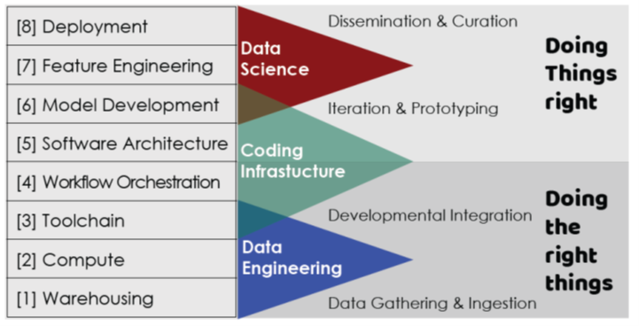
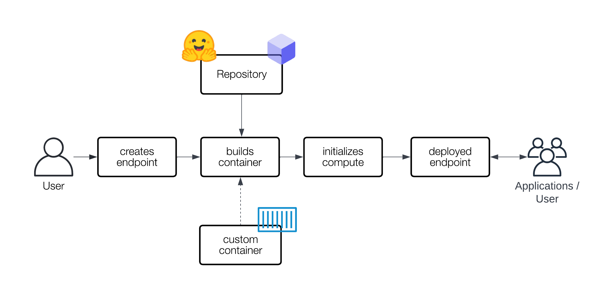

## HR-DataLab Healthcare

We are a cross-functional Agile team. Consisting of data scientists + Tech support.
Our team exists of 5 members that itertively define, build, test, and deploy tool-chain workflows for *Healtcare Data Science Use Cases*.
Here we present a Gen-AI approach that allows Healthcare specilatists to perfom innovative research with custom-made Large Language Models workflows. 


## Multi-Agent Collaboration for Complex Tasks

The integration of generative AI in healthcare is rapidly transforming the industry, enabling medical professionals to leverage advanced AI capabilities without extensive coding expertise. Today, rapid prototyping tools offer intuitive user interfaces along with custom components that facilitate the creation of sophisticated multi-agent workflows for solving complex tasks, including automated clinical documentation, diagnostic support, and large-scale data analysis.


| Type | Tools | Key Features | Target Audience |
|------|-------|--------------|-----------------|
| Multi-Agent Frameworks | AutoGen, CrewAI, LangGraph | • Complex AI agent systems<br>• Collaborative workflows<br>• Stateful interactions | Developers, AI Engineers |
| Low-Code/No-Code Solutions | Flowise, n8n | • Visual interfaces<br>• Drag-and-drop functionality<br>• Workflow automation<br>• LLM integration | Beginners, Non-Developers, Rapid Prototypers, System Integrators, Healthcare Professionals (for Flowise) |
| LLM Application Frameworks | LangChain, LlamaIndex | • External data source integration<br>• Specialized indexing and querying<br>• Versatile LLM application development | Developers, AI Engineers, Data Scientists |
| Comprehensive Platforms | Vertex AI | • End-to-end machine learning platform<br>• Model building, deployment, and scaling<br>• Data labeling and training tools | Machine Learning Engineers, Data Scientists, Medical Professionals (for healthcare applications) |
| Development Environments | Replit | • Browser-based IDE<br>• LLM API experimentation<br>• Collaborative coding<br>• Rapid prototyping | Developers, Beginners, AI Enthusiasts |


By reducing technical barriers, rapid prototyping tools like flowise and Vertex AI allow healthcare specialists to focus on their domain expertise rather than complex coding. This information technolgy-driven shift is already accelerating the development of AI-driven solutions in hospitals and research institutions. These innovations are paving the way for more accessible and widespread adoption of AI technologies in healthcare settings.


## How to construct and Deploy a secure LLM-workflow building Ecosysten

To construct a secure, containerized LLM workflow ecosystem, you need a layered approach combining orchestration and specialized LLM toolchains. Below is shown a framework based on industry best practices.



At its core (Warehousing + Compute layers), Docker can provide the containerization foundation, while tools like Flowise or Autogen can be used to orchestrate the entire workflow (Software Architecure level). For open-source LLM deployments in particular, the Hugging Face Transformers platform offers an LLM Repository combined with Inference Endpoints (Deployment level). 


When using an Inference Endpoint, the huggingface platform creates a specialized version of the model that's ready to be used, either based on the model you choose or a custom-made package you provide such as Flowise or AutoGen. It is kept separate from the original model files, which is crucial for ensuring security by preventing unauthorized access or tampering, and reliability by maintaining consistent performance without unexpected changes or breaks. 
Thus endpoints represent a managed infrastructure solution that allows users to deploy and run machine learning models in a secure and scalable environment, allowing users to focus on deploying and using their models without worrying about the technical details of hosting and maintenance 


 

 
 
https://huggingface.co/docs/inference-endpoints/en/index.


# Hugging Face Space + Azure OpenAI implementation of RAG using Flowise componeny

We developed and maintain a LLMs-based Hugging-face space workflow that allows researchers to process & analyze  text documents reliably and securely.  The code needed to implement the workflow can be downloaded from [Qolead workfow code](https://github.com/HR-DataLab-Healthcare/RESEARCH_SUPPORT/tree/main/PROJECTS/QoLEAD/code) and is explained below.</br></br>

The here presented code is based on the following references
* [Retrieval-Augmented Generation (RAG) with open-source Hugging Face LLMs using LangChain](https://medium.com/@jiangan0808/retrieval-augmented-generation-rag-with-open-source-hugging-face-llms-using-langchain-bd618371be9d)
* [Advanced RAG: Extracting Complex PDFs containing tables & Text Using LlamaParse](https://aksdesai1998.medium.com/advanced-rag-extracting-complex-pdfs-containing-tables-text-using-llamaparse-48b61693da58)
* [State-of-art retrieval-augmented LLM: bge-large-en-v1.5](https://medium.com/@marketing_novita.ai/state-of-art-retrieval-augmented-llm-bge-large-en-v1-5-4cd5abbcbf0a)
* [PyPDF](https://api.python.langchain.com/en/latest/document_loaders/langchain_community.document_loaders.pdf.PyPDFLoader.html)
* [Question Answering (QA) quickstart](https://python.langchain.com/v0.1/docs/use_cases/question_answering/quickstart/)
* [Vectorstores](https://python.langchain.com/docs/integrations/vectorstores/lancedb/)
* [Vectorstores](https://python.langchain.com/v0.1/docs/modules/data_connection/vectorstores/)
* [Chat Openai](https://python.langchain.com/docs/integrations/chat/azure_chat_openai/)


### RAG explained 
Retrieval-Augmented Generation (RAG) revolutionizes text generation by bridging the gap between factual accuracy and creative language. By dynamically accessing and incorporating relevant information, RAG algorithms can generate text that is not only well-written but also grounded in real-world knowledge.

### Create ENV
```powershell
micromamba  create --name qolead-env python=3.12 ipykernel jupyter ipywidgets numpy pandas PyPDF2
```

### Library installation

Add these line to your notebook:
```python
# ===> general Data Science packages
!pip install -U ipykernel jupyter ipywidgets numpy pandas PyPDF2

# ===> NLP packages needed for LangChain + Huggingface platforms
!pip install -U transformers sentence_transformers langchain_community faiss-cpu 
!pip install -U torch torchvision torchaudio 

# When GPU available use: [requires Python 3.9 or later](https://pytorch.org/)
!pip install -U torch torchvision torchaudio --index-url https://download.pytorch.org/whl/cu124

### Library Configuration
List of all imports needed to make the code work

import os
from urllib.request import urlretrieve
import numpy as np
from langchain_community.embeddings import HuggingFaceBgeEmbeddings
from langchain_community.llms import HuggingFacePipeline
from langchain_community.document_loaders import PyPDFLoader
from langchain_community.document_loaders import PyPDFDirectoryLoader
from langchain.text_splitter import RecursiveCharacterTextSplitter
from langchain_community.vectorstores import FAISS
from langchain.chains import RetrievalQA
from langchain.prompts import PromptTemplate
```
</br> 

### Create a map to store and load PDF files locally

```python
import os
# Download documents to local directory (here called LAWTON)
os.makedirs("LAWTON", exist_ok=True)


# load all PDFs that are stored in the local-direcory
from langchain_community.document_loaders import PyPDFLoader
from langchain_community.document_loaders import PyPDFDirectoryLoader
loader = PyPDFDirectoryLoader("./LAWTON/")
```


### Document preparation
PDF documents must be locally available and split in smaller chunks for a LLM to use them as a knowledge base.

Documents should be:

* Large enough to contain enough tokens to answer a question truthfully.
* Small enough to fit into the LLM prompt: Mistral-7B-v0.1 input tokens limited to 4096 tokens
* Small enough to fit into the embeddings model: BAAI/bge-large-en-v1.5: input tokens limited to 512 tokens (roughly 2000 characters. Note: 1 token ~ 4 characters). Note however, set truncation=True to increase to the maximum number of input tokens allowed.


```python
from langchain.text_splitter import RecursiveCharacterTextSplitter

docs_before_split = loader.load()
text_splitter = RecursiveCharacterTextSplitter(
    chunk_size = 900,
    chunk_overlap  = 50,
)
docs_after_split = text_splitter.split_documents(docs_before_split)

docs_after_split[0]
```


### Text Embeddings with Hugging Face models
At the time of writing (nov 2024), 213 text embeddings models for English are available on the Massive Text Embedding Benchmark [MTEB](https://huggingface.co/spaces/mteb/leaderboard). See also [2023 paper on MTEB](https://aclanthology.org/2023.eacl-main.148.pdf). Also [Models trained on Dutch vocabulary](https://huggingface.co/GroNLP/gpt2-small-dutch-embeddings) are available.

The **"Alibaba-NLP/gte-large-en-v1.5"** model is the 18th  on MTEB leaderboard. Key characteristics are:

* Language: English
* Model Size: 434
* Max Sequence Length: 8192
* Dimension: 1024

These numbers indicate that the model can handle long pieces of text (up to 8192 tokens) and produces embeddings with 1024 dimensions. This makes it perfect for tasks like text retrieval, question answering, and more. </br> </br>
The gte-large-en-v1.5 model, developed by the Institute for Intelligent Computing, Alibaba Group, is a powerful tool for natural language processing tasks. It’s a type of Text Embeddings model, which means it’s great at understanding the meaning of text.

To use it locally, the [sentence_transformers](https://api.python.langchain.com/en/latest/embeddings/langchain_community.embeddings.huggingface.HuggingFaceBgeEmbeddings.html#langchain-community-embeddings-huggingface-huggingfacebgeembeddings.) python package needs to be installed. 


```python
import torch
from torch import cuda, bfloat16
from transformers import AutoTokenizer, AutoModel

device = f'cuda:{cuda.current_device()}' if cuda.is_available() else 'cpu'
display(torch.cuda.is_available())

### ===> takes about 60 seconds to complete the process

from langchain_community.embeddings import HuggingFaceBgeEmbeddings

model_name = "Alibaba-NLP/gte-large-en-v1.5"

model_kwargs = {'device': 'cuda', # use: 'cuda' for GPU use, else use:  'cpu' 
                'trust_remote_code':True
                } 

encode_kwargs = {'normalize_embeddings': True,
                 'truncate':True # truncate the input to the maximum length the model can handle
                 }  

### Create the embeddings object
huggingface_embeddings = HuggingFaceBgeEmbeddings(
                                                    model_name=model_name,
                                                    model_kwargs=model_kwargs,
                                                    encode_kwargs=encode_kwargs,
)
```

### Retrieval System for vector embeddings using FAISS

FAISS [Facebook AI Similarity Search](https://python.langchain.com/docs/integrations/vectorstores/faiss/) developed by Facebook AI Research, is a widely acclaimed open-source library for efficient similarity search and clustering. </br> 

It can handle large-scale vector datasets at high speeds and has a low memory usage.
Faiss supports both CPU and GPU acceleration, making it [suitable for a wide range of applications](https://shayan-fazeli.medium.com/faiss-a-quick-tutorial-to-efficient-similarity-search-595850e08473), from recommendation systems to image similarity searches.


