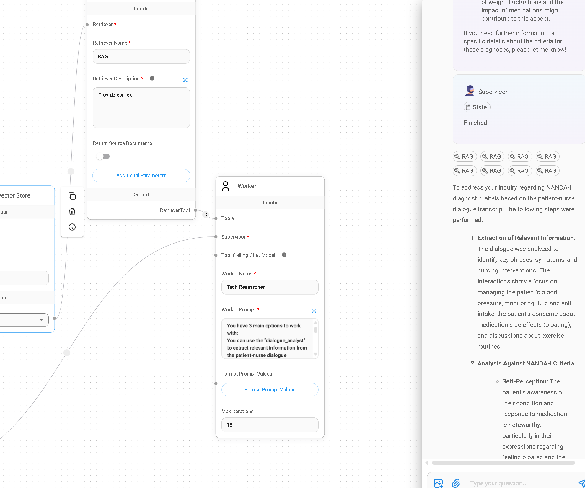

## HR-DataLab Healthcare

We are a cross-functional Agile team. Consisting of data scientists + Tech support.
Our team exists of 5 members that itertively define, build, test, and deploy tool-chain workflows for *Healtcare Data Science Use Cases*.
Here we present a Gen-AI approach that allows Healthcare specilatists to perfom innovative research with custom-made Large Language Models workflows. 


## Building  user-centered intelligent multi-agent systems for information retrieval 

The integration of generative AI in healthcare is rapidly transforming the industry, enabling medical professionals to leverage advanced AI capabilities without extensive coding expertise. Today, rapid prototyping tools offer intuitive user interfaces along with custom-made components that allow to solve complex medical tasks, including automated clinical documentation, diagnostic support, and large-scale data analysis.


| Type | Tools | Key Features    | Target Audience |
|------|-------|-----------------|-----------------|
| Multi-Agent Frameworks | AutoGen, CrewAI, LangGraph | • Complex AI agent systems<br>• Collaborative workflows<br>• Stateful interactions | Developers, AI Engineers |
| Low-Code/No-Code Solutions | Flowise, n8n | • Visual interfaces<br>• Drag-and-drop functionality<br>• Workflow automation<br>• LLM integration | Beginners, Non-Developers, Rapid Prototypers, System Integrators, Healthcare Professionals (for Flowise) |
| LLM Application Frameworks | Hugging Face, Ollama, LangChain, Ollama | • External data source integration<br>• Specialized indexing and querying<br>• Versatile LLM application development | Developers, AI Engineers, Data Scientists |
| Comprehensive Platforms | Vertex AI | • End-to-end machine learning platform<br>• Model building, deployment, and scaling<br>• Data labeling and training tools | Machine Learning Engineers, Data Scientists, Medical Professionals (for healthcare applications) |
| Development Environments | Replit | • Browser-based IDE<br>• LLM API experimentation<br>• Collaborative coding<br>• Rapid prototyping | Developers, Beginners, AI Enthusiasts |

<br> 
The tools as described above represent a spectrum of approaches to AI development, ranging from code-centric frameworks for building complex multi-agent systems to visual, low-code/no-code platforms for rapid prototyping and workflow creation. The diverse range of tools reflects the evolving ecosystem of AI development, catering to both experienced developers and those seeking accessible, user-friendly solutions.

<br> 
By reducing technical barriers, rapid prototyping tools like "Flowise" allow healthcare professionals to focus on their domain expertise rather than solving complex coding problems. This paves the way for more accessible and widespread adoption of Generative AI in healthcare research.

<br> 

## Deploing Gen-AI for secure and reliable information retrieval

To construct a secure, containerized LLM workflow ecosystem, you need a layered approach combining orchestration and specialized LLM toolchains along with Retrieval-Augmented Generation. RAG represents a paradigm shift in generative AI by combining retrieval mechanisms with generation capabilities to produce reliable, context-aware outputs across various domains. Below is shown a generic framework based on Data Science best practices.


At its core (Warehousing + Compute layers), Docker can provide the containerization foundation, while tools like Flowise or Autogen can be used to orchestrate the entire workflow (Software Architecure level). For open-source LLM deployments in particular, the Hugging Face Transformers platform offers an LLM Repository combined with Inference Endpoints (Deployment level). 

<br> 
<br> 
<br> 
<br> <br>

When using an Inference Endpoint, the huggingface platform creates a specialized version of the model that's ready to be used, either based on the model you choose or a custom-made package you provide such as Flowise or AutoGen. 

<br> 


 It is kept separate from the original model files, which is crucial for ensuring security by preventing unauthorized access or tampering, and reliability by maintaining consistent performance without unexpected changes or breaks. 
Thus endpoints represent a managed infrastructure solution that allows users to deploy and run machine learning models in a secure and scalable environment, allowing users to focus on deploying and using their models without worrying about the technical details of hosting and maintenance 

https://huggingface.co/docs/inference-endpoints/en/index.

<br>
<br>
<br>

# Clinical Reasoning for Nurse Specialists

We developed a multi-agent LLMs-based Hugging-face space Chatbot
that allows researchers to process and analyze text documents reliably and securely. 

```C
The information retrieval workflow is designed with 
a highly experienced and knowledgeable nurse as the end user. 

The nurses task is to provide a sound clinical reasoning report 
based on an patient-nurse dialogue transcript.

The clinical reasoning must be based upon NANDA International (NANDA-I) Taxonomy II
By utilizing its structured framework of 
13 domains, 47 classes, and over 267 nursing diagnosis labels, 
the taxonomy enables systematic organization and interpretation 
of patient data derived from nurse-patient dialogues. 
```

<br>

Shown below is part of the output as produced by the implemented information retrieval workflow 
and the goals of the nurse using this system. <br> <br> 



Als a demo video is available: <br> <br>  <video controls src="RAG-vid-test3 1.mp4" title="Title"></video>


[](https://github.com/HR-DataLab-Healthcare/PROJECTS/Harnessing%20the%20Power%20of%20Gen-AI%20in%20Research/VIDEO/RAG-vid-test3%201.mp4)


Markdown

<video src="https://github.com/HR-DataLab-Healthcare/PROJECTS/raw/main/Harnessing%20the%20Power%20of%20Gen-AI%20in%20Research/VIDEO/RAG-vid-test3%201.mp4" controls>
  Your browser does not support the video tag.
</video>


Here’s a detailed description of each step shown in the image, emphasizing its relevance to clinical reasoning using NANDA International Taxonomy II:

1. Recruiter Character Test
Purpose: This step likely assesses the initial characteristics needed for the workflow, ensuring it aligns with the needs of a knowledgeable nurse. It may involve evaluating personal attributes, competencies, or other relevant factors.
Relevance: This ensures that the user engaging with the system is capable of effectively interpreting and acting on the clinical data provided later in the workflow. <br> <br> 
2. Azure OpenAI Embedding
Purpose: This step utilizes Azure’s OpenAI capabilities to embed the input data, converting it into a structured format suitable for processing.
Relevance: For the nurse, transforming dialogue transcripts into embeddings allows for more efficient retrieval of relevant information later in the workflow. It helps in capturing the context and nuances of patient-nurse dialogues for clinical reasoning. <br> <br> 
3. PDF Tool
Purpose: The system processes PDF files, particularly the patient-nurse dialogue transcripts. The nurse would upload the transcript here for analysis.
Relevance: Extracting data from these transcripts is crucial for the nurse's clinical reasoning task. The tool ensures that the relevant patient information is accessible for interpretation according to NANDA-I standards. <br> <br> 
4. Memory Vector Store
Purpose: This component stores the embeddings created from previous steps. It functions as a repository for contextual data.
Relevance: Accessing stored vectors allows the nurse to quickly retrieve relevant patient information and dialogue context needed to make informed clinical reasoning decisions. <br> <br> 
5. Retriever Tool
Purpose: This tool retrieves data from the memory vector store based on the stored embeddings.
Relevance: The nurse can access specific information derived from past dialogues, ensuring that her clinical reasoning is grounded in actual patient interactions, which aligns with the NANDA-I taxonomy’s structured framework for diagnosis. <br> <br> 
6. Worker
Purpose: The worker processes the aggregated information to formulate insights or reports.
Relevance: This step is critical for synthesizing the knowledge extracted from the dialogue transcripts, allowing the nurse to generate a clinically sound report based on the NANDA-I taxonomy, ensuring structured reasoning and diagnosis. <br> <br> 
7. Supervisor
Purpose: The supervisor acts as a checkpoint within the workflow, overseeing the process to ensure quality and adherence to established protocols.
Relevance: This is essential in healthcare to validate clinical reasoning. The supervisor ensures that the nursing diagnoses generated from the dialogue transcripts are accurate and appropriately aligned with the NANDA-I standards. <br> <br> 
8. SQLite Agent Memory
Purpose: This component may be used for efficient data management and retrieval during the workflow.
Relevance: Storing relevant context and information enables quick access and ensures that the clinical reasoning report leverages all necessary data from previous dialogues.
Overall Workflow <br> <br> 


The entire workflow is designed to support the experienced nurse in synthesizing key insights from patient interactions efficiently. By utilizing NANDA International's structured approach, the nurse can categorize patient information accurately, leading to better clinical reasoning and patient outcomes. Each step ensures that the nurse has the tools necessary to interpret, analyze, and apply patient data effectively while adhering to established nursing diagnoses standards.


The references for the components used to implement the workflow are provided below.</br></br>

* [Retrieval-Augmented Generation (RAG) with open-source Hugging Face LLMs using LangChain](https://medium.com/@jiangan0808/retrieval-augmented-generation-rag-with-open-source-hugging-face-llms-using-langchain-bd618371be9d)
* [Advanced RAG: Extracting Complex PDFs containing tables & Text Using LlamaParse](https://aksdesai1998.medium.com/advanced-rag-extracting-complex-pdfs-containing-tables-text-using-llamaparse-48b61693da58)
* [State-of-art retrieval-augmented LLM](https://medium.com/@marketing_novita.ai/state-of-art-retrieval-augmented-llm-bge-large-en-v1-5-4cd5abbcbf0a)
* [PyPDF](https://api.python.langchain.com/en/latest/document_loaders/langchain_community.document_loaders.pdf.PyPDFLoader.html)
* [Question Answering (QA) quickstart](https://python.langchain.com/v0.1/docs/use_cases/question_answering/quickstart/)
* [Vectorstores](https://python.langchain.com/v0.1/docs/modules/data_connection/vectorstores/)
* [Chat Openai](https://python.langchain.com/docs/integrations/chat/azure_chat_openai/)


