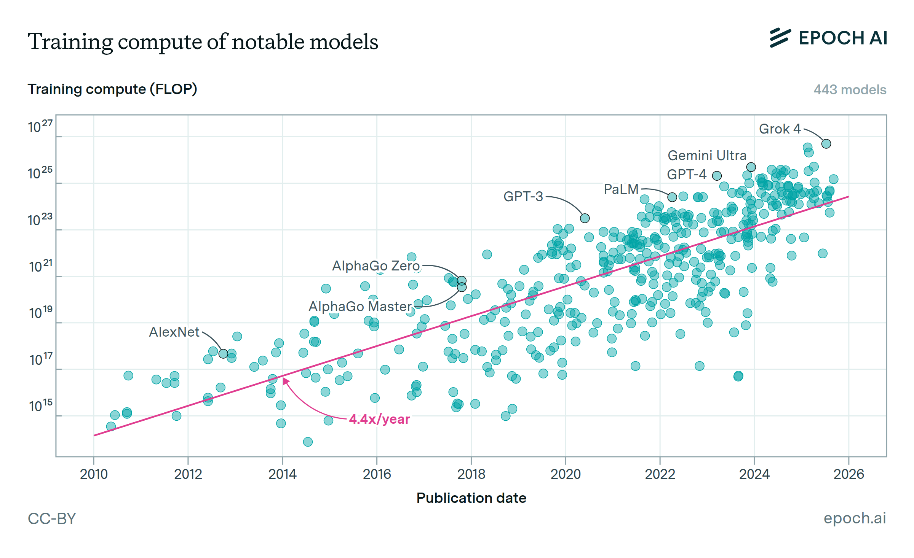

# Epoch AI Models Dataset

Epoch AI's database tracks over 3,200 notable machine learning models from 1950 to present, providing comprehensive data on training compute, parameters, dataset sizes, and hardware trends.[^1][^3]

This resource enables Tech Leads to benchmark infrastructure needs, forecast compute scaling, and align AI development strategies with industry frontiers.




## Usefulness for Tech Leads

- **Infrastructure Planning**: Training compute has grown 4.4x/year since 2010; power needs double annually for frontier models, guiding cluster sizing and energy budgeting.[^1]
- **Cost Forecasting**: Largest models cost hundreds of millions, doubling every 8 months; ~50% GPU spend helps prioritize hardware investments.[^3][^1]
- **Trend Analysis**: >30 models exceed GPT-4 scale (10^25 FLOP) as of mid-2025; track frontier thresholds evolving with top-10 compute releases.[^1]
- **Regulatory Awareness**: Large-scale models (>10^23 FLOP) trigger EU AI Act rules since August 2025, informing compliance roadmaps.[^1]
- **Benchmarking**: Compare against state-of-the-art (SOTA) models, highly cited (>1000 citations), or historically significant releases.[^1]


## Technical Details

**Dataset Scope**: Covers notable models (SOTA benchmarks, >1M users, >\$1M cost, historical relevance); frontier (top-10 compute at release); large-scale (>10^23 FLOP).[^1]

**Key Metrics**:


| Metric | Description | Growth Rate | Confidence Levels |
| :-- | :-- | :-- | :-- |
| Training Compute | FLOP used | 4.4x/year (2010+) | Confident (±3x), Likely (±10x), Speculative (±30x) [^1] |
| Parameters | Model size | Tracked via architecture | Per-entry estimation notes |
| Dataset Size | Tokens used | Estimated from publications/hardware | - |
| Hardware | GPUs/TPUs, clusters | Larger clusters dominate since 2018 | - |
| Power Draw | Training energy | 2x/year | Methodology detailed [^1] |

**Estimation Methods**: Direct from papers where available; inferred from architecture, hardware/duration otherwise. Updated weekly via automated search + manual review; major models added <2 weeks post-release.[^1]

## Quickstart

```python
import pandas as pd

# Load full dataset (CSV, ~November 2025 snapshot; check epoch.ai for latest)
url = "https://epoch.ai/data/all_ai_models.csv"
df = pd.read_csv(url)

# Explore frontier models
frontier = df[df['frontier'] == True]
print(frontier[['name', 'training_compute', 'release_date']].sort_values('training_compute', ascending=False))
```

**Downloads** [epoch.ai/data/ai-models]:

- All Models CSV
- Notable/Frontier/Large-Scale subsets


## Citation \& License

CC-BY: Credit Epoch AI. BibTeX available on site.[^1]

```
@misc{EpochAIModels2025,
  title = {Data on AI Models},
  author = {{Epoch AI}},
  year = {2025},
  url = {https://epoch.ai/data/ai-models}
}
```

Last updated: January 13, 2026. Report issues: data@epochai.org.[^3]
<span style="display:none">[^10][^11][^2][^4][^5][^6][^7][^8][^9]</span>

<div align="center">⁂</div>

[^1]: https://epoch.ai/data/ai-models

[^2]: https://epoch.ai

[^3]: https://github.com/epoch-research/ai-research-impact

[^4]: https://epoch.ai/data

[^5]: https://github.com/epoch-research

[^6]: https://huggingface.co/datasets/meowterspace42/github-ai-project-docs/viewer

[^7]: https://github.com/epoch-research/biology-ai-compute/blob/main/README.md

[^8]: https://github.com/epoch-research/data-stock/blob/master/README.md

[^9]: https://www.youtube.com/watch?v=5UhBnXWbCMY

[^10]: https://gist.github.com/ruvnet/0020d02e9ce85a773412f8bf518737a0

[^11]: https://www.facebook.com/groups/1083405790303889/posts/1112122534098881/

