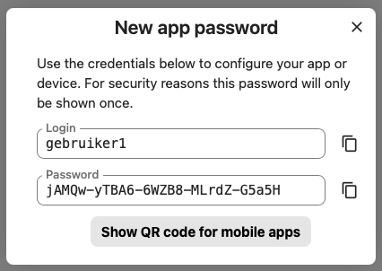

# Datalab Guide: Mounting Research Drive (RD)

This guide provides technical instructions for mounting Research Drive (RD) directories on Windows 11 and Ubuntu VMs. This setup is optimized for handling datasets, SQL scripts, and Docker environments.

## 1. Prerequisites

- **Rclone Installed:** Ensure Rclone is installed on the local  PC or Ubuntu VM environment.

- **[Create (new) WebDAV Credentials with Research Drive GUI](https://servicedesk.surf.nl/wiki/spaces/WIKI/pages/117179045/RD+How+to+get+your+WEBDAV+credentials)** <br>
It is possible to access your Research Drive account as a network drive on your PC, laptop, or mobile device. Clients other than ownCloud need additional credentials in order to connect to Research Drive. These usernames and passwords are called WebDAV credentials..

    

- **[Rclone Configuration with Research Drive (RD)](https://servicedesk.surf.nl/wiki/spaces/WIKI/pages/117179081/RD+How+to+use+Rclone+with+Research+Drive#RD%3AHowtouseRclonewithResearchDrive-2.Rcloneconfiguration)** <br> Configure a Rclone.conf file pointing to the SURF WebDAV endpoint.
    ```bash
    [RD]
    type = webdav
    url = https://my-researchdrive.surf.nl/remote.php/webdav/
    vendor = nextcloud
    user = <user name>
    pass = <encrypted password>
    ```
- **FUSE (Linux Only):** Required to use  'rclone mount' on Ubuntu

- **WinFsp (Windows Only):** Required to use `rclone mount` on Windows.

***

## 2. Windows 11 Configuration (Background Service)

To provide a seamless experience where the drive mounts automatically without keeping a terminal window open:

### A. Install WinFsp

Before mounting, install WinFsp. Open an administrative Command Prompt or PowerShell and run:

```powershell
choco install winfsp -y
```

**Note:** After installing WinFsp, your mount command will work as expected. Always use a drive letter (e.g., `X:`) as the mount point on Windows, not a folder path.

### B. Mounting Script Example

Here <BACKUPS (Projectfolder)/DATASETS/>  is the targer direcory on Research Drive.<br>
X is the mounting point on the Windows 11 PC. <br>

`CMD command line`:
```batch
rclone mount "RD:BACKUPS (Projectfolder)/DATASETS/" X: --links
```
Or alternatively
`C:\Scripts\mount_rd.bat`:

```batch
@echo off
rclone mount "RD:BACKUPS (Projectfolder)/DATASETS/" X: ^
--vfs-cache-mode full ^
--vfs-cache-max-age 24h ^
--network-mode ^
--links ^
--no-console
```

### C. Silent Execution
Create `C:\Scripts\mount_rd.vbs` to hide the command prompt:

```vbs
Set WinScriptHost = CreateObject("WScript.Shell")
WinScriptHost.Run Chr(34) & "C:\Scripts\mount_rd.bat" & Chr(34), 0
Set WinScriptHost = Nothing
```

### D. Persistence
Add a shortcut of the `.vbs` file to the Windows Startup folder (`shell:startup`).

***

## 3. Ubuntu VM Configuration (Systemd Service)
On Linux, utilize systemd to manage the mount as a system service, ensuring it restarts on failure and clears stale endpoints.

### A. Install Fuse
```bash
sudo apt install fuse3
```

### B. Create the Service File
Path: `/etc/systemd/system/rclone-mount.service`
with the nano editor. 

Here `~MyCloudDrive` is the Ubuntu VM's directory that points to Research Drive, with `"RD:BACKUPS (Projectfolder)/DATASETS"` as the target. 

```ini
[Unit]
Description=Rclone Research Drive Mount Service
After=network-online.target

[Service]
Type=simple
User=[your-username]
# Clears 'Transport endpoint is not connected' errors on start
ExecStartPre=-/usr/bin/fusermount -uz /home/[your-username]/MyCloudDrive
ExecStart=/usr/bin/rclone mount "RD:BACKUPS (Projectfolder)/DATASETS" /home/[your-username]/MyCloudDrive \
--config /home/[your-username]/.config/rclone/rclone.conf \
--vfs-cache-mode full \
--vfs-cache-max-age 24h
ExecStop=/bin/fusermount -u /home/[your-username]/MyCloudDrive
Restart=on-failure

[Install]
WantedBy=default.target
```


### C. Activation Commands

```bash
sudo systemctl daemon-reload
sudo systemctl enable rclone-mount.service
sudo systemctl start rclone-mount.service
```


***

## 4. Technical Notes \& Best Practices

| Feature | Recommendation |
| :-- | :-- |
| Cache Mode | Always use `--vfs-cache-mode full` for SQL/Notebook work to support random access. |
| Case Sensitivity | Windows is case-insensitive; Ubuntu is case-sensitive. Verify folder paths exactly. |
| Unmounting | On Linux, use `fusermount -u [path]`. Do not kill the process manually. |
| Docker | If using the mount for Docker volumes, ensure the VFS cache is enabled to prevent file-locking errors. Docker Bind Mounts. <br> <br> Use bind mounts in `docker-compose.yml` to point to the host path: <br> `- /home/[user]/MyCloudDrive/data:/var/lib/mysql`. <br> Ensure VFS cache is enabled to prevent file-locking error <br> |

```bash
services:
  db:
    image: mysql:8.0
    volumes:
      # Map the host's mount point to the container's data directory
      - /home/[your-username]/MyCloudDrive/mysql_data:/var/lib/mysql
    environment:
      MYSQL_ROOT_PASSWORD: your_password
```


