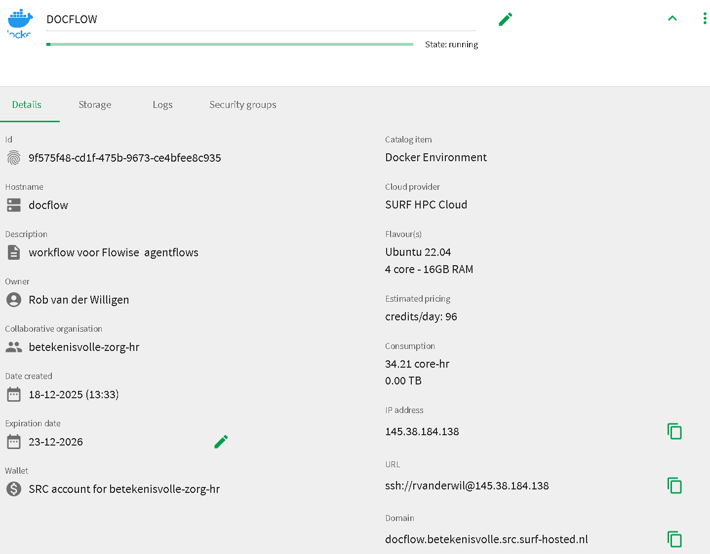
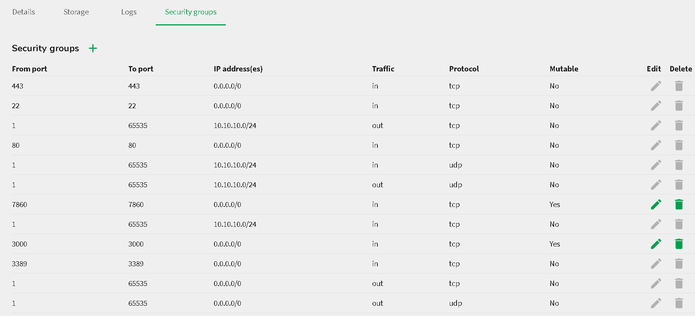

# Flowise on Ubuntu VM with Docker + Traefik HTTPS

This repository deploys **Flowise** (visual LLM workflow builder) on an Ubuntu VM using Docker Compose with **persistent storage** and **automatic HTTPS** via Traefik + Let's Encrypt.

## Features

- ✅ Persistent storage (`/home/rvanderwil/data`)
- ✅ HTTPS with free Let's Encrypt certificates
- ✅ No sudo required for `docker compose`
- ✅ Automatic Traefik TLS certificate renewal
- ✅ Flowise admin login protection


## Prerequisites

1. **Ubuntu VM** with public IP and ports **80/443** open in firewall
2. **Domain** with A-record pointing to VM (e.g. `docflow.betekenisvolle.src.surf-hosted.nl`)
3. **Docker + Docker Compose** installed
4. SSH access as user `rvanderwil`

## Quick Start

```bash
# Clone & enter repo
git clone <this-repo>
cd flowise-docker

# Create data & cert directories
mkdir -p ~/flowise-docker
touch acme.json && chmod 600 acme.json

# Add user to docker group (once)
sudo usermod -aG docker rvanderwil # replace this with the appropiate user (whoami)
newgrp docker  # or logout/login

# Create docker-compose.yml 
Save yml CODE + DOMEIN name as shown below as follows:

  nano ~/flowise-docker/docker-compose.yml`
  ====< copy paste content in nano editor >====
  crl-X ===> shift-Y  to save the content

# Stop Conflicting Services
If Nginx/Apache:
  sudo systemctl stop nginx
  sudo systemctl disable nginx


# Create an empty "real" file:
sudo touch acme.json
# Set the strict permissions:
sudo chmod 600 acme.json

# Deploy
cd ~/flowise-docker
docker compose up -d

# After UDARING docker-compose.yml 
docker compose up -d --force-recreate
```





**Access Flowise:** https://docflow.betekenisvolle.src.surf-hosted.nl

**Login:** `betekenisvollezorg@hr.nl` / `betekenisvolleZorg!2025`

## docker-compose.yml

```yaml
services:
  traefik:
    image: traefik:v2.11
    container_name: traefik
    restart: unless-stopped
    command:
      - "--api.dashboard=true"
      - "--providers.docker=true"
      - "--providers.docker.exposedbydefault=false"
      - "--entrypoints.web.address=:80"
      - "--entrypoints.websecure.address=:443"
      - "--certificatesresolvers.le.acme.httpchallenge=true"
      - "--certificatesresolvers.le.acme.httpchallenge.entrypoint=web"
      - "--certificatesresolvers.le.acme.email=betekenisvollezorg@hr.nl"
      - "--certificatesresolvers.le.acme.storage=/letsencrypt/acme.json"
    ports:
      - "80:80"
      - "443:443"
    volumes:
      - "/var/run/docker.sock:/var/run/docker.sock:ro"
      - "./acme.json:/letsencrypt/acme.json"

  flowise:
    image: flowiseai/flowise:latest
    container_name: flowise
    restart: unless-stopped
    environment:
      - PORT=3000
      - FLOWISE_EMAIL=betekenisvollezorg@hr.nl
      - FLOWISE_PASSWORD=betekenisvolleZorg!2025
      - DATABASE_PATH=/root/.flowise
      - LOG_PATH=/root/.flowise/logs
      - SECRETKEY_PATH=/root/.flowise
      - BLOB_STORAGE_PATH=/root/.flowise/storage
    volumes:
      - /home/rvanderwil/data:/root/.flowise
    labels:
      - "traefik.enable=true"
      - "traefik.http.routers.flowise.rule=Host(`docflow.betekenisvolle.src.surf-hosted.nl`)"
      - "traefik.http.routers.flowise.entrypoints=websecure"
      - "traefik.http.routers.flowise.tls.certresolver=le"
      - "traefik.http.services.flowise.loadbalancer.server.port=3000"

```


## Directory Structure

```
flowise-docker/
├── docker-compose.yml     # Traefik + Flowise
├── acme.json             # Let's Encrypt certs (auto-generated)
└── README.md             # This file
```

**Persistent data:** `/home/rvanderwil/data/` (SQLite DB, flows, uploads)

## Customization

### Change Domain

Edit Traefik label:

```yaml
- "traefik.http.routers.flowise.rule=Host(`your-new-domain.com`)"
```


### Change Credentials

Edit Flowise environment:

```yaml
- FLOWISE_EMAIL=your@email.com
- FLOWISE_PASSWORD=your-strong-password
```


### Different Data Path

```yaml
volumes:
  - /your/custom/path:/root/.flowise
```


## Troubleshooting

| Issue | Solution |
| :-- | :-- |
| `address already in use (port 80)` | `sudo systemctl stop nginx && sudo systemctl disable nginx` |
| `permission denied docker.sock` | `sudo usermod -aG docker $USER && newgrp docker` |
| No HTTPS / cert error | Check DNS A-record \& ports 80/443 open |
| Flows not saving | Verify `/home/rvanderwil/data/` contains `database.sqlite` |
| Traefik logs | `docker logs traefik` |

## Security Notes

- ✅ Strong admin password required
- ✅ HTTPS enforced (no HTTP)
- ✅ Flowise not directly exposed (Traefik only)
- ✅ Persistent encryption keys (`SECRETKEY_PATH`)
- ⚠️ Change default credentials immediately
- ⚠️ Keep `acme.json` permissions `600`


## Maintenance

```bash
# Update & restart
docker compose pull && docker compose up -d

# View logs
docker compose logs -f flowise
docker compose logs -f traefik

# Backup data
tar czf flowise-backup-$(date +%Y%m%d).tar.gz /home/rvanderwil/data

# Stop
docker compose down
```


## Architecture Diagram

```
Internet → [DNS: docflow.betekenisvolle.src.surf-hosted.nl]
         ↓ (80/443)
[Traefik: HTTPS + Let's Encrypt] → [Flowise:3000]
                                    ↓
                              [/home/rvanderwil/data]
```

**Flowise data persists** across updates/restarts. Templates from Marketplace save correctly after clicking **Save** (top bar).

***

⭐ **Star this repo** if helpful!
🐛 **Issues?** Open a GitHub issue.
📄 **License:** MIT

