# Praktische handreiking: los gerenderde flowchart

Deze pagina bevat uitsluitend de Mermaid-weergave van de praktische handreiking uit het statuut, zodat deze apart in Markdown Preview kan worden bekeken of geëxporteerd.

De gegenereerde zelfstandige SVG staat in [DataAnalysisExpert/DATALAB_STATUUT_PRAKTISCHE_HANDREIKING_FLOW.svg](./DataAnalysisExpert/DATALAB_STATUUT_PRAKTISCHE_HANDREIKING_FLOW.svg).

```mermaid
flowchart TD
	A(["Start aanvraag"]) --> B["1. Formuleer vraag, doel en gewenste output<br/>Gebruik hoofdstuk 1 en 4.1"]
	B --> C["2. Bepaal type traject<br/>Data, software, analyse, AI of combinatie"]
	C --> D["3. Doe intake en triage<br/>Gebruik hoofdstuk 2.3, 3 en 4"]
	D --> E{"Persoonsgegevens,<br/>gevoelige data of externe partners?"}
	E -- Ja --> F["4A. Classificeer data en bepaal grondslag<br/>Gebruik hoofdstuk 6.1 en 6.2"]
	E -- Nee --> G["4B. Volg standaard DataLab-route<br/>Met minimale documentatie"]
	F --> H{"Wordt AI gebruikt<br/>of ontwikkeld?"}
	G --> H
	H -- Ja --> I["5A. Toets AI-geletterdheid, menselijk toezicht,<br/>transparantie en risicocategorie<br/>Gebruik hoofdstuk 6.3 en 7"]
	H -- Nee --> J["5B. Beperk route tot data- en workflowgovernance"]
	I --> K{"Omvat het traject software, pipelines,<br/>API-koppelingen of AI-toepassingen?"}
	J --> K
	K -- Ja --> L["6A. Pas security by design toe en toets<br/>cyberrisico's, incl. relevante OWASP-risico's<br/>Gebruik hoofdstuk 6.2"]
	K -- Nee --> M["6B. Ga verder zonder aanvullende<br/>applicatiebeveiligingsroute"]
	L --> N{"Is extra bestuurlijke,<br/>privacy- of security-escalatie nodig?"}
	M --> N
	N -- Ja --> O["7A. Escaleer naar bevoegde rollen<br/>Gebruik hoofdstuk 3.3 en 7"]
	N -- Nee --> P["7B. Kies passende omgeving<br/>Lokaal, SURF, cloud of TRE via hoofdstuk 5.3"]
	O --> P
	P --> Q["8. Leg rollen, toegang, FIDO2/MFA,<br/>tooling, documentatie en werkafspraken vast<br/>Gebruik hoofdstuk 3, 6, 8, 9 en 10"]
	Q --> R["9. Voer traject gefaseerd uit<br/>Met logging, review, hardening en reproduceerbaarheid"]
	R --> S{"Verandert scope,<br/>data, software, AI-functionaliteit<br/>of toegangsmodel?"}
	S -- Ja --> T["10A. Herbeoordeel project<br/>Gebruik hoofdstuk 6, 9.2 en 7"]
	S -- Nee --> U["10B. Rond project af"]
	T --> D
	U --> V["11. Regel overdracht, archivering,<br/>publicatie en intrekken toegang<br/>Gebruik hoofdstuk 9.3, 10 en 12"]
	V --> W(["Einde: traject bestuurlijk en methodologisch afgerond"])
```

