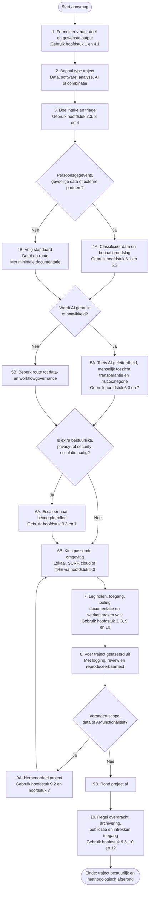

# Statuut van het HR Healthcare DataLab

Geactualiseerde versie: 8 april 2026

NB een ledger m.b.t. Het mandaat en de onstaans geschiedenis van dit statuut ontbreekt nog.
Zo is bijvoorbeeld nog niet beschreven dat het onderhavige statuut dient als blauwdruk voor 
het MT & bedrijfsbureau zodat het kan worden opgenomen in het kwaliteitshandboek.

Centrale uitgangspunten:

- [DataLab Healthcare](https://hr-datalab-healthcare.github.io/)
- [Waarom een DATA-LAB?](https://docent.cmi.hro.nl/willi/HC_DATALAB/waarom-een-data-lab/)
- [AI Scenario Guide – Hybride AI Scenario](https://docent.cmi.hro.nl/willi/HYBRIDE_AI_SCENARIO/)

## Inhoudsopgave

- [1. Doel, positie en reikwijdte](#sec-1-doel)
	- [1.1 Missie en positionering](#sec-1-1-missie)
	- [1.2 Reikwijdte van het DataLab](#sec-1-2-reikwijdte)
	- [1.3 Afbakening: wat het DataLab nadrukkelijk niet is](#sec-1-3-afbakening)
- [2. Kernprincipes en bestuurlijke uitgangspunten](#sec-2-kernprincipes)
	- [2.1 Human-centered werken met data en AI](#sec-2-1-human-centered)
	- [2.2 Hybride infrastructuur als voorkeursmodel](#sec-2-2-hybride)
	- [2.3 Triage, fasering en proportioneel handelen](#sec-2-3-triage)
- [3. Governance, rollen en verantwoordelijkheden](#sec-3-governance)
	- [3.1 Bestuurlijke inrichting](#sec-3-1-bestuurlijke-inrichting)
	- [3.2 Operationele rollen](#sec-3-2-operationele-rollen)
	- [3.3 Escalatie en besluitvorming](#sec-3-3-escalatie)
- [4. Werkwijze per onderzoeksfase](#sec-4-werkwijze)
	- [4.1 Intake en minimale input](#sec-4-1-intake)
	- [4.2 Ondersteuning per fase](#sec-4-2-fasen)
	- [4.3 Standaard output van een DataLab-traject](#sec-4-3-output)
- [5. Infrastructuur en DS-stack](#sec-5-infrastructuur)
	- [5.1 Digitale workspace als basis](#sec-5-1-workspace)
	- [5.2 De DS-stack en verantwoordelijkheidslagen](#sec-5-2-ds-stack)
	- [5.3 Keuze van omgeving: lokaal, SURF, cloud of TRE](#sec-5-3-keuze-omgeving)
- [6. Data-, privacy-, security- en AI-governance](#sec-6-governance-data-ai)
	- [6.1 Dataclassificatie en juridische grondslag](#sec-6-1-dataclassificatie)
	- [6.2 Privacy, informatiebeveiliging en auditability](#sec-6-2-privacy-security)
	- [6.3 AI-geletterdheid, menselijk toezicht en modelgebruik](#sec-6-3-ai-geletterdheid)
	- [6.4 Continuiteit, incidentrespons en ketenregie](#sec-6-4-continuiteit)
- [7. Bestuurlijke verantwoordelijkheid: Nis2 & AI-ACT](#sec-7-nis2-ai-act)
	- [7.1 Waarom dit een bestuursopgave is](#sec-7-1-bestuursopgave)
	- [7.2 Bestuurlijke plichten onder Nis2](#sec-7-2-nis2)
	- [7.3 Bestuurlijke plichten onder AI-ACT](#sec-7-3-ai-act)
	- [7.4 Vertaling naar het HR Healthcare DataLab](#sec-7-4-vertaling)
- [8. Samenwerking, gedrag en gebruiksregels](#sec-8-samenwerking)
	- [8.1 Wat gebruikers praktisch mogen verwachten](#sec-8-1-verwachtingen)
	- [8.2 Gedragsregels voor gebruikers en partners](#sec-8-2-gedragsregels)
	- [8.3 Wat zonder expliciete afstemming niet is toegestaan](#sec-8-3-niet-toegestaan)
- [9. Toegang, gebruik en afsluiting](#sec-9-toegang)
	- [9.1 Procedure voor toegang en inrichting](#sec-9-1-procedure)
	- [9.2 Periodieke review tijdens gebruik](#sec-9-2-review)
	- [9.3 Afsluiting van projecten en overdracht](#sec-9-3-afsluiting)
- [10. Intellectueel eigendom, publicatie en documentatie](#sec-10-ip)
	- [10.1 Eigenaarschap en gebruiksrechten](#sec-10-1-eigenaarschap)
	- [10.2 Publicatie, open science en vertrouwelijkheid](#sec-10-2-publicatie)
	- [10.3 Minimale documentatie-eisen](#sec-10-3-documentatie)
- [11. Projectmanagement via GitHub Enterprise SaaS](#sec-11-github)
	- [11.1 Waarom GitHub Enterprise SaaS past bij een DataLab](#sec-11-1-waarom-github)
	- [11.2 Custom repositories als werkdomeinen](#sec-11-2-custom-repos)
	- [11.3 Scrum boards, issues en sprintsturing](#sec-11-3-scrum)
	- [11.4 Voorbeeldinrichting op basis van HR-DataLab-Healthcare](#sec-11-4-voorbeeld)
- [12. Evaluatie, wijziging en slotbepalingen](#sec-12-slot)
	- [12.1 Periodieke evaluatie](#sec-12-1-evaluatie)
	- [12.2 Wijzigingsprocedure](#sec-12-2-wijzigingsprocedure)
	- [12.3 Slotbepaling](#sec-12-3-slotbepaling)
- [Bronnenlijst](#bronnenlijst)

## 1. Doel, positie en reikwijdte

### 1.1 Missie en positionering

Het HR Healthcare DataLab is een mensgerichte, methodologische en data-inhoudelijke voorziening van Hogeschool Rotterdam die onderzoekers, docenten en projectteams ondersteunt bij vraagstukken rond data, software, analyse, AI en reproduceerbaarheid, wanneer dit aantoonbaar bijdraagt aan de kwaliteit, uitvoerbaarheid en verantwoording van praktijkgericht onderzoek. Deze missie sluit aan op het uitgangspunt “Making Human-Centered Sense of Data”, op de huidige positionering van DataLab Healthcare als eerste aanspreekpunt en op de bestuurlijk verdedigbare keuze voor een hybride inrichting van data- en AI-capaciteit binnen de hogeschool. In de oorspronkelijke HC DataLab-lijn wordt datalab-werk expliciet gepositioneerd als antwoord op dataficering, platformisering en de noodzaak om data niet alleen technisch te verwerken, maar ook professioneel, maatschappelijk en didactisch te duiden; die opgave sluit direct aan bij de oproep uit Science om in het hoger onderwijs de AI-geletterdheidskloof actief te overbruggen ([CMI / Hogeschool Rotterdam, z.d.](#ref-1); [Hogeschool Rotterdam, 2026a](#ref-5); [Hogeschool Rotterdam, 2026b](#ref-6); [Miranda, 2026](#ref-21)).

Het DataLab is geen losstaand innovatie-eiland, maar een schakel tussen onderwijs, onderzoek, ondersteunende diensten en externe praktijkpartners. Het DataLab ondersteunt de publieke opdracht van Hogeschool Rotterdam om vanuit de strategische agenda 2023-2028 te werken aan maatschappelijke transities, met behoud van professionele autonomie, publieke waarden en aantoonbare zorgvuldigheid ([Hogeschool Rotterdam, 2023](#ref-4); [Hogeschool Rotterdam, 2026a](#ref-5)).

### 1.2 Reikwijdte van het DataLab

Dit statuut is van toepassing op ondersteuningstrajecten waarin het DataLab een rol speelt bij:

- het aanscherpen van onderzoeksvragen, datastromen en analysekeuzes;
- proof-of-concept, prototyping en pipeline-ontwerp;
- inrichting van reproduceerbare workflows, documentatie en overdracht;
- afstemming over DMP, SMP, veilige opslag, toegang en passende researchdiensten;
- inzet of beoordeling van AI-toepassingen binnen onderzoek, onderwijs of hybride onderzoeksomgevingen;
- samenwerking in een lokale, federatieve of Trusted Research Environment (TRE) wanneer privacy- of security-eisen dat nodig maken ([Hogeschool Rotterdam, 2026a](#ref-5); [Hogeschool Rotterdam, 2026b](#ref-6)).

De reikwijdte omvat zowel projecten in Healthcare als bredere interdisciplinaire trajecten waarin gezondheidsdata, onderwijsdata, AI-experimenten of data-intensieve vraagstukken samenkomen.

### 1.3 Afbakening: wat het DataLab nadrukkelijk niet is

Het DataLab is niet standaard:

- een uitvoeringsloket dat volledige analyses of langdurige dataverwerking overneemt;
- een formele goedkeuringsinstantie voor AVG-, DPIA- of securitytoetsing;
- een onbeperkt softwareontwikkelteam voor maatwerk zonder opdracht, mandaat of afstemming;
- een vrijplaats voor experimenten zonder documentatie, classificatie of bestuurlijke verantwoording.

Het DataLab werkt primair als triage-, ontwerp-, afstemmings- en kwaliteitsfunctie. Waar specialistische, formele of langdurige inzet nodig is, verwijst het DataLab door naar de juiste expertise of organiseert het een gezamenlijke route ([Hogeschool Rotterdam, 2026b](#ref-6)).

## 2. Kernprincipes en bestuurlijke uitgangspunten

### 2.1 Human-centered werken met data en AI

Het DataLab werkt vanuit een human-centered benadering. Data, modellen en infrastructuur zijn geen doel op zich, maar middelen om betekenisvolle, navolgbare en ethisch verantwoorde inzichten te genereren. Deze benadering verzet zich tegen een louter technisch of platformgedreven gebruik van data en AI, en benadrukt dat menselijke interpretatie, professionele dialoog en maatschappelijke context altijd leidend moeten blijven ([CMI / Hogeschool Rotterdam, z.d.](#ref-1)).

In zorgcontexten is dit ook inhoudelijk consistent met de gedachte dat AI vooral waarde toevoegt wanneer het professioneel oordeel, klinische context en menselijke verantwoordelijkheid versterkt in plaats van vervangt ([Topol, 2019](#ref-23)).

Daaruit volgen de volgende basisprincipes:

- menselijk begrip en professionele betekenisgeving gaan voor automatisering om de automatisering;
- het DataLab ondersteunt verantwoord experimenteren, niet onbeheerst opschalen;
- gevoelige of kritieke beslissingen blijven onder menselijk toezicht;
- documentatie, uitleg en reconstructie zijn integraal onderdeel van goed datalab-werk.

### 2.2 Hybride infrastructuur als voorkeursmodel

Het DataLab hanteert een hybride infrastructuurvisie als standaard bestuurlijk uitgangspunt. Dat betekent: lokaal waar datacontrole, privacy, betrouwbaarheid of onderwijsnabijheid centraal staan; federatief, gedeeld of cloud-gebaseerd waar schaalbare capaciteit, modeltoegang of samenwerking nodig zijn. Deze keuze voorkomt zowel onnodige afhankelijkheid van een enkele externe leverancier als de bestuurlijke en financiele last van een volledig autarkische lokale inrichting. Onderzoek naar on-device machine learning, edge-cloud collaborative inference en deep learning laat bovendien zien dat zware modeltaken, lokale datacontrole en schaalbare compute in de praktijk juist gelaagd gecombineerd moeten worden in plaats van in één monolithische omgeving te worden ondergebracht ([Hogeschool Rotterdam, 2026a](#ref-5); [Dhar et al., 2021](#ref-17); [He et al., 2020](#ref-18); [LeCun et al., 2015](#ref-19)).

Deze hybride lijn is verenigbaar met:

- de DataLab Healthcare-praktijk van PoC, prototyping en gefaseerde opschaling;
- de human-centered traditie van het HC Data-Lab;
- de sectorale en Europese beweging richting federatieve, interoperabele en verantwoordbare digitale infrastructuren ([CMI / Hogeschool Rotterdam, z.d.](#ref-1); [Hogeschool Rotterdam, 2026a](#ref-5); [Hogeschool Rotterdam, 2026b](#ref-6)).

### 2.3 Triage, fasering en proportioneel handelen

Het DataLab werkt vroegtijdig, gefaseerd en proportioneel. Niet elk project heeft dezelfde infrastructuur, governance of expertise nodig. Daarom start elk traject met een intake waarin doel, datagevoeligheid, methode, timing, partners, gewenste output en risico's expliciet worden gemaakt. Op basis daarvan wordt bepaald:

- of het DataLab direct ondersteunt of eerst doorverwijst;
- welke omgeving passend is;
- welke documentatie verplicht is;
- welke aanvullende rollen moeten worden betrokken;
- welke beheersmaatregelen nodig zijn ([Hogeschool Rotterdam, 2026b](#ref-6)).

## 3. Governance, rollen en verantwoordelijkheden

### 3.1 Bestuurlijke inrichting

De bestuurlijke inrichting van het DataLab moet licht genoeg zijn om experimenten mogelijk te maken, maar stevig genoeg om privacy, informatiebeveiliging, continuiteit en publieke waarden aantoonbaar te borgen. Daarom kent het DataLab ten minste drie sturingsniveaus:

| Niveau | Hoofdtaak |
|---|---|
| Bestuurlijk eigenaarschap | Vaststellen van koers, scope, randvoorwaarden, prioriteiten en verantwoordingsafspraken. |
| Operationele coordinatie | Intake, triage, planning, kwaliteitsborging, afstemming tussen rollen en voortgang. |
| Projectspecifieke inrichting | Uitvoering van afspraken per project, inclusief documentatie, toegangsbeheer en overdracht. |

De bestuurlijke eigenaar blijft eindverantwoordelijk voor de kaders waarbinnen het DataLab functioneert. In een hybride model kan die verantwoordelijkheid niet worden uitbesteed aan leveranciers of sectorale voorzieningen ([Hogeschool Rotterdam, 2026a](#ref-5); [Nationaal Cyber Security Centrum, 2026](#ref-7); [SURF Security Expertise Centrum, z.d.](#ref-8)).

Een dergelijke taakverdeling past bij datagovernance-benaderingen waarin rollen, controles en lifecycle-besluiten expliciet worden gemaakt in plaats van impliciet in tooling of projectgewoonte te verdwijnen ([DAMA NL, 2023](#ref-11)).

### 3.2 Operationele rollen

Per traject worden rollen expliciet toegewezen. Afhankelijk van aard en gevoeligheid van een project kunnen de volgende rollen betrokken zijn:

| Rol | Kernverantwoordelijkheid |
|---|---|
| DataLab-coordinator / tech lead | Intake, triage, routebepaling, samenhang tussen infrastructuur, workflow en documentatie. |
| Projectleider / aanvrager | Inhoudelijk eigenaarschap van de onderzoeksvraag, planning, deliverables en projectcontext. |
| Methodoloog / statisticus | Ontwerp, analysekader, validiteit, reproduceerbaarheid en toetsbaarheid van keuzes. |
| Datasteward / RDM-support | DMP, metadata, archivering, bewaartermijnen, FAIR en publicatie-afspraken. |
| ICT / IDT | Accounts, licenties, technische inrichting, beheer, integraties en ondersteunende tooling. |
| Privacy / security / FG-route | Classificatie, DPIA-route, maatregelen, toegangsbeleid, incident- en compliancevraagstukken. |
| Domeinexpert / praktijkpartner | Contextvaliditeit, interpretatie van data, toepassingsgrenzen en maatschappelijke relevantie. |

De rolverdeling wordt per project gedocumenteerd in een intake-uitkomst of plan van aanpak ([Hogeschool Rotterdam, 2026b](#ref-6)).

### 3.3 Escalatie en besluitvorming

Escalatie is verplicht wanneer:

- persoonsgegevens of bijzondere persoonsgegevens worden verwerkt;
- een project buiten de standaard DataLab-scope valt;
- structurele softwareontwikkeling, integratie of productiebeheer ontstaat;
- er twijfel is over juridische grondslag, datadeling of publicatie;
- AI-toepassingen worden ingezet met verhoogd risico voor studenten, medewerkers, patienten of besluitvorming;
- externe leveranciers, cloud-diensten of samenwerkingspartners nieuwe afhankelijkheden introduceren.

In zulke gevallen kan het DataLab een traject niet zelfstandig afronden zonder aanvullende afstemming met de relevante formele rol of bevoegd gezag.

## 4. Werkwijze per onderzoeksfase

### 4.1 Intake en minimale input

Iedere aanvraag start met een intake. Minimaal wordt aangeleverd:

1. onderzoeksvraag, doel en beoogde output;
2. type data, herkomst, omvang en gevoeligheid;
3. globale methode of analysebenadering;
4. planning, deadlines en beoogde fasering;
5. betrokken partners, gewenste toegang en beoogde omgeving.

De intake leidt tot een kort plan van aanpak met daarin: wat het DataLab doet, wat de aanvrager doet, welke aanvullende rollen nodig zijn, welke omgeving passend is en welke documentatie verplicht is, zodat toegang, verantwoordelijkheden en kwaliteitsborging al in de voorfase expliciet worden vastgelegd ([Hogeschool Rotterdam, 2026b](#ref-6); [Tilburg University, z.d.](#ref-15)).

### 4.2 Ondersteuning per fase

| Fase | Typische vraag | Rol van het DataLab |
|---|---|---|
| Voorfase | Is de vraag scherp genoeg en is de route haalbaar? | Intake, aanscherpen van vraag/doel, eerste methodologische en technische routekeuze, doorverwijzing waar nodig. |
| Verkenning / PoC | Kunnen we eerst veilig testen en prototypen? | Pipeline-ontwerp, keuze van tools en omgeving, beperkte proof-of-concept, voorbereiding op opschaling. |
| Dataverzameling | Hoe organiseren we kwaliteit, logging en workflow? | Advies over datastromen, kwaliteitscontroles, versiebeheer en werkafspraken. |
| Analyse | Hoe borgen we reproduceerbaarheid en overdraagbaarheid? | Ondersteuning bij workflow, scripts, documentatie, evaluatie en afbakening van modelgebruik. |
| DMP / SMP | Welke afspraken zijn nodig? | Afstemming over opslag, toegang, toolkeuze, licenties, overdracht en archivering. |
| Rapportage / overdracht | Hoe blijft het navolgbaar? | Audit trail, reconstructie, kwaliteitscriteria, handover en afsluitafspraken. |

De fase-aanpak is niet lineair verplicht: kleine trajecten kunnen compact door meerdere fasen gaan, terwijl grotere trajecten formele go/no-go-momenten vereisen.

### 4.3 Standaard output van een DataLab-traject

Afhankelijk van de fase levert een traject minimaal een of meer van de volgende artefacten op:

- intakeverslag of routebesluit;
- project- of onderzoeksprotocol;
- analyseplan;
- DMP;
- SMP;
- beschrijving van gekozen omgeving en toegangsafspraken;
- audit trail met versies, runs, beslissingen en overdrachtsmomenten.

## 5. Infrastructuur en DS-stack

### 5.1 Digitale workspace als basis

Het DataLab faciliteert geen losse tools zonder samenhang, maar een digitale workspace: een combinatie van hardware, software, toegangsafspraken, documentatie en werkprocessen waarmee data veilig kan worden opgeslagen, verwerkt, geanalyseerd en gedeeld. Deze workspace moet passen bij de fase van het onderzoek, de gevoeligheid van de data en de mate van benodigde rekenkracht ([Hogeschool Rotterdam, 2026b](#ref-6)).

### 5.2 De DS-stack en verantwoordelijkheidslagen

Het DataLab werkt met een DS-stack-benadering op basis van separation of concerns. Daarmee worden keuzes zichtbaar en overdraagbaar per laag:

1. **Infrastructuurlaag:** compute, storage, back-up, netwerk, performance.
2. **Toegang en beveiliging:** accounts, rollen, rechten, logging, classificatie, veilige werkplek.
3. **Data-laag:** databronnen, intake, metadata, datakwaliteit, datasetversies.
4. **Verwerkingslaag:** ETL/ELT, scripts, workflows, reproduceerbare runs, monitoring.
5. **Analyse- en modelleerlaag:** statistiek, ML, evaluatie, validatie, gevoeligheidsanalyse.
6. **Output- en overdrachtslaag:** rapportage, dashboards, code, documentatie, audit trail en archivering ([Hogeschool Rotterdam, 2026b](#ref-6)).

Iedere laag kent een eigen eigenaar of verantwoordelijke rol. Daardoor blijft het mogelijk om delen van een traject aan te passen zonder het hele systeem onnodig te destabiliseren.

Het expliciet scheiden van deze lagen ondersteunt bovendien systematische modelevaluatie en reproduceerbaarheid, iets wat in ACM-literatuur over grote taalmodellen als randvoorwaarde voor betrouwbare inzet wordt benadrukt ([Chang et al., 2024](#ref-16)).

### 5.3 Keuze van omgeving: lokaal, SURF, cloud of TRE

Het DataLab kiest de omgeving niet op basis van voorkeur alleen, maar op basis van vraag, risico en proportionaliteit:

- **Lokaal / workstations / HPC:** geschikt voor vroege prototyping, kleine of middelgrote datasets, onderwijsnabije experimenten en niet- of beperkt gevoelige data.
- **SURF Research Drive:** geschikt voor duurzame opslag, samenwerking en projectstructuur.
- **SURF SRAM:** geschikt voor rollen, groepen en federatief toegangsbeheer.
- **SURF Research Cloud:** geschikt voor schaalbare onderzoeksomgevingen en reproduceerbare opschaling.
- **TRE of vergelijkbare beveiligde omgeving:** noodzakelijk bij verhoogde privacy- of security-eisen, strikte exportregels of gevoelige samenwerkingsdata ([Hogeschool Rotterdam, 2026b](#ref-6)).

De onderliggende voorkeurslogica is hybride: kritieke data en beheersmaatregelen blijven onder eigen regie, terwijl aanvullende capaciteit gecontroleerd en gedocumenteerd kan worden benut via federatieve of externe voorzieningen ([Hogeschool Rotterdam, 2026a](#ref-5)).

## 6. Data-, privacy-, security- en AI-governance

### 6.1 Dataclassificatie en juridische grondslag

Voor ieder traject wordt vooraf vastgesteld:

- om welk type data het gaat;
- wie eigenaar, bronhouder en verwerkingsverantwoordelijke is;
- welke juridische grondslag geldt;
- welke classificatie van toepassing is;
- welke minimale dataset nodig is voor het doel.

Bij gezondheidsgegevens moeten met name doelbinding, minimale gegevensverwerking en passende uitzonderingsgronden vooraf aantoonbaar zijn uitgewerkt ([Autoriteit Persoonsgegevens, z.d.-a](#ref-9); [Autoriteit Persoonsgegevens, z.d.-b](#ref-10)). Dataminimalisatie, doelbinding en bewaarbeperking zijn standaard. Projecten zonder voldoende duidelijkheid over doel, grondslag of datastromen worden niet opgestart of worden teruggelegd voor herontwerp ([Hogeschool Rotterdam, 2026b](#ref-6)).

### 6.2 Privacy, informatiebeveiliging en auditability

Het DataLab sluit aan op de privacy- en informatiebeveiligingsvolwassenheid die Hogeschool Rotterdam nastreeft. Dat betekent dat maatregelen niet impliciet of incidenteel mogen zijn, maar gedocumenteerd, formeel ingebed, aantoonbaar getest en periodiek geevalueerd moeten worden. Voor onderzoeksdata moet bovendien de juridische status van ruwe data, hergebruiksrechten en de route voor zorgvuldige deling van gezondheidsdata expliciet worden gedocumenteerd, zodat juridische en ethische randvoorwaarden niet pas achteraf zichtbaar worden ([Hogeschool Rotterdam, 2026b](#ref-6); [SURF Security Expertise Centrum, z.d.](#ref-8); [SURF, z.d.](#ref-14); [Data voor gezondheid, 2021](#ref-12); [Hartwig Medical Foundation, z.d.](#ref-13)).

Minimaal gelden de volgende eisen:

- least-privilege en need-to-know bij toegang;
- logging, auditability en reconstructeerbaarheid van relevante acties;
- gebruik van goedgekeurde omgevingen en accounts;
- passende encryptie en MFA waar van toepassing;
- DPIA-route of aanvullende privacy/security-afstemming indien nodig;
- expliciete export- en deelregels bij gevoelige data.

### 6.3 AI-geletterdheid, menselijk toezicht en modelgebruik

AI-gebruik binnen het DataLab vereist niet alleen technische, maar ook professionele en bestuurlijke beheersing. Daarom gelden de volgende uitgangspunten:

- AI-toepassingen worden vooraf geinventariseerd en functioneel afgebakend;
- modelkeuze wordt gemotiveerd op basis van doel, datagevoeligheid, uitlegbaarheid en onderhoudbaarheid;
- kritieke beslissingen blijven onder menselijk toezicht;
- output van generatieve of agentische systemen wordt niet zonder controle als juist of volledig beschouwd;
- gebruikers moeten over een toereikend niveau van AI-geletterdheid beschikken of dit vooraf verwerven ([Europese Commissie, 2026](#ref-2); [Hogeschool Rotterdam, 2026a](#ref-5)).

Het DataLab ondersteunt daarom niet alleen toolgebruik, maar ook verantwoord modelgebruik, bronvalidatie, bounded autonomy en het expliciet vastleggen van controlepunten. Modelselectie mag daarbij niet uitsluitend op generieke benchmarkprestaties worden gebaseerd; voor DataLab-toepassingen tellen ook hallucinatierisico, domeinvalidatie, herhaalbaarheid en contextbehoud, zeker bij generatieve toepassingen in klinische en onderwijscontexten ([Chang et al., 2024](#ref-16); [Huang et al., 2025](#ref-22); [van Velzen et al., 2025](#ref-20); [Miranda, 2026](#ref-21)).

### 6.4 Continuiteit, incidentrespons en ketenregie

De hybride infrastructuurvisie ontslaat Hogeschool Rotterdam niet van haar eigen zorgplicht. Waar externe diensten worden gebruikt, blijft de instelling verantwoordelijk voor risicoanalyse, logging, toegangsbeheer, incidentrespons, continuiteit en ketenbeheersing ([Hogeschool Rotterdam, 2026a](#ref-5); [Nationaal Cyber Security Centrum, 2026](#ref-7); [Europees Parlement en de Raad, 2022](#ref-3)).

Daarom moet bij ieder traject duidelijk zijn:

- welke afhankelijkheden in de keten bestaan;
- welke fallback- of herstelopties beschikbaar zijn;
- wie incidenten meldt en afhandelt;
- hoe periodieke review en actualisatie plaatsvinden.

## 7. Bestuurlijke verantwoordelijkheid: Nis2 & AI-ACT

### 7.1 Waarom dit een bestuursopgave is

Volgens het Hybride AI Scenario verandert de keuze voor AI-infrastructuur de bestuurlijke maatstaf waarmee Hogeschool Rotterdam haar digitale voorzieningen moet beoordelen. Zodra onderwijs, onderzoek en AI afhankelijk worden van externe platforms, sectorale voorzieningen en leveranciersketens, moet het bestuur aantoonbaar kunnen verantwoorden hoe risicoanalyse, logging, continuiteit, toegangsbeheer en incidentsturing zijn ingericht. De kern is daarbij niet of capaciteit lokaal of extern draait, maar of de instelling de regie op kritieke data, processen en controlemaatregelen aantoonbaar behoudt ([Hogeschool Rotterdam, 2026a](#ref-5)).

### 7.2 Bestuurlijke plichten onder Nis2

In dezelfde bron wordt Nis2 gelezen als een explicitering van zorgplicht, meldplicht, ketenbeveiliging en bestuurlijke verantwoording. Dat betekent voor Hogeschool Rotterdam dat cyberweerbaarheid en informatiebeheer niet volledig kunnen worden gedelegeerd aan IT, SURF of leveranciers: het bestuur moet laten zien dat passende maatregelen zijn vastgesteld, uitgevoerd en periodiek getoetst op onder meer risicoanalyse, continuiteit, incidentrespons, ketenbeveiliging, toegangsbeheer en evaluatie. Voor het DataLab impliceert dit dat iedere hybride voorziening alleen toelaatbaar is wanneer rollen, escalatielogica en controlemaatregelen vooraf bestuurlijk navolgbaar zijn ingericht ([Hogeschool Rotterdam, 2026a](#ref-5)).

### 7.3 Bestuurlijke plichten onder AI-ACT

De bron positioneert de AI-ACT als een aanvullende bestuursopgave: naast cyberweerbaarheid moet de instelling ook de rechtmatige, transparante en pedagogisch verantwoorde inzet van AI aantoonbaar organiseren. Daaruit volgt dat AI-toepassingen systematisch moeten worden geinventariseerd, per toepassing in een risicocategorie moeten worden geplaatst en dat transparantie, documentatie, menselijk toezicht en AI-geletterdheid niet facultatief zijn maar bestuurlijke randvoorwaarden vormen. Voor het DataLab betekent dit dat experimenteerruimte alleen verantwoord is wanneer tegelijk zichtbaar blijft welke AI-toepassing wordt gebruikt, welk doel zij dient, welke controlepunten gelden en waar menselijk ingrijpen verplicht blijft ([Hogeschool Rotterdam, 2026a](#ref-5)).

### 7.4 Vertaling naar het HR Healthcare DataLab

Voor het HR Healthcare DataLab volgt hieruit dat hybride infrastructuur geen technisch compromis is, maar een bestuursmodel waarin lokale regie over gevoelige data en kernprocessen wordt gecombineerd met gecontroleerde inzet van externe of sectorale capaciteit. Het DataLab ondersteunt die lijn door intake, dataclassificatie, logging, review, begrenzing van autonome AI-functionaliteit en periodieke herbeoordeling als vaste onderdelen van elk traject te behandelen. Daarmee wordt het DataLab niet de drager van de eindverantwoordelijkheid, maar wel het operationele mechanisme waarmee het bestuur Nis2- en AI-ACT-verplichtingen in de praktijk aantoonbaar kan laten landen ([Hogeschool Rotterdam, 2026a](#ref-5)).

## 8. Samenwerking, gedrag en gebruiksregels

### 8.1 Wat gebruikers praktisch mogen verwachten

Gebruikers mogen van het DataLab verwachten:

- een helder intakeproces en een eerste inhoudelijke routekeuze;
- concrete adviezen over vraagverheldering, workflow, tooling en omgeving;
- ondersteuning bij prototyping, reproduceerbaarheid en documentatie;
- tijdige doorverwijzing wanneer specialistische of formele afstemming nodig is;
- een werkwijze die past bij de gevoeligheid van data en de schaal van het project ([Hogeschool Rotterdam, 2026b](#ref-6)).

### 8.2 Gedragsregels voor gebruikers en partners

Iedere gebruiker van het DataLab:

- werkt respectvol, zorgvuldig en transparant samen;
- erkent bijdragen van anderen en documenteert gebruikte bronnen, tools en datasets;
- gebruikt data uitsluitend voor het goedgekeurde doel;
- handelt conform privacy-, security- en toegangsafspraken;
- meldt incidenten, datalekken of twijfelgevallen onmiddellijk;
- vermijdt onnodige kopieen, exports en parallelle schaduwprocessen buiten de afgesproken omgeving;
- houdt rekening met de maatschappelijke, didactische en professionele gevolgen van data- en AI-gebruik ([CMI / Hogeschool Rotterdam, z.d.](#ref-1); [Hogeschool Rotterdam, 2026b](#ref-6)).

Voor gevoelige onderzoeks- en zorgdata betekent dit ook dat delen, hergebruik en publicatie alleen plaatsvinden binnen expliciete afspraken over doel, context en beschermingsmaatregelen ([Data voor gezondheid, 2021](#ref-12); [Hartwig Medical Foundation, z.d.](#ref-13)).

### 8.3 Wat zonder expliciete afstemming niet is toegestaan

Zonder expliciete goedkeuring of aanvullende route is niet toegestaan:

- re-identificatie van geanonimiseerde of gepseudonimiseerde data;
- gebruik van niet-goedgekeurde externe AI-tools of cloud-diensten voor gevoelige data;
- publicatie of overdracht van artefacten zonder controle op privacy, eigenaarschap en vertrouwelijkheid;
- langdurige productie-inzet van experimentele pipelines zonder overdracht en beheerafspraken;
- autonome AI-acties met materiele gevolgen voor personen, onderwijsbesluiten of gevoelige onderzoeksuitkomsten.

## 9. Toegang, gebruik en afsluiting

### 9.1 Procedure voor toegang en inrichting

Toegang tot DataLab-voorzieningen verloopt in beginsel via de volgende stappen:

1. intake en intakebesluit;
2. dataclassificatie en bepaling van de passende omgeving;
3. vastlegging van rollen, documentatie en noodzakelijke afspraken;
4. technische inrichting van accounts, rechten en projectstructuren;
5. start van het traject met afgesproken evaluatiemomenten.

Toegang wordt altijd tijd-, doel- en rolgebonden ingericht.

Deze route volgt de logica van gecontroleerde datalab-toegang waarin vraag, omvang, rollen en rechten in samenhang worden beoordeeld in plaats van pas tijdens uitvoering te worden hersteld ([Tilburg University, z.d.](#ref-15); [Autoriteit Persoonsgegevens, z.d.-a](#ref-9)).

### 9.2 Periodieke review tijdens gebruik

Tijdens gebruik geldt een reviewplicht wanneer:

- de projectscope verandert;
- nieuwe databronnen of partners worden toegevoegd;
- een PoC wordt opgeschaald naar operationeel gebruik;
- AI-functionaliteit wordt uitgebreid;
- risico's of incidenten aanleiding geven tot herbeoordeling.

### 9.3 Afsluiting van projecten en overdracht

Bij afsluiting van een traject worden ten minste de volgende punten vastgelegd:

- welke data, code en documentatie bewaard, gearchiveerd of vernietigd worden;
- wie eigenaar blijft van welke artefacten;
- welke accounts en toegangen worden ingetrokken;
- hoe overdracht plaatsvindt naar beheer, publicatie of vervolgonderzoek;
- welke leerpunten worden teruggekoppeld naar het DataLab als organisatie.

## 10. Intellectueel eigendom, publicatie en documentatie

### 10.1 Eigenaarschap en gebruiksrechten

Eigenaarschap van data, code, modellen en andere projectartefacten volgt de geldende afspraken van Hogeschool Rotterdam, de betrokken lectoraten, onderzoeksgroepen en eventuele externe partners. Indien partners data aanleveren, blijven bronrechten en gebruiksbeperkingen expliciet van kracht tenzij schriftelijk anders is vastgelegd.

Voor onderzoeksdata impliceert dit ook dat onderscheid wordt gemaakt tussen eigendom van ruwe data, afgeleide datasets, code, modellen en documentatie, inclusief eventuele licentie- of gebruiksbeperkingen die hergebruik beperken ([SURF, z.d.](#ref-14)).

Voor elk traject met externe partijen of verhoogde gevoeligheid moeten gebruiksrechten, publicatierechten en overdrachtsrechten vooraf expliciet zijn vastgesteld.

### 10.2 Publicatie, open science en vertrouwelijkheid

Het DataLab stimuleert open science en overdraagbaarheid waar dit verantwoord kan, maar nooit ten koste van privacy, contractuele beperkingen of het risico op herleidbaarheid. Publicatie van resultaten, scripts of afgeleide datasets vindt daarom alleen plaats na toetsing op:

- privacy en vertrouwelijkheid;
- contractuele of partnergebonden restricties;
- intellectueel eigendom;
- navolgbaarheid van gebruikte methode en artefacten.

Juist bij generatieve en klinische toepassingen vraagt verantwoord publiceren extra aandacht voor contextverlies, privacyverlies en semantische vervorming van afgeleide output ([van Velzen et al., 2025](#ref-20); [Hartwig Medical Foundation, z.d.](#ref-13)).

### 10.3 Minimale documentatie-eisen

Voor ieder DataLab-traject geldt een minimale documentatieplicht. Afhankelijk van de aard van het project moet het dossier ten minste bevatten:

- intake-uitkomst of plan van aanpak;
- protocol of probleemdefinitie;
- analyseplan;
- DMP;
- SMP;
- beschrijving van infrastructuur- en toegangskeuzes;
- audit trail of overdrachtsnotitie.

Zonder minimale documentatie geldt een traject niet als bestuurlijk of methodologisch afgerond.

## 11. Projectmanagement via GitHub Enterprise SaaS

### 11.1 Waarom GitHub Enterprise SaaS past bij een DataLab

Voor een DataLab past GitHub Enterprise SaaS als centrale projectmanagementlaag omdat inhoudelijke artefacten zoals code, notebooks, documentatie, protocollen en analysebesluiten direct gekoppeld kunnen worden aan issues, reviews en sprintwerk. Daarmee wordt projectsturing niet losgekoppeld van de audit trail die het DataLab toch al nodig heeft voor overdraagbaarheid, reproduceerbaarheid en kwaliteitsborging ([Hogeschool Rotterdam, 2026b](#ref-6)).

Een Enterprise SaaS-inrichting is daarbij vooral relevant omdat private repositories, fijnmazige rechten, teamstructuren, branch protection en centrale governance gecombineerd kunnen worden met laagdrempelige samenwerking tussen onderzoekers, data scientists, methodologen en ondersteunende diensten.

### 11.2 Custom repositories als werkdomeinen

Voor het HR Healthcare DataLab ligt een indeling in custom repositories voor de hand. Niet ieder project of werkpakket hoort in dezelfde repository thuis. Een werkbare indeling is bijvoorbeeld:

- een repository voor research support en generieke werkwijzen;
- aparte repositories per project, dataset-route of prototype;
- een repository voor documentatie of publieke verantwoording;
- een aparte proces- of board-omgeving voor sprint- en backlogsturing.

Deze scheiding voorkomt dat inhoudelijke artefacten, operationele backlog-items en organisatorische afspraken door elkaar gaan lopen. Het publieke voorbeeld van de GitHub-organisatie HR-DataLab-Healthcare laat deze logica al zien met een afzonderlijke RESEARCH_SUPPORT-repository, een aparte website-repository en een afzonderlijke SCRUM_BOARD-repository; in een GitHub Enterprise SaaS-context kan dezelfde structuur intern en met private rechten worden opgeschaald ([HR-DataLab-Healthcare, z.d.-a](#ref-24); [HR-DataLab-Healthcare, z.d.-b](#ref-25); [HR-DataLab-Healthcare, z.d.-c](#ref-26)).

### 11.3 Scrum boards, issues en sprintsturing

Een Scrum-board voegt voor het DataLab vooral waarde toe wanneer het niet alleen softwaretaken toont, maar ook methodologische, privacy/security- en datamanagementtaken zichtbaar maakt. Een werkbare minimumstructuur is:

- **Backlog:** intakeverzoeken, verbeterpunten, afhankelijkheden en nieuwe projectvragen;
- **Ready:** uitgewerkte issues met eigenaar, scope en acceptatiecriteria;
- **In Progress:** actieve sprintitems;
- **Review:** inhoudelijke review, methodologische check, privacy/security-check of pull request review;
- **Done:** afgeronde items met vastgelegde output en documentatie.

Issues kunnen zo worden gebruikt voor intake, DMP/SMP-acties, dataclassificatie, pipeline-aanpassingen, analysebesluiten en overdrachtsmomenten. Pull requests koppelen codewijzigingen en documentatie vervolgens aan concrete backlog-items, zodat zichtbaar blijft waarom iets is gewijzigd, door wie, op basis van welke review en met welk effect op het projectdossier.

### 11.4 Voorbeeldinrichting op basis van HR-DataLab-Healthcare

Voor het HR Healthcare DataLab is de volgende GitHub Enterprise SaaS-inrichting aanbevelenswaardig:

1. één organisatie voor het DataLab;
2. custom repositories per werkstroom of projecttype;
3. één centraal Scrum-board voor intake, sprintplanning, blokkades en oplevering;
4. issue-templates voor intake, data-aanvraag, DMP/SMP, analyseverzoek en overdracht;
5. branch protection, reviewverplichtingen en rolgebaseerde rechten;
6. koppeling van issues, pull requests, releases en documentatie aan het projectdossier.

Het publieke HR-DataLab-Healthcare-voorbeeld laat zien dat een cross-functioneel Agile team zijn research support en scrumsturing al op repositoryniveau kan onderscheiden. Voor een Enterprise SaaS-variant is de volgende stap om deze scheiding te combineren met private projectrepositories, gestandaardiseerde workflows en formele rechtenstructuren, zodat projectmanagement direct bijdraagt aan auditability, overdraagbaarheid en bestuurlijke beheersbaarheid ([HR-DataLab-Healthcare, z.d.-a](#ref-24); [HR-DataLab-Healthcare, z.d.-b](#ref-25); [Hogeschool Rotterdam, 2026b](#ref-6)).

## 12. Evaluatie, wijziging en slotbepalingen

### 12.1 Periodieke evaluatie

Het DataLab wordt minimaal jaarlijks geevalueerd op:

- kwaliteit en doorlooptijd van intake en triage;
- mate van tijdige betrokkenheid in de voorfase;
- kwaliteit van documentatie en overdracht;
- passende inzet van lokale, federatieve en beveiligde omgevingen;
- privacy-, security- en auditbevindingen;
- mate waarin ondersteuning daadwerkelijk bijdraagt aan kwalitatief beter en verantwoord onderzoek.

### 12.2 Wijzigingsprocedure

Wijzigingen in dit statuut worden voorbereid door de operationele coordinatie van het DataLab en vastgesteld door de bestuurlijk eigenaar na consultatie van relevante stakeholders, waaronder methodologische, privacy/security- en ICT/IDT-vertegenwoordiging. Inhoudelijke actualisatie is verplicht wanneer wetgeving, institutionele kaders of de DataLab-infrastructuur wezenlijk veranderen.

### 12.3 Slotbepaling

Dit statuut is bedoeld als werkbaar bestuurs- en uitvoeringskader. Waar dit document niet voorziet, geldt dat het meest zorgvuldige, proportionele en navolgbare handelingsperspectief wordt gekozen, met tijdige escalatie naar de bevoegde rol. De centrale lijn blijft daarbij ongewijzigd: mensgericht werken met data en AI, onder eigen regie waar het moet en in hybride samenwerking waar het verantwoord kan.

## Bronnenlijst

Onderstaande referenties vormen de centrale uitgangspunten en ondersteunende kaders voor deze geactualiseerde versie van het statuut. DOI's of URL's beginnen steeds op een nieuwe regel.

[1]  CMI / Hogeschool Rotterdam. (z.d., 2019). *Waarom een DATA-LAB?* 
<https://docent.cmi.hro.nl/willi/HC_DATALAB/waarom-een-data-lab/>

[2]  Europese Commissie, Directoraat-Generaal Onderwijs, Jeugd, Sport en Cultuur. (2026). *Guidelines on the ethical use of artificial intelligence and data in teaching and learning for educators* (2e ed.). 
<https://op.europa.eu/en/publication-detail/-/publication/f692aa0b-17a7-11f1-8870-01aa75ed71a1>

[3]  Europees Parlement en de Raad. (2022). *Richtlijn (EU) 2022/2555 betreffende maatregelen voor een hoog gezamenlijk niveau van cyberbeveiliging in de Unie (NIS2-richtlijn).* 
<https://eur-lex.europa.eu/legal-content/NL/TXT/HTML/?uri=CELEX:32022L2555>

[4]  Hogeschool Rotterdam. (2023). *Talent voor Transitie: Strategische agenda 2023-2028.* 
<https://www.hogeschoolrotterdam.nl/globalassets/documenten/hogeschool/over-ons/talent-voor-transitie---strategische-agenda-2023---2028.pdf>

[5]  Hogeschool Rotterdam. (2026a). *AI Scenario Guide – Business Case AI in het Onderwijs: Hybride AI Scenario.* 
<https://docent.cmi.hro.nl/willi/HYBRIDE_AI_SCENARIO/>

[6]  Hogeschool Rotterdam. (2026b). *DataLab Healthcare.* 
<https://hr-datalab-healthcare.github.io/>

[7]  Nationaal Cyber Security Centrum. (2026). *Over de Cyberbeveiligingswet (NIS2).* 
<https://www.ncsc.nl/over-ncsc/wettelijke-taak/wat-gaat-de-nis2-richtlijn-betekenen-voor-uw-organisatie/samenvatting-nis2-richtlijn>

[8]  SURF Security Expertise Centrum. (z.d.). *SURFaudit Toetsingskader informatiebeveiliging.* 
<https://sec.surf.nl/surfaudit-toetsingskader-informatiebeveiliging/>

[9]  Autoriteit Persoonsgegevens. (z.d.-a). *De AVG in het kort.* 
<https://www.autoriteitpersoonsgegevens.nl/themas/basis-avg/avg-algemeen/de-avg-in-het-kort>

[10] Autoriteit Persoonsgegevens. (z.d.-b). *Gezondheidsgegevens verwerken.* 
<https://www.autoriteitpersoonsgegevens.nl/themas/gezondheid/gezondheidsgegevens-gebruiken-en-delen/gezondheidsgegevens-verwerken>

[11] DAMA NL. (2023). *Data Science Governance Framework.* 
<https://dama-nl.org/wp-content/uploads/2023/03/DAMA-NL-Data-Science-Governance-Framework-2023.2.pdf>

[12] Data voor gezondheid. (2021). *ECP | Handleiding - Aanpak begeleidingsethiek voor AI in de zorg.* 
<https://www.datavoorgezondheid.nl/binaries/datavoorgezondheid/documenten/publicaties/2021/01/15/handleiding-aanpak-begeleidingsethiek-voor-ai--digitale-zorg/Handleiding+Aanpak+begeleidingsethiek+voor+AI+in+de+zorg.pdf>

[13] Hartwig Medical Foundation. (z.d.). *Oog voor de ethische aspecten van het delen van data.* 
<https://www.hartwigmedicalfoundation.nl/oog-voor-de-ethische-aspecten-van-het-delen-van-data/>

[14] SURF. (z.d.). *De juridische status van ruwe data: een wegwijzer voor de onderzoekspraktijk.* 
<https://www.surf.nl/rapport-de-juridische-status-van-ruwe-data-een-wegwijzer-voor-de-onderzoekspraktijk>

[15] Tilburg University. (z.d.). *Data Lab.* 
<https://www.tilburguniversity.edu/nl/campus/universiteitsbibliotheek/informatie-zoeken/financiele-bedrijfsgegevens/datalab>

[16] Chang, Y., Wang, X., Wang, J., et al. (2024). *A survey on evaluation of large language models.* ACM Transactions on Intelligent Systems and Technology, 15(3), 1-45. 
<https://doi.org/10.1145/3641289>

[17] Dhar, S., Guo, J., Liu, J., Tripathi, S., Kurup, U., & Shah, M. (2021). *A survey of on-device machine learning: An algorithms and learning theory perspective.* ACM Transactions on Internet of Things, 2(3), Article 15. 
<https://doi.org/10.1145/3450494>

[18] He, Z., Zhang, T., & Lee, R. B. (2020). *Attacking and protecting data privacy in edge-cloud collaborative inference systems.* IEEE Internet of Things Journal, 8(12), 9706-9716. 
<https://doi.org/10.1109/JIOT.2020.3022358>

[19] LeCun, Y., Bengio, Y., & Hinton, G. (2015). *Deep learning.* Nature, 521(7553), 436-444. 
<https://doi.org/10.1038/nature14539>

[20] van Velzen, M., van der Willigen, R. F., de Beer, V. J., et al. (2025). *Privacy-, linguistic-, and information-preserving synthesis of clinical documentation through generative agents.* Frontiers in Artificial Intelligence, 8, 1644084. 
<https://doi.org/10.3389/frai.2025.1644084>

[21] Miranda, M. L. (2026). *Higher education must bridge the AI gap.* Science, 392(6793), 5. 
<https://doi.org/10.1126/science.aeh5777>

[22] Huang, L., Yu, W., Ma, W., et al. (2025). *A survey on hallucination in large language models: Principles, taxonomy, challenges, and open questions.* ACM Transactions on Information Systems, 43(2), Article 38. 
<https://doi.org/10.1145/3703155>

[23] Topol, E. J. (2019). *High-performance medicine: The convergence of human and artificial intelligence.* Nature Medicine, 25(1), 44-56. 
<https://doi.org/10.1038/s41591-018-0300-7>

[24] HR-DataLab-Healthcare. (z.d.-a). *RESEARCH_SUPPORT* [GitHub repository]. 
<https://github.com/HR-DataLab-Healthcare/RESEARCH_SUPPORT>

[25] HR-DataLab-Healthcare. (z.d.-b). *SCRUM_BOARD* [GitHub repository]. 
<https://github.com/HR-DataLab-Healthcare/SCRUM_BOARD>

[26] HR-DataLab-Healthcare. (z.d.-c). *HR-DataLab-Healthcare* [GitHub organization]. 
<https://github.com/HR-DataLab-Healthcare>

## Praktische handreiking: statuut stap voor stap hanteren

Onderstaand schema vertaalt het statuut naar een praktische volgorde voor intake, beoordeling, uitvoering en afsluiting van een DataLab-traject.

