# 🤖 Workshophandleiding: Chatbots met RAG in Flowise AI  
  
## 📌 Over deze workshop  
In deze workshop leer je hoe je een **persoonlijke chatbot** bouwt met behulp van **Retrieval Augmented Generation (RAG)** in **Flowise AI**.    
We gebruiken een **externe PDF-bron** (bijvoorbeeld een CV, handleiding of onderzoeksrapport) om de chatbot context te geven en maken deze in staat om **gerichte, contextuele antwoorden** te geven op gebruikersvragen.  
  
---  
  
## 🎯 Leerdoelen  
Na deze workshop kun je:  
- Een **nieuw project** opzetten in Flowise AI.  
- Een **PDF-document laden** en voorbereiden voor AI-verwerking.  
- **Tekst splitsen** in beheersbare stukken met behoud van context.  
- **Vector stores en embeddings** gebruiken voor semantische zoekopdrachten.  
- Een **Conversational Retrieval QA Chain** opzetten voor contextueel chatten.  
- Een **ChatOpenAI-model** integreren voor antwoordgeneratie.  
- Je chatbot testen en inzetten.  
  
---  
  
## 🛠️ Benodigde technologieën  
  
| Technologie | Beschrijving |  
|-------------|--------------|  
| **Flowise AI** | Open-source low-code platform om LLM-applicaties visueel te bouwen en te testen. |  
| **LangChain** | Framework voor het orkestreren van LLM-componenten en integratie met externe tools. |  
| **Azure OpenAI / OpenAI API** | GPT-modellen met enterprise-grade beveiliging en schaalbaarheid. |  
| **Node.js** | JavaScript runtime waarop Flowise server-side draait. |  
| **Docker** | Containerplatform voor consistente en schaalbare deployments. |  
| **Retrieval Augmented Generation (RAG)** | Techniek om actuele, contextuele antwoorden te genereren op basis van externe kennisbronnen. |  
| **Hugging Face Spaces** | Platform voor het publiceren van AI-modellen en interactieve applicaties met een webinterface. |  
| **Inference Endpoints** | Beheerde, schaalbare en beveiligde API-koppelingen voor het draaien van AI-modellen in productie. |  
  
---  
  
## 🚀 Stappenplan: Chatbot bouwen in Flowise  
  
### 1️⃣ Flowise openen  
- Start Flowise online via:
<br> HUGGINFACE: https://huggingface.co/spaces/RobFvdw/DATALAB_FLOW01
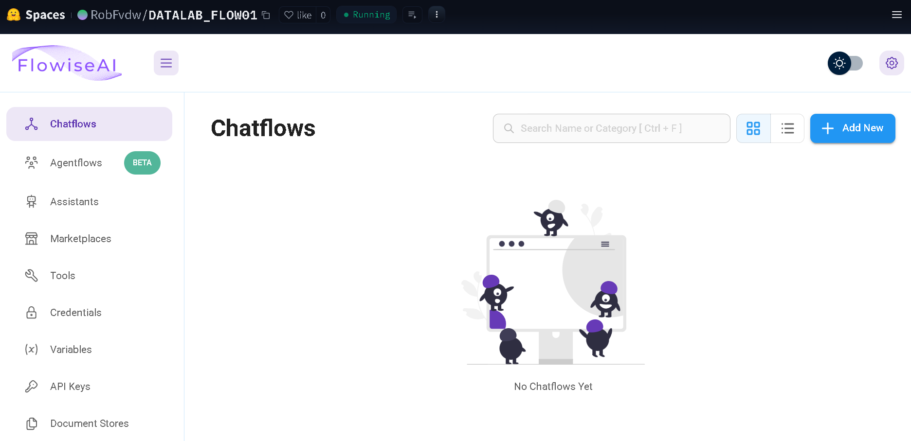

- Klik op **Add New** om een nieuwe flow te maken.  
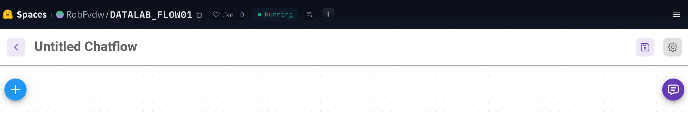

- Klik op **paarse icoon** om flow op te slaan met naam AZURE-RAG (ipv *Untitled Chatflow*).
- Klik op save 
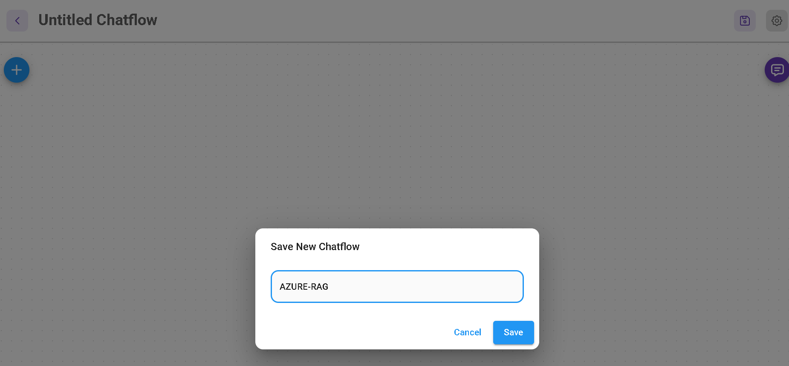
---  

### 2️⃣ Document Loader toevoegen  
- Sleep een **Document Loader** node naar je flow.  
- Kies **PDF File** als type document loader.  
- Upload het PDF-bestand dat je als kennisbron wilt gebruiken (bijvoorbeeld je CV).  
- Zet **Usage** op *One document per file*.  


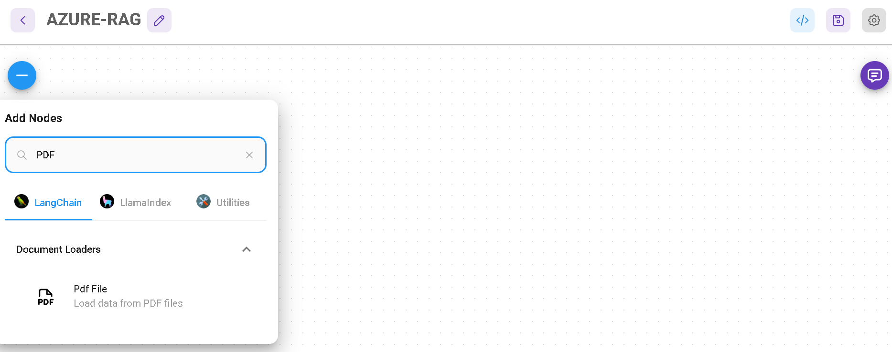
---  

### 3️⃣ Tekst splitsen met Text Splitter  
- Voeg een **Recursive Character Text Splitter** toe.  
- Stel in:  
- **Chunk size** = maximaal aantal tekens per blok.  
- **Chunk overlap** = aantal tekens overlap om context te behouden.  
- Verbind de **Document Loader** met de **Text Splitter**.  

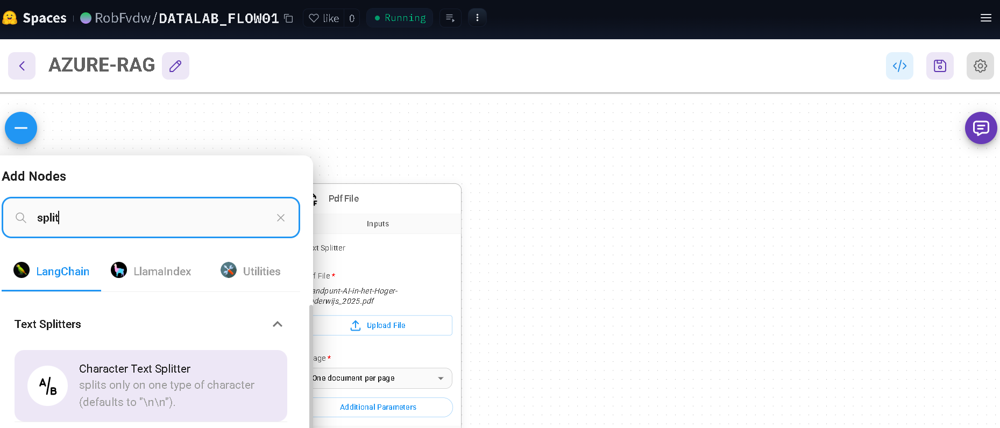
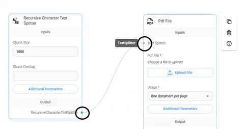
---  

### 4️⃣ Vector Store instellen  
- Voeg een **In-Memory Vector Store** toe.  
- Verbind de **Text Splitter** met de **Vector Store**.  

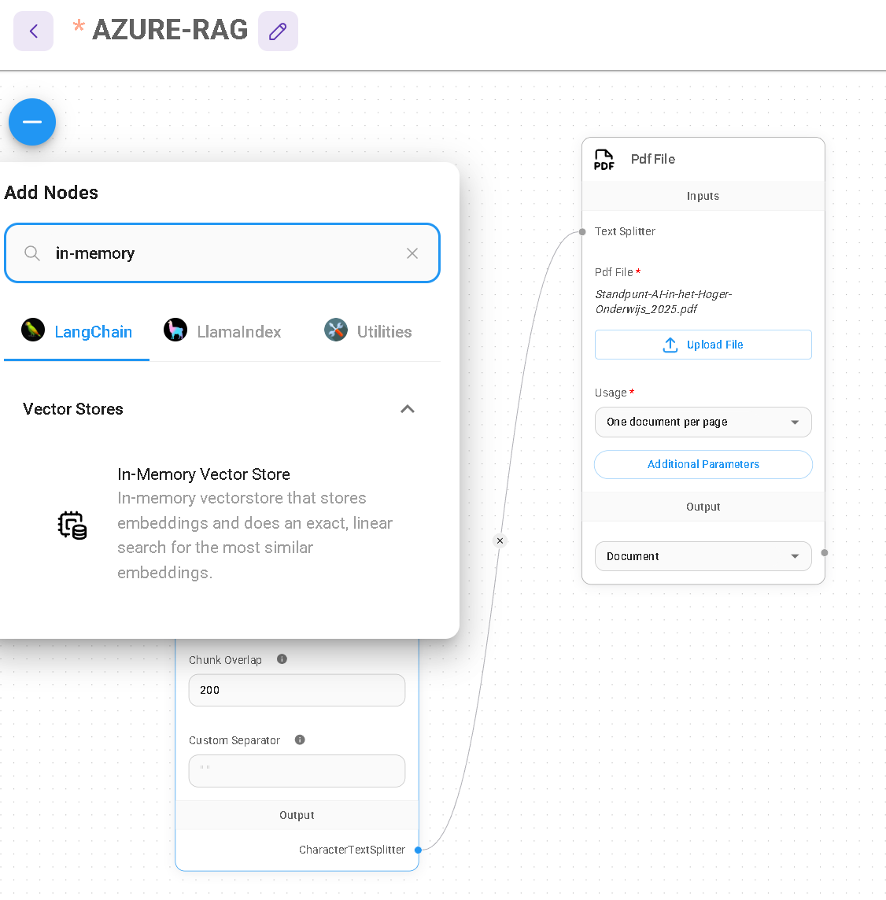

---  

### 5️⃣ Azure OpenAI credentials toevoegen ✅
Voordat we embeddings en chatmodellen kunnen gebruiken, moeten we Azure OpenAI instellen.

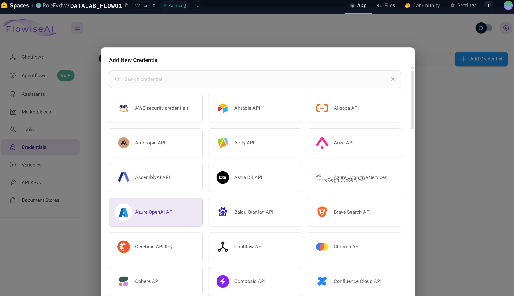
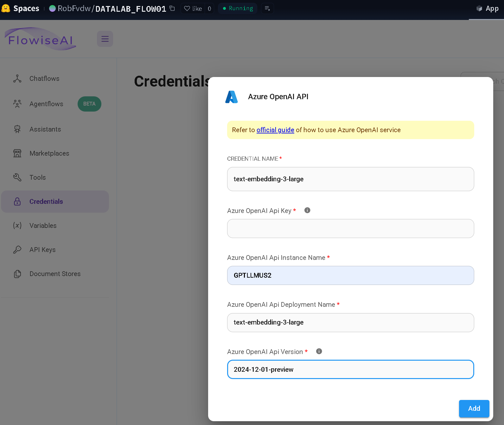

```
📌 Azure OpenAI account & API key verkrijgen  
1. Ga naar [Azure Portal](https://portal.azure.com/).  
2. Maak een nieuwe resource: **Azure OpenAI**.  
3. Wacht tot de resource is aangemaakt en open deze.  
4. Ga naar **Keys and Endpoint** in het menu.  
5. Kopieer:  
 - **Endpoint URL** (bijv. `https://jouw-resource.openai.azure.com/`)  
 - **API Key** (Key 1 of Key 2)  
6. Ga naar **Model deployments** en:  
 - Deploy **text-embedding-3-large** (deployment name bijv. `embedding-large`)  
 - Deploy **gpt-4-mini** (deployment name bijv. `gpt4-mini`)  

💡 *Noteer deze deployment names, je hebt ze nodig in Flowise.*  

#### 📌 Instellen in Flowise  
1. Sleep een **Azure OpenAI Embeddings** node in je flow.  
2. Vul in:  
 - **Resource Name**: naam van je Azure OpenAI resource.  
 - **Deployment Name**: bijvoorbeeld `embedding-large`.  
 - **Endpoint**: jouw endpoint URL.  
 - **API Key**: jouw Azure OpenAI API key.  
3. Verbind deze embeddings node met de **Vector Store**.  
```

### 6️⃣ Embeddings toevoegen  

We gaan **Azure OpenAI** gebruiken om embeddings te genereren met het **text-embedding-3-large** model. 

- Voeg een **AzureOpenAI Embeddings** node toe.  
- Vul je **modelnaam** in.  
- Verbind de **Embedding** node met de **Vector Store**.  

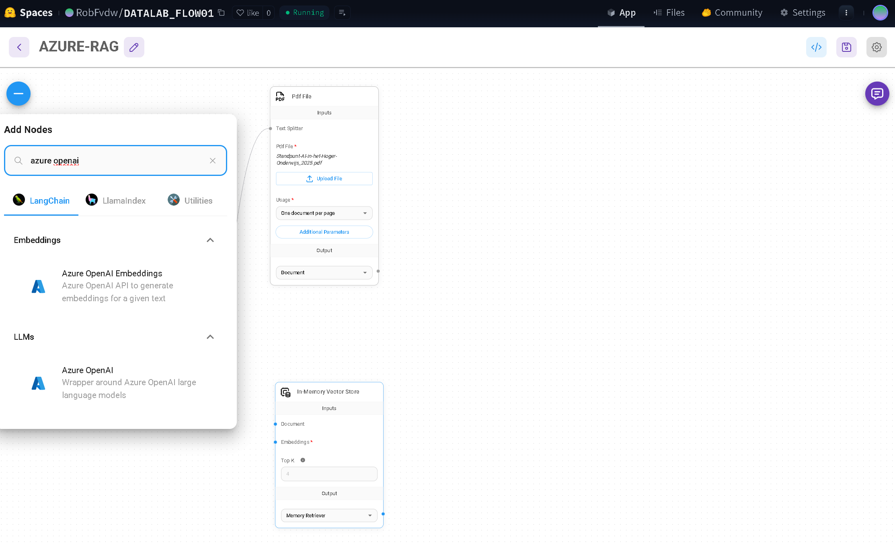


---  

### 7️⃣ Retrieval Chain opzetten  
- Voeg een **Conversational Retrieval QA Chain** toe.  
- Verbind de **Vector Store** met de Retrieval Chain.  
- Deze chain zorgt dat vervolgvragen contextueel beantwoord worden met gebruik van chatgeschiedenis.  

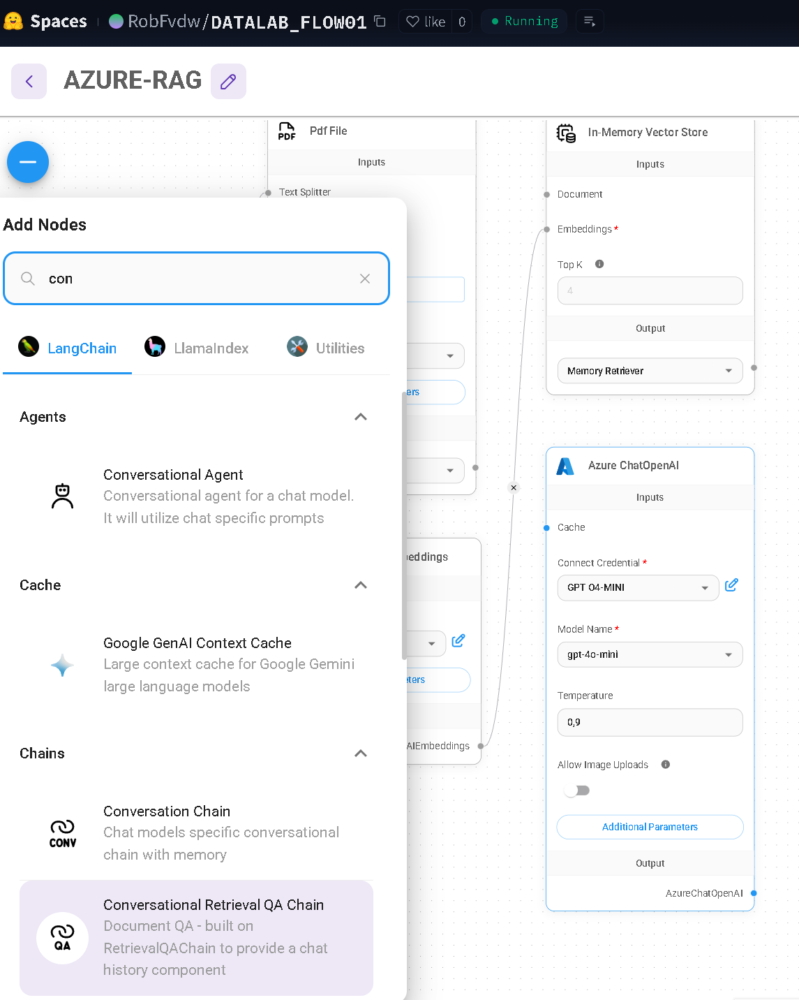

---  

### 8️⃣ Chatmodel koppelen  
- Voeg een **ChatOpenAI** node toe.  
- Selecteer je **OpenAI API Key** en kies het gewenste model (bij voorkeur `gpt-4`, anders `gpt-3.5`).  
- Verbind de Retrieval Chain met het Chatmodel.  


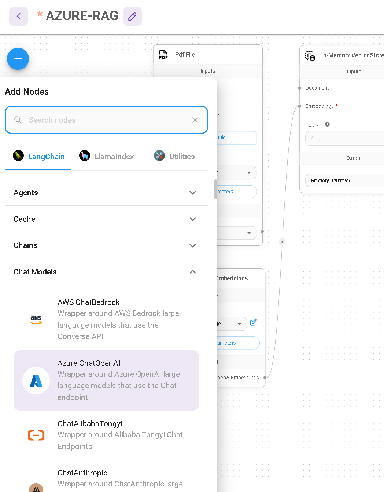

---  

### 9️⃣ Database updaten  
- Klik op het **Upsert Database**-icoon.  
- Klik op **Upsert** om de data in de vector store op te slaan.  

---  

### 🔟 Chatbot testen  
- Klik op het **chat-icoon** rechtsboven in Flowise.  
- Stel vragen over de inhoud van je PDF en controleer of de antwoorden correct zijn.  

💡 Voorbeeld:    
*Vraag:* "Wat is het e-mailadres uit mijn CV?"    
*Antwoord:* [Chatbot haalt het uit de PDF en geeft het juiste adres.]  

---  

## 📊 Architectuur in het kort  

**RAG in Flowise werkt als volgt:**  
1. **Document Loader** → Laadt externe data (PDF).  
2. **Text Splitter** → Verdeelt tekst in kleine, contextuele stukken.  
3. **Embeddings** → Zet tekst om in vectorrepresentaties.  
4. **Vector Store** → Slaat vectors op en maakt semantisch zoeken mogelijk.  
5. **Retrieval Chain** → Combineert vectorzoekresultaten met chatgeschiedenis.  
6. **Chat Model** → Genereert antwoord op basis van context en prompt.  

---  

## 📌 Conclusie  
Met Flowise AI kun je eenvoudig een **RAG-chatbot** bouwen die externe documenten gebruikt om **gerichte en contextuele antwoorden** te geven.    
Door gebruik te maken van **document loaders**, **text splitters**, **vector stores**, **embeddings** en **retrieval chains**, bouw je krachtige AI-assistenten die je kunt inzetten in onderwijs, onderzoek of bedrijfsprocessen.  

---  

## 📚 Verdere bronnen  
- [Flowise AI Documentatie](https://docs.flowiseai.com)  
- [LangChain Documentatie](https://python.langchain.com/docs/)  
- [OpenAI API](https://platform.openai.com/)  
- [Hugging Face Spaces](https://huggingface.co/spaces)  
