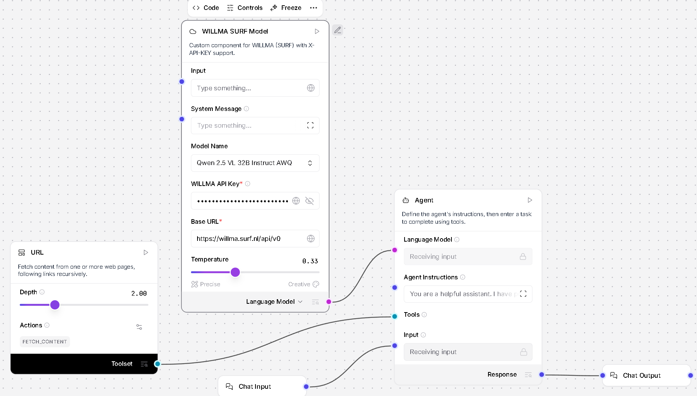

# LLM Truth-Finding Workshop for user supplied URL input

This workshop guides naive researchers through using a Langflow-based LLM agent playground to perform fact-checking on the WWI text at [TEXT_ON_WWI.html](https://hr-datalab-healthcare.github.io/RESEARCH_SUPPORT/WORKSHOPS/SAMEN_AAN_DE_SLAG_2026/TEXT_ON_WWI.html). The playground, accessible via [SAMEN_AAN_DE_SLAG_2026](https://hr-datalab-healthcare.github.io/RESEARCH_SUPPORT/WORKSHOPS/SAMEN_AAN_DE_SLAG_2026/index.html), employs a retrieval-augmented agent grounded in fetched web content for truthful validation.

## Flow Explanation

The Langflow in the image depicts a chat-based LLM agent system with grounding for accuracy. Core components include a URL Loader (fetches web content), LLM Agent (processes queries using tools), System Message (enforces tool use and truthfulness), and Chat Input/Output for interaction. Connections route user input through language models and tools to generate grounded responses, preventing hallucinations by mandating URL fetches before answering.

The agent operates in two modes: tool mode (user provides URL in chat, agent extracts and fetches) or context injection (pre-fetched content fed directly). Instructions like "You must use the URL tool to fetch content... Answer only based on fetched content. Do not hallucinate" ensure responses stay factual.

## Component Table

| Component | Function | Usage for Truth-Finding |
| :-- | :-- | :-- |
| URL Loader | Fetches raw text from provided URLs (e.g., Wikipedia) | Input target page like Wikipedia WWI; agent reads it as primary source 
| LLM Agent | Reasons over fetched content using tools; extracts links from chat | Queries like "Is X true per this page?" trigger fetch and validation  |
| System Message | "Always fetch URL first; answer only from content; say 'not in text' if absent" | Forces grounding; blocks external knowledge or fabrication |
| Chat Input | User enters question + URL (e.g., "Validate trench myth https://en.wikipedia.org/wiki/World_War_I")  | Enables dynamic truth missions on WWI misconceptions|
| Language Model | Powers agent (e.g., OpenAI); parses and summarizes grounded data | Outputs verified facts or admissions of absence |

This table educates beginners: paste URL into chat, ask validation questions, get evidence-based replies.

---

# Workshop 

---
---

### Explain why NO_INPUT  flow cannot answers in response to a provided url   whereas the USER_INPUT can?

### NO INPUT

### USER INPUT

---
---

## Langflow Components Parameters

Langflow nodes like URL Loader, LLM Agent, and OpenAI LLM expose tunable parameters for precision in truth-finding. Temperature controls creativity (0=deterministic, 1=random); model names select backends.[^1][^2][^3][^4]

## URL Loader Settings

| Parameter | Description | Example Values |
| :-- | :-- | :-- |
| URL | Target webpage to fetch | "https://en.wikipedia.org/wiki/World_War_I" (USER_INPUT); blank (NO_INPUT)  |
| Tool Mode | Enables agent tool call vs. direct output | ON (chat-extractable); OFF (context inject)  |
| Format | Output structure  | Text (clean read); HTML (raw); JSON (structured) |
| Loader | Fetch backend  | Default WebLoader; RequestsLoader (custom headers) |

## LLM Agent Settings

| Parameter | Description | Example Values |
| :-- | :-- | :-- |
| System Message | Grounding prompt | "Fetch URL first; answer only from content; no hallucinations" (truth mode); "Summarize freely" (creative) |
| Agent Instructions | Behavior rules ] | "You are a helpful assistant"; "Truthful fact-checker: cite text only"  |
| Tools | Connected loaders  | URL Loader only; +Calculator (math checks) |
| Language Model | Backend LLM  | OpenAI (GPT-4o); Ollama (local Llama3) [^1] |
| Max Iterations | Tool call loops | 3 (efficient); 10 (deep reasoning) |

## Language Model (OpenAI) Settings

| Parameter | Description | Example Values |
| :-- | :-- | :-- |
| Model Name | LLM variant | gpt-4o-mini (fast/cheap); gpt-4-turbo (accurate); o1-preview (reasoning)  |
| Temperature | Randomness (0-2) | 0.0 (factual, repeatable); 0.2 (balanced); 0.8 (creative summaries)  |
| API Key | Auth token  | "sk-..." (Azure OpenAI); env var \$OPENAI_API_KEY |
| Max Tokens | Output limit  | 1000 (concise); 4000 (detailed validation) |
| Top P | Nucleus sampling | 0.9 (diverse); 1.0 (full) |

## Chat Input/Output Settings

| Parameter | Description | Example Values |
| :-- | :-- | :-- |
| Session ID | Chat history  | auto; "wwi-truth-1" (persistent) |
| Placeholder | User prompt hint  | "Ask + URL: Validate trench myth" |
| Temperature Override | Per-chat control | 0.1 (strict fact-check) |

---
---

## Test Method

A parametric test procedure varies one Langflow parameter at a time (holding others fixed) across known WWI myths from TEXT_ON_WWI.html, scoring agent accuracy/groundedness. Use baselines like Temp=0, LLM model , strict system prompt; test 3 runs per config for averages.[^1][^2]

## Test Procedure

1. Load USER_INPUT_FLOW; set target URL to TEXT_ON_WWI.html.

- https://hr-datalab-healthcare.github.io/RESEARCH_SUPPORT/WORKSHOPS/SAMEN_AAN_DE_SLAG_2026/TEXT_ON_WWI.html

2. Define 6 myths: trenches everywhere, gas main killer, donkeys safe, flu from Spain, US instant win, Nov 11 total peace.

3. Query: "Is [myth] true? Fetch https://en.wikipedia.org/wiki/World_War_I".

4. Vary one parameter (e.g., Temp 0/0.3/0.7); score responses:
    - 2: Correctly debunks with quote.
    - 1: Partial (admits unsure but no hallucination).
    - 0: Affirms myth/hallucinates.[^1]
5. Metrics: Avg Score (higher better), Grounded % (cites fetch), Halluc % (external facts).
6. Iterate params; best = max score, 100% grounded, 0% halluc.

### Summary Table

| Parameter | Test Values | Expected Best | Rationale [Source] |
| :-- | :-- | :-- | :-- |
| Temperature | 0.0, 0.3, 0.7 | 0.0 | Low temp maximizes determinism; reduces myth affirmation |
| Model Name | gpt-4o, o1-mini, llama3  | gpt-4o | Superior fact adherence; o1 good but pricier  |
| URL Depth | 0.5, 1.0, 1.5  | 1.0 | Full page without overload; >1 risks noise  |
| Tool Mode | ON, OFF  | ON | Enables dynamic Wikipedia fetches for cross-check  |
| System Prompt Strength | Weak ("helpful"), Strict ("fetch only; no external")  | Strict | Forces grounding; weak allows hallucinations  |
| Max Tokens | 500, 2000 | 2000 | Allows full quotes for proof; low truncates  |

